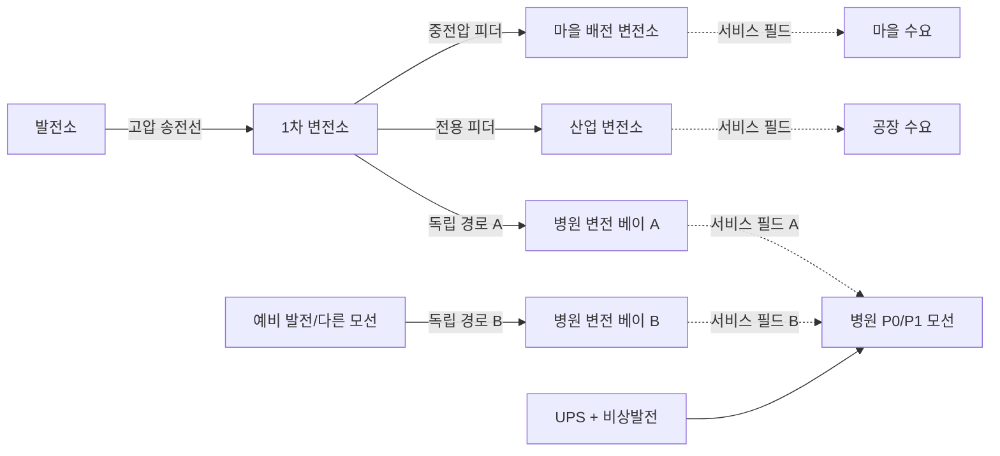

# Gridworks

> 상태: 통합 게임 기획·시스템 설계 기준서
>
> 게임명: `Gridworks`
>
> 한 줄 소개: **가장 적은 돈으로, 다음 고장까지 버틸 수 있는 전력망을 건설하라.**

이 문서는 게임 규칙, 콘텐츠, 수치와 구현 경계를 정의하는 권위 기준서다. 화면 제작 기준과
콘셉트 스케치 재현 방법은 [비주얼 제작 명세](VISUAL_PRODUCTION_SPEC.md)를 따른다. 이미지는
본문을 이해하기 위한 필수 입력이 아니며, 이미지와 글이 충돌하면 이 문서의 글과 산식이
우선한다.

## 0. 게임 비전

마을, 병원, 공장과 지형은 존재하지만 전력 인프라는 부족하다. 플레이어는 지역 전력회사와
인프라 건설 책임자가 되어 발전소, 송전선과 철탑, 1차 변전소, 배전 변전소를 직접 배치하고
공사한 뒤 그 계통을 운영한다.

게임의 핵심은 다음 네 문장이다.

1. **전기가 들어온 변전소만 주변에 서비스 권역을 만든다.**
2. **그 권역은 발전소까지 실제 송전 경로로 연결되어야 한다.**
3. **가장 싼 계통이 아니라, 고장 하나를 견디는 계통 중 가장 싼 계통이 좋은 계통이다.**
4. **전기를 실제로 전달해 팔면 돈을 벌고, 끊으면 보상금과 계약 위약금을 낸다.**

마을과 공장은 플레이어가 짓는 도시 건물이 아니라, 전력을 공급해야 할 수요처다.
플레이어의 역할은 지역 전력회사 겸 인프라 건설 책임자다.

지도는 완전히 빈 지역, 부분적으로 전력망이 깔린 지역, 노후 설비를 인수해 교체해야 하는
지역을 모두 지원한다. 어떤 시작 상태에서도 공간 건설, 실제 전력 흐름, 공사 시간, 경제와
신뢰도 규칙은 동일하게 작동한다.

### 0.1 플레이어가 실제로 경험하는 게임

플레이어는 빈 땅에 마음대로 도시를 만드는 시장이 아니다. 이미 사람들이 살고 병원이
환자를 받고 공장이 주문을 수행하는 지역을 인수한다. 첫 화면에서 보이는 것은 건설 가능한
건물 목록보다 “누가 언제까지 얼마의 전력을 필요로 하는가”다. 마을은 저녁에 수요가 오르고,
병원은 작은 순간 정전도 허용하지 않으며, 공장은 많은 전력을 사는 대신 사전 계약에 따라
일시 감축할 수 있다. 이 차이가 모든 건설 선택의 출발점이다.

플레이어는 먼저 지도를 읽는다. 발전소 후보지에서 마을까지 직선을 긋는 것이 아니라 강을
어디서 건널지, 도로 회랑을 이용할지, 병원에 두 번째 경로를 어떻게 독립시킬지 판단한다.
경로를 그리는 동안 게임은 돈, 공사일, 철탑 수와 예상 손실을 즉시 계산한다. 더 짧은 노선이
항상 좋은 것은 아니다. 같은 철탑 회랑이나 같은 모선을 공유하면 한 번의 사고에 두 회선이
함께 무력화될 수 있기 때문이다.

발주 뒤에는 시간이 흐른다. 작업반은 기초를 만들고 철탑을 세우고 도체를 건 뒤 시험한다.
공사가 끝나기 전의 선로는 전기를 전달하지 않는다. 시운전에 성공하면 발전소에서 변전소까지
전류가 이어지고, 변전소 주변의 서비스 필드 안에 있는 건물이 순서대로 켜진다. 이 순간은
건설의 보상이자 앞으로 지켜야 할 약속의 시작이다. 공급된 MWh는 매출이 되고, 공급하지 못한
MWh는 잃은 매출과 보상금이 된다.

평상시에는 자동급전이 플레이어의 운전 정책에 따라 발전기와 저장장치를 조절한다. 플레이어는
매분 숫자를 맞추는 대신 다음 폭염, 정비일과 수요 증가를 보며 설비를 보강한다. 위기가 오면
시간이 느려지고, 평소에 숨겨졌던 설계의 약점이 드러난다. 한 선로가 끊겼을 때 우회 경로가
살아 있는지, 배터리가 저녁까지 버티는지, 공장 감축 계약을 너무 늦게 부르지 않았는지가
결과를 결정한다.

사고가 끝나면 게임은 성공·실패만 선언하지 않는다. 어떤 고장이 어떤 변전소를 거쳐 어떤
고객에게 영향을 주었는지, 무엇이 피해를 줄였는지, 얼마를 벌고 얼마를 보상했는지를 한
원인 사슬로 설명한다. 플레이어는 그 보고서를 바탕으로 다음 공사를 결정한다. 따라서 한
세션은 “짓고 끝나는 퍼즐”이 아니라 `약속 → 투자 → 운영 → 시험 → 학습`의 반복이다.

### 0.2 이 게임이 주려는 감정

초반의 감정은 부족함이다. 돈도 작업반도 제한되어 있어 모든 수요처를 최고 사양으로 지킬
수 없다. 중반의 감정은 소유감이다. 플레이어가 직접 고른 경로와 변전소가 지도에 남고,
도시의 불빛이 자신의 설계에 의존한다. 위기의 감정은 공포보다 책임감에 가깝다. 문제는
갑자기 생겼지만 원인은 이전 선택과 연결되어 있고, 대응 수단의 도착시간과 비용도 보인다.
마지막 감정은 안도와 후회가 함께 있어야 한다. 병원을 지킨 우회선은 비쌌지만 가치가 있었고,
미뤄 둔 정비는 결국 더 큰 비용으로 돌아왔다는 사실을 플레이어가 스스로 설명할 수 있어야
한다.

숫자의 현실성은 이 감정을 지탱하는 수단이지 목적이 아니다. 전문 지식이 없는 플레이어도
“이 선은 너무 뜨겁다”, “이 병원은 한 경로에 의존한다”, “이 발전소는 싸게 돌지만 늦게
완공된다”를 이해할 수 있어야 한다. 전문 수치는 그 직관을 확인하거나 더 깊이 파고들 때
제공한다.

### 0.3 핵심 용어를 쉬운 말로 정의하기

| 용어 | 이 게임에서 뜻하는 것 | 뜻하지 않는 것 |
|---|---|---|
| 서비스 필드 | 통전된 배전 변전소가 지역 저압망을 통해 접속할 수 있는 권역 | 발전소 없이도 전기를 만드는 마법 범위 |
| 통전 | 발전소 또는 살아 있는 외부 전원까지 닫힌 전기 경로가 있고 설비를 사용할 수 있는 상태 | 건설이 끝났다는 사실만으로 성립하는 상태 |
| 유효 정격 | 날씨·상태·정비를 반영해 지금 안전하게 쓸 수 있는 MW | 설비 명판에 적힌 영구 고정값 |
| 예비력 | 사고 뒤 정해진 시간 안에 실제 낼 수 있는 추가 MW | 꺼진 발전기 명판의 단순 합계 |
| 독립 N-1 | 전기 설비 하나를 잃어도 중요부하 기준을 지키는가에 대한 검사 | 산불처럼 여러 설비를 함께 잃는 모든 재난의 보증 |
| 공통원인 위험 | 같은 회랑·부지·보호구역 때문에 여러 설비가 함께 영향을 받는 위험 | 독립 N-1과 같은 하나의 점수 |
| 사용불가 | 고장·정비·보호동작 때문에 전력을 전달할 수 없는 상태 | 반드시 파괴되어 영구 복구 불가능한 상태 |
| 수요반응 | 사전 계약에 따라 고객이 일정 시간 사용량을 줄이는 유상 조치 | 사고 뒤 일방적으로 전기를 끊는 무상 정전 |
| 시운전 | 공사 완료 자산의 접속·보호·전압·지급조건을 확인하고 계통에 편입하는 절차 | 완공 버튼을 누르는 즉시 생략되는 연출 |

문서와 UI는 전문 용어를 먼저 제시한 뒤 설명하지 않는다. 먼저 쉬운 결과를 말하고 필요할
때 정확한 용어와 계산을 펼친다. 예를 들어 `N-1 실패`만 띄우지 않고 “이 모선이 고장 나면
병원의 두 선이 함께 꺼집니다”를 먼저 보여준다.

## 1. 제품 정의

| 항목 | 결정 |
|---|---|
| 장르 | 싱글 플레이 아이소메트릭 전력망 건설·운영 전략 |
| 플랫폼 | 우선 PC/macOS, 마우스·키보드 중심 |
| 한 세션 | 캠페인 임무 45~90분, 고정 챌린지 30~60분 |
| 시간 | 평상시 고속 진행, 경보 시 자동 감속, 언제든 정지 |
| 도시 | 이미 존재하는 마을·병원·공장·공공시설이 성장하거나 계약으로 추가됨 |
| 건설 | 자유 배치, 거리·지형·철탑 수에 따라 비용과 기간 산정 |
| 물리 | 그래프 기반 전력조류, 손실, 선로 열, 설비 용량, 섬 분리 |
| 승리 | 의무 수요를 안전 기준 이상으로 공급하면서 생애주기 비용을 최소화 |
| 실패 | 파산, 병원 장기 정전, 회복 불가능한 광역 정전, 계약상 최저 공급률 위반 |
| 1.0 모드 | 3장 핵심 캠페인, 동일 지도 기반 고정 챌린지 |
| 후속 모드 | 7장 장기 캠페인, 파라미터형 엔드리스, 본격 샌드박스 순으로 확장 |

플레이어 판타지는 “기계를 돌리는 기술자”에만 머물지 않는다. 지도를 내려다보면 어디에
얼마를 써서 누구를 살렸는지가 한눈에 보여야 한다. 송전선 하나는 단순한 장식이 아니라
예산, 공사 기간, 수용 용량, 노후도와 우회 가능성을 모두 가진 약속이다.

## 2. 디자인 기둥

### 2.1 전력은 공간을 통해 전달된다

발전량 총합만 맞추면 끝나는 게임이 아니다. 발전소와 수요처 사이에 실제 연결 경로가
있어야 하며, 중간의 모든 선로와 변전소가 흐르는 전력을 감당해야 한다. 강, 산, 도로,
주거지와 토지 사용권이 경로의 가격을 바꾼다.

### 2.2 변전소는 서비스 권역을 만든다

플레이어가 직관적으로 이해할 수 있는 핵심 규칙이다. 전원이 들어온 배전 변전소는 주변
지면에 `서비스 필드`를 만든다. 범위 안의 호환 수요처는 배전선을 개별로 긋지 않아도
접속된다. 이것은 판타지 에너지가 아니라 마지막 배전망을 추상화한 게임 표현이다.

### 2.3 싸게 짓되 여유를 남긴다

직선 하나로 모든 시설을 잇는 망은 가장 싸지만 선로 하나가 끊기면 모두 꺼진다. 모든
경로를 이중화하면 안전하지만 파산한다. 플레이어는 병원에는 이중 경로를, 공장에는 유상
수요 감축을, 마을에는 적당한 예비 용량을 배치하는 식으로 위험을 다르게 가격화한다.

### 2.4 위기는 사전 선택의 결과를 드러낸다

폭염이나 노후 선로 고장은 정답을 무효화하는 주사위가 아니다. 점검, 정비, 예비력,
우회망, 이동식 변전 설비와 수요 감축 계약에 미리 쓴 돈이 가치가 있었는지를 검증하는
시험이다. 위험은 범위와 근거가 먼저 보이고, 사고 후에는 원인 경로가 설명된다.

### 2.5 설비가 곧 도시의 생존권이다

미술과 사운드는 전력망을 추상 숫자가 아니라 주민과 산업이 의존하는 생명선으로 보이게
한다. 켜진 병원, 느려진 공장, 어두워진 외곽 마을이 계통 상태의 결과여야 한다.

### 2.6 발전 포트폴리오는 시간·입지·현금의 선택이다

비싼 재생에너지는 연료비를 줄이는 대신 큰 선투자와 날씨 변동을 요구한다. 원자력은 압도적
출력과 낮은 생산 단가를 주지만 매우 비싸고 오래 걸리며, 수요지 근처에서는 주민 수용성
비용이 폭증한다. 석탄·LNG는 생산 단가가 높지만 원전보다 유연하고, 특히 LNG 피커는 몇
분 안에 위기를 막는다. “어떤 발전원이 최고인가”가 아니라 언제 착공하고 어디에 놓아 어떤
계약과 계통을 뒷받침할지가 핵심이다.

### 2.7 세 레이어의 우선순위는 같지 않다

제품의 중심은 **공간 건설과 신뢰도 계획**이다. 평상시 계통 운전은 플레이어가 정한 정책으로
자동화하고, 직접 급전·차단기 조작은 위기 때의 전술 레이어로 제한한다. 장기 금융은 핵심
루프가 검증된 뒤 캠페인 후반에 열리는 경량 전략 레이어다. 세 시스템은 같은 상태를
공유하지만 플레이 시간과 UI 복잡도를 같은 비중으로 요구하지 않는다.

## 3. 핵심 플레이 루프

```text
수요·지형 조사
  → 발전원과 변전소 부지 선정
  → 송전 경로를 그리고 비용·기간·안전성 비교
  → 공사 계약 및 작업반 배정
  → 시운전과 계통 투입
  → 평상시 운영·요금 수입·정비
  → 폭염·고장·증산 같은 사건 대응
  → 사고 보고서와 생애주기 비용 확인
  → 보강·교체·우회망 투자
```

한 번의 작은 루프는 `배치 → 연결 → 점등`의 즉각적인 만족을 준다. 긴 루프는 `절약 →
취약성 노출 → 보강 → 더 큰 수요 수용`으로 진행된다.

### 두 개의 시간 눈금

공사와 사고를 같은 속도로 흘리지 않는다.

- **달력 모드**: 평상시에는 `x1 / x4 / x16 / 다음 이정표까지`로 일·주 단위 공사와
  수요 성장을 빠르게 진행한다. 한 임무는 보통 게임 안의 30~120일을 다룬다.
- **운영 모드**: 경보가 발생하면 `정지 / x1 / x2 / x4`로 바뀌고 분 단위 열 누적,
  배터리와 차단기 조작을 처리한다. 중요한 차단·고장에는 자동 정지한다.
- 발전소나 대형 송전선처럼 한 임무보다 오래 걸리는 공사는 장 사이에도 진행 상태가
  유지된다. 장기 캠페인은 약 2년의 달력을 사용한다.

플레이어가 아무 결정을 기다리지 않는 시간은 자동으로 압축한다. 반대로 과부하 선로가
몇 분 뒤 차단될 때는 남은 시간을 정확히 보여준다.

내부 시간은 하이브리드 스케줄러가 처리한다.

- **안정 구간**: 수요·기상 갱신, 공사 마일스톤, 발전기 기동 완료, SOC 경계, 정산,
  열 임계값과 고장 중 가장 가까운 사건까지 건너뛰고 에너지·이자·열화를 구간 적분한다.
- **위기 구간**: 과부하, 저장 부족, 사고 또는 수동 운전 중에는 1분 고정 틱을 사용한다.
- **빠른 사고**: 발전기·선로 탈락 직후의 자동 절체, 초고속 저장 반응과 자동 부하차단은
  한 운영 틱 안의 순서 있는 사건으로 해결한다.

안정 상태를 6시간 건너뛴 결과는 1분 틱 360회의 결과와 규정 오차 안에서 같아야 한다.
위기가 끝났을 때 이전 달력 속도로 돌아갈지 일시정지를 유지할지는 접근성 설정으로 둔다.

### 플레이 10분의 예

1. 마을 18 MW와 병원 8 MW의 신규 요청이 들어오고, 같은 상위 회랑에는 12 MW 공장이
   이미 연결되어 있다.
2. 마을 배전 변전소를 두 후보지에 놓아 서비스 범위와 토지 비용을 비교한다.
3. 발전소까지 가장 짧은 송전 경로는 강을 건너므로 싸지만 공사 기간이 길다.
4. 도로를 따라 우회하는 경로는 12% 비싸지만 나중에 공장 분기를 붙이기 쉽다.
5. 공사를 발주하면 자금이 예약되고 철탑이 구간별로 완성된다.
6. 시운전 후 서비스 필드가 켜지고 범위 안의 주택과 병원에 불이 들어온다.
7. 폭염은 40 MW 마을 변전소의 유효 정격을 36 MW로 낮추고 마을·병원 피크를 34 MW로,
   공장을 포함한 상위 회랑 피크를 48 MW로 올린다.
8. 플레이어는 공장 4 MW 감축으로 상위 회랑 여유를 만들고, 이동식 냉각으로 변전소 유효
   정격을 38.4 MW까지 회복한다. 새 변전소보다 싸지만 다음 성장에는 다시 부족하다.

### 세션의 다섯 단계

한 임무는 시스템을 한꺼번에 던지지 않고 다섯 단계의 압력 곡선으로 진행한다.

1. **인수와 진단**: 플레이어는 기존 계통, 수요 계약, 현금, 공사 기한과 알려진 위험을
   받는다. 이때는 정답을 요구하지 않고 어디가 단일 경로인지, 어느 설비의 상태가 불확실한지
   표시한다.
2. **첫 약속**: 신규 마을, 병원 또는 공장 계약을 수락할지 결정한다. 계약은 매출뿐 아니라
   필요한 MW, 서비스율과 정전 보상 책임을 만든다. 거절하면 당장 안전하지만 성장 기회를
   잃는다.
3. **건설과 운영**: 부지와 경로를 정하고 공사를 발주한다. 수요가 증가하는 동안 플레이어는
   작업반과 현금을 배분하고, 자동급전 정책과 예비력 하한을 조정한다.
4. **시험 사건**: 예보된 폭염, 계획 정비 또는 설비 경고가 여러 단계로 다가온다. 준비
   시간이 끝나면 한 개 이상의 설비가 감용되거나 사용불가가 되어 망의 실제 여유를 시험한다.
5. **복구와 결산**: 서비스율을 회복한 뒤 원인·대응·비용을 검토한다. 임시 우회나 비상연료를
   사용했다면 다음 임무로 넘길 영구 복구 의무가 생긴다.

각 단계에는 하나의 주 질문이 있다. 진단에서는 “어디가 취약한가”, 계약에서는 “이 수요를
감당할 것인가”, 건설에서는 “어떤 위험을 돈으로 줄일 것인가”, 사건에서는 “무엇을 먼저
살릴 것인가”, 결산에서는 “다음에는 무엇을 바꿀 것인가”다. UI와 튜토리얼은 이 질문보다
앞서 새로운 전문 용어를 제시하지 않는다.

### 결정의 세 시간범위

- **지금 15분**: 배터리, 자동절체, 피커와 DR로 사고 직후의 부족분을 막는다.
- **다음 며칠**: 작업반, 임시선, 점검, 연료와 계획정비를 배치한다.
- **다음 계절·장**: 발전소, 영구 회랑, 대형 변전소와 금융을 결정한다.

좋은 선택은 한 시간범위만 최적화하지 않는다. 배터리를 지금 모두 쓰면 즉시 정전은 막지만
저녁 피크를 잃을 수 있고, 가장 싼 임시선을 오래 유지하면 다음 사건 때 더 큰 복구비를 낸다.
게임은 선택 버튼 옆에 `도착시간`, `지속시간`, `즉시비용`, `후속의무`를 함께 표시해 이
연결을 글과 숫자로 설명한다.

## 4. 월드와 전력망의 두 겹 구조

### 4.1 공간 월드

공간 월드는 다음을 책임진다.

- 설비의 위치, 회전, 점유 면적과 접속 포트
- 선로의 꺾임점, 길이, 철탑 간격과 지형 통과 비용
- 마을·병원·공장의 건물 위치와 서비스 필드 포함 여부
- 강 횡단, 경사, 도로 접근, 토지 사용권과 공사 차량 경로
- 화면에 보이는 공사 단계와 손상 상태

### 4.2 전기 그래프

전기 그래프는 다음을 책임진다.

- 발전소와 변전소의 모선
- 송전선, 배전 피더, 변압기의 간선
- 선로별 전력 흐름, 손실, 정격, 온도와 차단 상태
- 계통 분리, 발전·수요 균형, 불균형 대응 대리모델과 자동 부하 차단
- 발전소의 출력, 기동 시간, 연료와 예비력

3D 오브젝트가 직접 게임 규칙을 계산하지 않는다. 공간 월드에서 공사가 완료되면 하나의
원자적 명령으로 전기 그래프에 노드와 간선을 추가한다. 저장과 리플레이는 이 명령을 같은
순서로 재현한다.



## 5. 서비스 필드 규칙

### 5.1 활성 조건

변전소의 서비스 필드는 아래 조건을 모두 만족할 때만 활성화된다.

1. 공사가 끝나고 시운전을 통과했다.
2. 상위 모선에서 변전소까지 닫힌 전기 경로가 있다.
3. 변전소와 상위 선로가 사용 가능 상태다.
4. 변전소가 최소 여자 전력과 자체 사용 전력을 공급받는다.

미연결 변전소는 회색 점선 범위만 보이며 주변 건물을 켜지 못한다. 전원이 들어오면 중심에서
바깥으로 육각 셀이 점등되어 “연결 성공”을 즉시 보여준다.

판정은 수평 유클리드 반경을 25 m 육각 셀에 래스터화한다. 일반 도로, 작은 경사와 건물은
범위를 막지 않는다. 서비스 필드가 지역 저압 배전망까지 추상화하기 때문이다. 단, 지도에
명시된 넓은 하천, 절벽과 금지 구역은 `배전 횡단점`이나 다리가 없으면 셀 연결을 끊는다.
줌인에서는 육각 셀, 줌아웃에서는 같은 셀의 외곽 등고선을 보여주므로 원과 육각형이 서로
다른 규칙처럼 보이지 않게 한다.

### 5.2 접속 대상과 용량 배분

- 범위 안에 있고 변전소 전압 등급과 호환되는 수요처만 후보가 된다.
- 다른 변전소로 넘길 수 있는 수요처는 실제 예비 피더와 절체 설비가 설치된 후보만 포함한다.
  서비스 필드가 겹친다는 사실만으로 전력이 순간이동하지 않는다.
- 기본 배분은 플레이어가 정한 서비스 우선순위와 계약 중요도 순서다.
- 변전소가 공급할 수 있는 전력은 `정격`, `실제 유입 가능 전력`, `온도 보정 정격` 중
  가장 작은 값이다.
- 용량이 부족하면 전체 필드가 갑자기 꺼지지 않는다. 우선순위가 낮은 외곽 셀부터
  호박색으로 변하고 차례로 공급이 제한된다.
- 겹치는 필드의 건물은 `주 공급`, `예비 공급`, `절체 등급`을 따로 기록한다. 호환 피더가
  둘 이상이면 거리·부하율·전환 비용의 결정론적 우선순위로 배정하고, 플레이어가 수동
  고정할 수 있다. 재배정은 용량·토폴로지·정책이 바뀔 때만 실행하며 히스테리시스로
  흔들림을 막는다.

서비스 오버레이는 세 상태를 색과 패턴으로 분리한다.

1. `기하학적 범위`: 피더를 설치하면 접속할 수 있는 셀
2. `전기적 활성`: 상위 계통에서 변전소까지 전원이 들어온 셀
3. `실제 공급`: 현재 용량 배정과 우선순위에 따라 계량 중인 셀

출시 시나리오의 서비스 필드는 `AggregateLoadOnly` 축약모델이다. 전압강하·무효전력·3상
불평형을 직접 계산하지 않으므로 이 모델로 전압품질을 주장하지 않는다. 상세 검증이 필요한
시나리오는 별도 `FeederEquivalent`가 최대 전달 MW, 손실곡선, 피더 탈락 후 서비스율을
제공할 수 있지만 런타임 필수 기능은 아니다.

### 5.3 변전소 유형

아래 수치는 첫 밸런스 프로토타입용이며 실제 공학 가격을 뜻하지 않는다. 화폐 `M`은
게임 안의 백만 예산 단위다.

| 설비 | 서비스 반경 | 정격 | 비용 | 기본 공기 | 용도 |
|---|---:|---:|---:|---:|---|
| 마을 배전 변전소 | 550 m | 40 MW | 6 M | 14일 | 넓은 주거·상업 권역 |
| 산업 변전소 | 360 m | 120 MW | 13 M | 28일 | 좁고 높은 공장 부하, 빠른 부하 변화 |
| 중요시설 변전소 | 300 m | 2×15 MW | 10 M | 21일 | 2×100% 변압기·분할 모선·자동 절체 |
| 1차 변전소 | 없음 | 300 MW | 24 M | 45일 | 고압을 여러 하위 변전소에 분배 |
| 광역 345/154 kV 허브 | 없음 | 1,200 MW | 45 M | 75일 | 원전·대형 발전단지 송출과 광역 분기 |
| 이동식 변전 설비 | 180 m | 12 MW | 3 M 임대 | 2일 | 사고 복구용, 손실·운영비가 큼 |

마을 변전소로 공장을 억지로 덮을 수는 있지만 공장의 모터 기동 부하와 피크 때문에 정격을
빨리 소진한다. 산업 변전소는 반경이 작지만 같은 면적에서 훨씬 큰 전력을 안정적으로
처리한다. 병원은 범위 안에 들어오는 것만으로 완전 보호되지 않는다. 서로 다른 상위
모선이나 서로 겹치지 않는 두 송전 경로가 있어야 `이중 공급`으로 인정한다.

중요시설 변전소는 UI에서 한 시설처럼 보이지만 전기 그래프에는 방화벽으로 분리된 A/B
변압기 베이와 분할 모선 두 개로 존재한다. 각 베이가 중요 부하 100%를 감당한다. 두 경로는
선로 구간, 차단기, 변압기 베이, 상위 1차 변전소와 동일 물리 회랑을 공유하지 않아야 완전
독립이다. N-1 제거 단위도 UI 카드 전체가 아니라 독립 베이·상위 자산 각각이다.

병원 건물의 P0 모선에는 무정전 UPS가 직접 붙어 자동 절체와 비상발전 기동 사이를 15분
버틴다. 현장 연료 4시간 이상인 비상발전은 두 번째 경로를 일시 대체할 수 있지만 영구
이중화로 표기하지 않는다. 발전 측에서는 가장 큰 온라인 발전기 하나를 잃는 N-1 조건도
별도로 통과해야 한다.

## 6. 송전선과 철탑

### 6.1 배선 조작

1. 발전소 또는 변전소의 접속 포트를 누른다.
2. 마우스로 경로를 그리면 철탑이 허용 간격으로 자동 배치된다.
3. 클릭으로 꺾임점을 고정하고, 종점 포트를 누르면 노선이 닫힌다.
4. 확정 전 `총비용`, `공사 기간`, `철탑 수`, `예상 피크 부하율`, `손실`, `N-1 결과`를
   비교한다.
5. 공사를 발주하면 유령 노선이 공사 노선으로 바뀌고 구간별로 완성된다.

배선 중에는 건물과 수목의 채도를 낮추고 접속 포트, 경사, 강 횡단, 금지 구역과 작업로만
선명하게 보인다. 가장 싼 경로, 가장 빠른 경로, 가장 안전한 경로를 한 번에 미리볼 수
있지만 최종 꺾임점은 플레이어가 결정한다.

전신주와 철탑은 경로를 따라 자동 배치하지만 공짜 장식물이 아니다. 각각 별도 자재비,
기초 공사 시간과 상태를 가지며, 플레이어는 특수 지형에서 위치를 옮길 수 있다. 최종
견적은 `접속 설비 고정비 + 도체·회랑 거리비 + 지지물 수량 + 특수 경간 + 토지비`다.
두 선로가 지도에서 교차해도 자동으로 접속되지 않는다. 전기적으로 연결하려면 개폐소나
변전소를 명시적으로 건설해야 한다.

### 6.2 선로 등급

| 선로 | 정격 | 고정비 | 도체·회랑비 | 기본+거리 공기 | 특징 |
|---|---:|---:|---:|---:|---|
| 66 kV 전신주 피더 | 60 MW | 0.8 M | 1.1 M/km | 3일 + 4일/km | 싸고 빠르나 폭염·폭풍에 약함 |
| 154 kV 철탑 송전선 | 180 MW | 2.0 M | 2.7 M/km | 7일 + 6일/km | 중거리 주력, 병렬 증설 가능 |
| 345 kV 대형 송전선 | 600 MW | 6.0 M | 6.5 M/km | 18일 + 10일/km | 장거리 간선, 부지·민원 비용 큼 |
| 임시 우회선 | 35 MW | 1.5 M | 1.8 M/km | 1일 + 1일/km | 30일 수명, 손실과 고장률이 높음 |

이 표는 플레이어가 보는 건설 카탈로그다. 권위 데이터의 각 회선·변압기 형식에는 아래
전기·복구 파라미터가 추가로 있어야 한다.

| 파라미터 | 역할 |
|---|---|
| 전압 등급과 접속 포트 | 잘못된 전압의 직접 연결 차단 |
| 리액턴스 또는 서셉턴스 | 메시형 계통의 흐름 분배 |
| 저항 근사·손실계수 | 흐름 제곱에 따른 손실 |
| 정상 정격 | 지속 가능한 장기 흐름 |
| 비상 정격·허용시간 | 사고 직후의 단시간 여유 |
| 열 시정수 | 과부하가 차단까지 축적되는 속도 |
| 기온·바람 민감도 | 날씨에 따른 유효 정격과 냉각 |
| 전기 고장·회랑·부지 그룹 | 독립 N-1과 공통원인 사건 구분 |
| 복구 등급 | 필요한 작업반·부품과 표준 복구시간 |

| 지지물 | 배치 간격 예시 | 개당 비용 | 개당 공기 | 특징 |
|---|---:|---:|---:|---|
| 66 kV 콘크리트 전신주 | 80~120 m | 0.08 M | 0.25일 | 접근이 쉬우나 환경 노출이 큼 |
| 154 kV 표준 철탑 | 250~350 m | 0.35 M | 1일 | 회랑의 기본 단위 |
| 345 kV 대형 철탑 | 350~500 m | 0.90 M | 2일 | 큰 기초와 넓은 회랑 필요 |
| 특수 하천 횡단 철탑 | 경간별 | 2.50 M | 5일 | 긴 경간, 별도 점검 대상 |

선로의 전기 용량과 사용 가능 여부는 가장 약한 구간에 의해 제한된다. 상태는 약 0.5~1 km
구간과 주요 지지물별로 보관하되, 평상시 UI는 노선 전체 요약을 보여준다. 중간 개폐기가
있으면 고장 구간만 격리할 수 있고, 없으면 노선 전체를 정지해야 한다.

표의 고정일은 측량·허가, 거리일은 표준 지형에서 한 작업반이 수행하는 회랑 정리·가선
작업량이며 철탑 기초·설치와 양단 시험을 포함하지 않는다. 영구 노선의 양단 접속·보호시험은
기본 5일, 임시선은 1일이다. 실제 완공일은 아래 작업반별 임계 경로로 결정한다.

```text
각 구간: 측량·허가
      → 회랑 정리
      → 지지물 기초
      → 지지물 설치
      → 가선
전체 노선: 모든 구간 가선 완료
        → 양단 접속
        → 보호시험·시운전
```

실제 완공일은 이 구간별 선후관계 DAG의 가장 긴 경로다. 서로 다른 구간은 작업반 수만큼
병렬 진행할 수 있지만 한 구간에서 기초 전에 철탑을 세우거나 철탑 전에 가선할 수 없다.
표의 km 공기는 회랑 정리와 가선의 합산 작업량이며, 지지물 표는 기초·설치 작업량이다.
견적기는 두 작업량을 DAG에 각각 넣어 이중 계산 없이 완공일을 구한다. 지형 배수는 해당
구간의 회랑·기초에만 적용하고 양단 시운전 고정일에는 적용하지 않는다.

추가 비용 계수 예시:

- 강 횡단: 해당 경간 비용 `×1.8`, 최소 공기 +5일
- 급경사: 거리비 `×1.4`, 고장 복구 시간 `×1.25`
- 도로 인접: 거리비 `×0.9`; 전용 공사용 진입권까지 확보하면 공기 `×0.85`. 통행을 유지해야
  하는 공공도로는 비용 할인만 받고 공기는 줄지 않음
- 주거지 통과: 토지 보상 고정비와 허가 기간 추가
- 기존 회랑 병렬 증설: 거리비 `×0.7`, 단 공사 중 기존 회선 일시 감용

### 6.3 흐름, 손실과 열

내부 계산은 메시형 계통에서 전력이 자동으로 나뉘는 DC-like 전력조류를 사용한다.
플레이어가 지정한 “한 경로”로 물류처럼 흘리는 방식은 사용하지 않는다. 대신 선택한 선로에
현재 흐름 방향과 `현재 MW / 유효 정격 MW`를 표시한다.

선로 손실은 다음 형태로 근사한다.

```text
손실 = 손실계수(전압, 길이, 상태) × 흐름²
```

각 전기적 섬의 계산 순서는 고정한다.

```text
1. 자동급전 정책으로 발전·수요 균형의 초기값을 만든다.
2. Bθ = P를 풀어 손실 없는 1차 선로 흐름을 계산한다.
3. 각 선로의 손실 kF²를 계산해 절반씩 양단의 추가 수요로 배분한다.
4. 정해진 반복 횟수만큼 2~3을 다시 풀어 에너지 수지를 닫는다.
5. 남은 불균형은 외부 연계선 → 재급전 → 출력 제한 → 계약 DR → 부하차단 순으로 처리한다.
```

플레이어에게 보이는 총 발전 MWh는 `고객 인도 + 저장 순충전 + 선로·변압기 손실 + 출력제한
전 이미 생산한 에너지`와 같은 계량 경계에서 닫혀야 한다. 완전한 AC 해석은 런타임에 넣지
않되, 손실의 위치와 비용은 사라지지 않는다.

선로 열은 고정 폭염 배수를 매분 다시 곱하지 않는다. 전류제곱 발열, 일사, 주위온도와
풍속에 따른 대류·복사 냉각을 축약한 1차 열상태가 도체온도를 갱신하고, 정상·비상 정격과
차단까지 남은 시간을 만든다. §11.2의 감용 퍼센트는 첫 밸런스의 대표 운전점 앵커이며,
실제 런타임은 같은 날에도 바람과 흐름에 따라 유효 정격이 오르거나 내릴 수 있다.

과부하는 즉시 폭발하지 않고 열을 축적한다.

| 유효 정격 대비 흐름 | 결과 |
|---:|---|
| 0~70% | 안전 여유, 정상 냉각 |
| 70~90% | 경제 운전, 단일 고장 시 혼잡 가능 |
| 90~100% | 여유 부족 경보 |
| 100~120% | 열 누적, 수십 게임 분 안에 조치 필요 |
| 120~150% | 빠른 열 누적, 보호 차단 가능 |
| 150% 초과 | 거의 즉시 차단 |

기온, 바람과 노후도가 `유효 정격`과 냉각 속도를 바꾼다. 따라서 평상시 82%인 선로가
폭염에는 96%가 될 수 있다.

## 7. 발전, 저장과 수요

### 7.1 발전 설비 포트폴리오

비용과 공기는 님비 입지 할증을 적용하기 전의 기본값이다. 변동비는 연료·소모품을 포함한
수직 슬라이스용 게임 수치이며 실제 시장가격이 아니다.

| 발전원 | 정격 | 기본 건설비 | 기본 공기 | 최소출력·기동 | 변동비 | 게임 역할 |
|---|---:|---:|---:|---|---:|---|
| LNG 가스 피커 | 90 MW | 38 M | 60일 | 0%, 10분 | 0.25 M/GWh | 매우 비싸지만 즉시 피크 대응 |
| LNG 복합화력 | 280 MW | 92 M | 160일 | 25%, 2시간 | 0.14 M/GWh | 유연한 주력, 폭염 출력 저하 |
| 석탄 화력 | 350 MW | 120 M | 240일 | 40%, 12시간 | 0.11 M/GWh | 큰 출력, LNG보다 느리지만 원전보다 유연 |
| 원자력 | 3×300 = 900 MW | 420 M | 540일 | 온라인 호기당 80%, 72시간 | 0.018 M/GWh | 건설이 매우 비싸고 느리나 대출력·초저생산비 |
| 태양광 단지 | 60 MWp | 45 M | 60일 | 기상 추종 | 0.006 M/GWh | 비싼 초기비, 낮 피크 수입, 고온 효율 저하 |
| 집광형 태양열 | 120 MW / 960 MWh | 150 M | 240일 | 저장열 범위 내 30분 | 0.015 M/GWh | 매우 비싸나 해진 뒤에도 저장열 급전 가능 |
| 풍력 단지 | 100 MW | 75 M | 120일 | 바람 추종 | 0.007 M/GWh | 비싼 초기비, 연료비 없음, 예측 오차 |
| 배터리 | 50 MW / 200 MWh | 34 M | 50일 | 즉시 | 0.010 M/GWh 처리량 | 발전원이 아니라 시간 이동·예비력 |
| 비상 디젤 | 12 MW | 5 M | 7일 | 1분 | 0.35 M/GWh | 병원·복구용, 연료 4시간 기준 |

화력 안에서도 역할이 다르다. LNG는 출력 조정과 기동이 빠르지만 연료비가 가장 높고,
석탄은 LNG보다 느리지만 원자력보다 훨씬 유연하다. 원자력은 출력과 생산 단가가 압도적이지만
캠페인 초기에 착공해도 후반에야 가동되며, 정비 대정지나 수요 부족 때 쉽게 끌 수 없다.

원전 한 단지는 독립 기동 가능한 300 MW 호기 세 개다. 한 호기의 최소 안정출력은 240 MW라
단지 전체를 가동할 때 720 MW가 필요하지만, 수요가 작으면 한두 호기만 운전할 수 있다.
대신 각 호기는 기동에 72시간이 걸리므로 폭염을 보고 즉시 세 번째 호기를 켤 수 없다. 가장
큰 발전기 N-1 제거 단위도 단지 900 MW 전체가 아니라 온라인 300 MW 호기 하나다.

900 MW를 정상 송출하려면 보통 300 MW 1차 변전소 하나로는 부족하다. 원전 프로젝트에는
1,200 MW 발전소 스위치야드·수전 허브와 서로 다른 철탑 열에 놓인 `2×600 MW 345 kV`
회선이 필수다. 한 회선 고장 시 보호계전이 한 호기 300 MW를 자동 감발·정지해 나머지 회선
정상정격을 지킨다. 손실과 제어 여유를 포함해 남은 두 호기의 순송출 목표는 `580 MW 이하`로
자동 제한한다. 이 송출 패키지가 시운전되지 않으면 원전도 상업 운전할 수 없다.

급전 가능 발전기의 반복 기동은 무료가 아니다.

| 설비 | 램프 | 기동비 | 최소 운전 / 정지 |
|---|---:|---:|---:|
| LNG 피커 | 90 MW/10분 | 0.12 M | 1시간 / 30분 |
| LNG 복합화력 | 70 MW/시간 | 1.50 M | 8시간 / 4시간 |
| 석탄 | 35 MW/시간 | 4.00 M | 24시간 / 24시간 |
| 원전 1호기 | 15 MW/시간 | 10.00 M | 7일 / 7일 |
| 비상 디젤 | 12 MW/분 | 0.02 M | 없음 / 없음 |

### 7.1.1 자동급전과 예비력 정책

평상시 MW를 매분 직접 맞추는 것은 플레이어의 일이 아니다. 플레이어는 아래 운전 정책을
설정하고, 예측 가능한 merit-order와 제약 휴리스틱이 정상 급전과 혼잡 재급전을 수행한다.

- 발전원 우선순위와 자동 기동 허용
- 배터리 최소 SOC와 충전 우선시간
- 시간대별 예비력 하한
- 계약 DR과 부하차단 순서
- 자동 절체 허용과 외부 구매 상한
- 원전·석탄의 최소 운전시간을 고려한 선기동 규칙

수동 급전은 위기 때 쓰는 시간제한 오버라이드다. 안전·램프·최소출력 제약을 우회하지 못하고,
만료되면 자동정책으로 돌아간다. 자동화가 선택한 이유는 `수요`, `변동비`, `기동시간`, `혼잡`,
`예비력`의 원인 행으로 설명한다.

예비력은 하나의 명판 합계가 아니라 지속시간별 검증 능력이다.

| 구간 | 대표 수단 | 의미 |
|---|---|---|
| 즉시~1분 | UPS, 배터리, 비상 디젤, 자동 부하차단 | 사고 직후 P0와 계통 불균형 보호 |
| 15분 | 가스 피커, DR, 저장장치 | 단기 사고를 버티는 운전 여유 |
| 2시간 이상 | 복합화력, 외부 조달, 계획 변경 | 저장 고갈 뒤에도 지속 가능한 공급 |

HUD는 세 구간의 검증 MW와 퍼센트를 함께 보이고, 좁은 화면의 `RESERVE 6%`는 세 구간 중
현재 제약을 결정하는 최저 예비율이다. 이를 누르면 어느 시간대와 설비가 병목인지 펼쳐진다.

주파수는 1분 틱에서 Hz 동특성을 적분하지 않는다. 설비 탈락 때 `최초 불균형 MW → 자동
절체·즉시 예비력 → 부족분 자동 부하차단 → 안정화된 1분 상태` 순으로 처리하는
`FrequencyAdequacyProxy`를 쓴다. UI는 최초 부족량, 즉시 대응 MW, 자동 차단 부하와 15분 뒤
필요한 지속 공급력을 보여준다. 이는 과도안정도나 상세 보호계전 시뮬레이션이 아니다.

집광형 태양열의 960 MWh는 전기 환산 저장량이며 저장 왕복효율 90%, 하루 열손실 1%다.
배터리는 왕복효율 88%, 하루 자기방전 0.1%이고 충·방전 합산 처리량에 표의 열화비를 낸다.
충전 전력은 최종 판매가 아니며, 방전 뒤 수요처 경계에 전달된 양만 매출이 된다.

비상 디젤의 초기 탱크는 `12 MW×4시간 = 48 MWh`다. 연료 재고는 발전기와 별도 자산
상태이며 12시간 배송 뒤 보충된다. 반환·재임대로 같은 발전기를 다시 불러도 무료 48 MWh가
생기지 않는다. 배송은 물리 재고만 채우고 연료비는 실제 발전 MWh에 표의 변동비로 한 번만
전기한다.

원자력처럼 일반 현금·신용 한도를 넘는 대형 프로젝트에는 용도가 고정된 `인프라 채권`을
사용한다. 발전소·입지 할증·필수 송출망을 합친 통합 패키지의 자기자본 20%, 채권 80%를
약정한다. 채권은 다른 공사에 전용할 수 없고 입지 할증이 붙으면 발행 원금도 커진다.

적격비용은 발전소 본체, 의무 안전·환경설비, 직접 토지·승인된 입지 보상, 필수 송출망과
허브다. 일반 운영자금, 벌금, 정전 보상, 취소·철거비는 채권으로 낼 수 없다.

채권은 20년 만기, 고정 연 6%, 원금 180일 거치 뒤 월 균등상환이다. 이자는 인출일부터
`ProjectFinance`만 일별 발생시켜 `InterestPayable`에 쌓고 매 30일 지급일에 현금으로 낸다.
일반 신용 이자도 같은 주기를 쓴다. 계약·정전 정산기는 금융이자를 다시 만들지 않는다.
따라서 가동 전에도 현금이 빠진다. 현금 원장에는 채권 발행 유입과 원금 상환이 모두
기록된다. 효율 등급은 자산 CAPEX를 연환산 자본비용의 기준으로 한 번만 사용하고, 실제
이자·발행 수수료는 별도 금융부담 지표에 넣는다. 원금을 어느 비용 항목에도 다시 더하지 않는다.

조기상환은 가능하지만 상환 원금의 1% 수수료를 낸다. 도래 이자·원금을 30일 넘게 지급하지
못하면 채무불이행으로 캠페인이 종료된다. 캠페인 결산 때 남은 원금은 재무상태표에 그대로
표시되며 수입이나 추가 비용으로 다시 세지 않는다.

캠페인 후보 A처럼 자기자본도 부족한 경우 공공 공동투자를 선택할 수 있다. 필요 자기자본의
절반, 최대 120 M까지 대신 내주지만 캠페인 종료까지 원전 전력 판매 총마진의 25%를 가져간다.
평가 자본비용은 자금 출처와 무관하게 통합 패키지 전체 CAPEX를 기준으로 연환산하므로
보조금으로 사회적 비용을 숨길 수 없다.

공동투자 약정은 각 30/40/30 마일스톤에서 제한된 프로젝트 자금으로 비례 인출한다. 원전이
메시망의 어느 고객에게 갔는지 추적하지 않고 아래 내부 기준가격으로 월 배분한다.

```text
원전 프로젝트 월마진 = 원전 순주입 GWh×0.10 M/GWh
                         + 원전 적격용량 MW·일×0.0003 M/MW·일
                         - 원전 발전 변동비 - 원전 고정 O&M
공동투자자 배분 = 25% × max(0, 월마진)
```

공동투자금 유입과 배분은 재무 현금흐름이며, 배분액은 플레이어 현금에는 영향을 주지만 전체
CAPEX를 이미 평가 자본비용의 기준으로 사용하므로 원금이나 CAPEX를 다시 더하거나 빼지
않는다. 투자자 배분도 같은 자산의 소유권 이전이므로 효율 LCC에서는 제외하고
지급능력·기말현금에는 전액 반영한다.

### 7.1.2 평가 자본비용용 기준 설계수명

| 자산군 | 기준 설계수명 |
|---|---:|
| 66 / 154 / 345 kV 선로 | 40 / 50 / 60년 |
| 영구 변전소 | 35년 |
| 가스 피커 / 복합화력 / 석탄 / 원자력 | 30 / 35 / 40 / 60년 |
| 태양광 / 풍력 | 25 / 25년 |
| 집광형 태양열 | 35년 |
| 배터리 | 15년 |
| 비상 디젤 | 20년 |
| 임시 우회선 | 30일, 실제 임대·설치비 전액 평가 |

### 7.2 수요처 차이

| 수요처 | 평시 예시 | 피크 특성 | 정전 비용 | 특별 규칙 |
|---|---:|---|---|---|
| 마을 | 12~28 MW | 아침·저녁, 폭염 냉방 | 중간 | 외곽부터 단계 감축 가능 |
| 병원 | 6~12 MW | 비교적 일정, 폭염 시 증가 | 매우 높음 | 이중 경로 또는 비상발전 요구 |
| 공장 | 30~110 MW | 교대 시작 때 급증 | 계약에 따라 높음 | 유상 감축·생산 연기 가능 |
| 정수장 | 4~9 MW | 일정 | 매우 높음 | 장기 정전 시 마을 피해 증가 |
| 데이터센터 | 25~90 MW | 거의 일정, 냉각 영향 | 높음 | 허용 중단 횟수·최대 정전시간·독립 공급·UPS 계약 |

수요는 차단 우선순위도 가진다.

- `P0 생명 안전`: 중환자실·수술실·핵심 통신. 자동 차단 금지.
- `P1 필수`: 정수·소방·병원 일반 진료. 마지막 단계에서만 제한.
- `P2 일반`: 주거·상업. 외곽 셀부터 순환 제한 가능.
- `P3 유연`: 공장 비핵심 공정·예약 충전. 계약에 따라 먼저 감축.

공급 제한은 단순히 “행복 -10”을 만들지 않는다. 공장 감축은 보상금과 세수 손실, 마을
정전은 복구 보상과 다음 계약 요금, 병원 정전은 임무 실패 위험으로 환산된다.

### 7.3 발전소 입지와 님비 비용

원자력·석탄·LNG 발전소는 수요지에 가까울수록 송전선이 짧아지지만 주민 수용성 비용이
급격히 오른다. 이것은 재료가 마법처럼 비싸지는 것이 아니라 주민·영업 영향 보상, 환경·
안전 심사, 소음·대기·냉각 대책, 지역기금, 허가 소송 위험과 공사 제한 시간을 하나의 입지
할증으로 묶은 것이다. 부지 소유자에게 주는 순수 매입대금은 `직접 토지비`로 따로 계산해
입지 할증과 중복하지 않는다.

거리 `d`는 발전소 중심이 아니라 발전소 허가부지 폴리곤과 가장 가까운 거주 셀 폴리곤
사이의 최단거리다. 아래 값은 연속 곡선의 앵커이며 앵커 사이는 선형 보간한다. 따라서
경계를 1 m 넘기는 방식으로 할증이 갑자기 사라지지 않는다.

| 거리 앵커 | LNG 배수 | 석탄 배수 | 원자력 배수 | 허가 지연 앵커 |
|---:|---:|---:|---:|---:|
| 6 km 이상 | ×1.00 | ×1.00 | ×1.00 | 0일 |
| 3.0 km | ×1.15 | ×1.25 | ×1.40 | 30일 |
| 2.4 km | ×1.40 | ×1.80 | ×2.50 | 90일 |
| 1.5 km 이하 | ×1.90 | ×2.80 | ×4.00 | 240일 |

노출 인구도 별도로 계산한다. 각 거주 셀 인구에 `max(0, 1-d셀/6 km)`를 곱해 합친 값을
`E`라 하고, 기준 노출 10,000명을 넘은 부분만 최대 0.30의 추가 프리미엄을 만든다.

```text
P인구 = min(0.30, max(0, E-10,000) ÷ 20,000 × 0.10)
입지 할증 = 기본 발전소 CAPEX
            × max(0, 거리배수(d)-1 + P인구 - 승인된 완화 크레딧 합)
총 입지 견적 = 기본 CAPEX + 입지 할증 + 완화설비 직접비 + 직접 토지비
최종 허가기간 = max(0, 보간 허가기간 - 승인된 허가 단축일 합)
```

스케치의 후보 A는 `d=2.4 km`, `E=8,400`, 완화책 없음이라 원전 거리배수 2.50이 그대로
적용되어 `420×(2.5-1)=630 M` 할증이 된다. 풍력은 1 km 이내 주거지에서
소음·경관 대책으로 `×1.25`, 집광형 태양열은 토지·물 사용 때문에 농촌 거주 셀과 수원지
근처에서 `×1.15` 할증을 받는다. 태양광은 님비 할증이 작지만 넓은 토지비가 기본 CAPEX에
들어 있다.

| 완화책 | 직접비 | 프리미엄 크레딧 | 허가 단축 | 제한 |
|---|---:|---:|---:|---|
| 산업단지·폐광 재생 | 8 M | 0.12 | 15일 | 지정 부지에서 1회 |
| 녹지·방음·상시 감시 | 기본 CAPEX 4% | 0.10 | 10일 | 환경설비 태그 1회 |
| 폐열·지역 환경 패키지 | 기본 CAPEX 3% | 0.08 | 10일 | 열수요가 있는 부지만 |
| 주민 요금·지역기금 | E 10,000명당 4 M | 0.12 | 20일 | 현금성 비용, 계약당 1회 |

같은 태그는 중복 구매할 수 없고 크레딧을 모두 적용해도 최종 배수는 1.0 아래로 내려가지
않는다. 주민기금·법무·허가비는 평가 물리자본과 O&M 기준 자산에 포함하지 않는다. 더 먼 부지를
택하면 이 비용을 피하는 대신 긴 송전선·손실·고장 노출을 감수한다.

배치 미리보기는 `발전소 본체 + 입지 할증 + 허가 지연 + 필요한 송전선`을 한 견적으로
보여준다. 견적은 `QuoteId`, 규칙 버전, 부지 형상 해시, 인구 스냅샷, 완화책과 30일 만료일을
가진다. 형상·인구·완화책이 바뀌거나 만료되면 재견적하며 같은 QuoteId는 한 번만 발주할 수
있다. `PrepareProject`는 원 QuoteId·만료일·형상·인구·규칙 해시를 ProjectId에 복사할 뿐
만료를 연장하지 않는다. `CommitAssetConstruction` 때 다시 검증하고, 만료됐으면
`RequoteProject` 뒤 채권·공동투자 한도를 재승인해야 한다. 님비 결과는 숨은 주사위가 아니며
같은 입력은 항상 동일하다.

대형 발전소는 최종 투자결정 전에 `개발 옵션`을 살 수 있다. 옵션은 부지 예약, 허가 조사와
계통영향평가를 시작하지만 발전소 본공사와 채권 인출은 시작하지 않는다. 후보 A/B의 첫
밸런스 값은 각각 6 M/10 M이며, 최종 투자하면 통합 패키지의 선행개발비로 인정하고 포기하면
돌려받지 못한다. 옵션 만료 전 최종 투자결정을 하면 이미 지난 승인기간을 그대로 인정한다.
따라서 플레이어는 전체 자기자본을 조기에 묶는 대신 제한된 비용으로 “기다릴 권리”를 산다.
옵션이 없으면 최종 투자결정일이 곧 모든 선행승인의 시작일이다.

발전소 착공 전에는 입지 허가와 계통영향평가·회랑 권리 확보를 병렬로 처리한다. 둘 다 끝난
날이 본공사 착공지시일 `NTP`다. NTP 뒤에는 발전소 본공사와 실제 송출망·허브 공사를 병렬로
진행하고 둘 다 끝나야 공동 시운전한다. 따라서 같은 기간을 선행조건과 물리 공사에 두 번
더하지 않는다.

```text
NTP = 오늘 + max(입지 허가, 계통 접속 선행승인)
발전소 완료 = NTP + 발전소 기본 공기
송출망 완료 = NTP + 송출망 실제 공기
상업운전일 = max(발전소 완료, 송출망 완료) + 공동 시운전
공동 시운전 = 0일 원자 검증; 각 자산의 실제 보호시험 5일은 송출망 공기에 이미 포함

후보 A 필수 송출망
  = 2회선 × (고정 6 + 1.85 km×6.5 + 회선당 철탑 5×0.9) + 1,200 MW 허브 45
  = 90.05 M → UI 90 M
  실제 공사 = max(허브 75일, 회선 병렬 18+1.85×10+5×2) + 양단 시험 5 = 80일
  계통영향평가·권리 선행승인 = 75일

후보 B 필수 송출망
  = 2회선 × (고정 6 + 6.9 km×6.5 + 회선당 철탑 16×0.9)
    + 특수경간 2×2.5×공동접근 0.9 + 1,200 MW 허브 45
  = 180 M
  실제 공사 = max(허브 75일, 회선 병렬 18+6.9×10+16×2+특수경간 5)
              + 양단 시험 5 = 129일
  계통영향평가·권리 선행승인 = 124일

원전 후보 A: NTP 90일 + max(본공사 540일, 송출망 80일) = D-630
원전 후보 B: NTP 124일 + max(본공사 540일, 송출망 129일) = D-664
```

이 공기는 두 송전 작업반과 변전·시운전 작업반을 병렬 예약한 패키지 견적이다. 작업반을
다른 공사에 돌리면 같은 공정 DAG에서 송출망 완공일과 금융비가 다시 계산된다.

두 회선은 지도 줌아웃에서 하나의 넓은 계획 회랑으로 합쳐 보이지만, 전기 그래프와 건설
원장에는 별도 회선·철탑 열로 존재한다. 같은 회랑을 덮치는 공통 고장은 표준 N-1보다 강한
별도 위험으로 남는다.

위 입지·수용성 수치는 선택의 긴장을 위한 `GameBalanceProfile`이다. 실제 지역 자료로
검증한 `ResearchCalibrationProfile`과 섞지 않으며, 게임 수치만으로 현실 주민 수용성이나
발전기술의 사회적 비용을 주장하지 않는다.

## 8. 돈, 수익, 보상과 최소비용 목표

### 8.1 돈의 흐름

발전소는 전기를 만들기만 해서는 돈을 벌지 않는다. 수요처 또는 외부 연계선까지 실제로
전달되어 계량된 전력량만 판매로 정산한다. 버리거나 출력 제한한 전력은 매출이 0이고 연료·
변동비는 이미 사용한 만큼 남는다.

경제 시스템의 목적은 회계 자체를 퍼즐로 만드는 것이 아니라 설계의 결과를 돈으로 되돌려
주는 것이다. 값싼 단일 회선은 처음에는 현금을 남겨 다른 계약을 받을 수 있게 하지만,
사용불가가 되면 판매가 멈추고 보상금·긴급연료·야간수리비가 동시에 발생한다. 반대로 너무
많은 예비 회선은 사고를 쉽게 넘기더라도 이자와 유지비 때문에 성장 자금을 잠근다. 플레이어가
비교해야 하는 것은 “싸다/비싸다”가 아니라 `지금 지불할 돈`, `평상시에 벌 돈`, `고장 때
노출되는 돈`, `다른 기회를 포기한 돈`이다.

예를 들어 공장 계약은 큰 매출을 주지만 저녁 피크에 병원과 같은 회랑을 사용할 수 있다.
플레이어는 새 회선을 건설하거나, 공장에 더 낮은 요금을 주고 감축권을 사거나, 가스 피커를
대기시킬 수 있다. 세 선택은 모두 수요를 맞추지만 현금 흐름의 시점과 사고 때의 행동 가능성이
다르다. 견적 화면은 이 차이를 `초기 현금`, `평시 일수익`, `예상 위기비용`, `완공일`로
나눠 보여주고 하나의 불투명한 총점으로 숨기지 않는다.

```text
수요처 i의 의무 MWh = max(0, 기준 MWh - 사전 승인 DR MWh)
수요처 i의 공급 MWh = 계약 경계 계량기의 실제 인도량
수요처 i의 미공급 MWh = max(0, 의무 MWh - 공급 MWh)

전력 판매 매출 = Σ(공급 MWh ÷ 1,000 × 계약 단가[M/GWh])
                 + 일별 가용용량 대금
                 + 고객당 1회 최초 접속 분담금
                 + 외부 연계선 수출 매출

영업 현금흐름 = 전력 판매 매출 - 발전 변동비(연료·소모품 포함) - 탄소비용 - 고정 O&M
                - 수요반응 지급금 - 정전 보상금 - 계약 위약금
투자 현금흐름 = 공사 단계 지급액(-) + 자산 매각·적격 보조금(+)
재무 현금흐름 = 채권·신용·공동투자 인출(+) - 원금 상환 - 이자·수수료 - 투자자 배분
기말 현금 = 기초 현금 + 영업 + 투자 + 재무 현금흐름
```

매출 계량점은 `ServiceContractId`가 소유한 수요처 경계 하나뿐이다. 서비스 필드가 겹쳐도
같은 `DemandPointId`는 한 번만 계량한다. 선로 양단, 변전소 통과량, 배터리 충전은 매출이
아니다. 발전 변동비는 발전기 모선의 실제 주입 MWh에 붙는다. 사전에 출력 제한해 만들지
않은 전력에는 변동비가 없지만, 이미 생산한 뒤 버린 전력에는 비용이 남는다.

P0 안전판정 경계는 병원 내부 핵심모선이다. 승인된 UPS·비상발전이 자동절체 공백을 메우면
P0 미공급은 아니지만, 그 시간이 상위 전력회사 공급 가용성으로 둔갑하지는 않는다. 계약은
`최대 절체시간`, `독립 공급 여부`, `UPS 유지시간`, `비상발전 의존시간`을 따로 기록한다.
고객 소유 비상발전 MWh는 전력 판매 매출이 아니며, 운영자 소유 설비만 계약 단가와 연료비를
한 번씩 정산한다.

수입:

- 검증 MW에 대한 일별 가용용량 대금
- 고객당 한 번의 최초 접속 분담금
- 실제 전달·계량된 전력량에 따른 사용 요금
- 잉여 전력을 외부 연계선으로 보낸 수출 매출
- 안전도·청정도 조건을 만족한 공공 보조금

지출:

- 부지 취득과 설비 건설비
- 철탑·선로의 거리 및 지형 비용
- 표의 발전 변동비(연료·소모품 포함)와 고정 O&M
- LNG·석탄의 실제 발전량에 붙는 탄소비용
- 인프라 채권 원리금과 일반 신용 이자
- 점검, 예방 정비, 고장 복구와 임시 설비 임대
- 미공급 전력 보상, 계약 위반과 긴급 구매 비용
- 공사 작업반 추가 고용과 야간 공사 할증

보상은 정전이 끝나야 생기는 비용이 아니다. 각 운영 틱 또는 안정 구간에 해당하는 미지급
보상채무를 발생시켜 다음 일일
결산에 지급하고, 사건 시작 때 사고 기본금을 예약한다. 계획한 유상 수요반응은 사전 계약
가격만 지급하며 정전으로 보지 않지만, 플레이어가 일방적으로 끊은 부하는 미공급이다.

```text
이번 틱 보상채무 = Σ(등급별 미공급 MWh ÷ 1,000
                       × 등급별 보상 단가[M/GWh]
                       × 현재 사건연령의 지속시간 배수)

사건 총비용 = 모든 틱 보상채무 + 수요처별 사고 기본금
              + max(0, SLA 산출액 - 같은 기간의 틱 보상채무)

지속시간 배수: 15분 미만 ×1.0 / 15~60분 ×1.5 / 1~4시간 ×2.5 / 4시간 초과 ×4.0
```

배수는 해당 연령 구간의 틱에만 적용하고 과거 미공급량에 소급하지 않는다. 따라서 4시간
경계에서 보상 전체가 갑자기 네 배가 되는 현금 절벽이 없다. SLA 추가 위약은 이미 지급할
보상과의 차액만 내므로 같은 손해를 이중 계상하지 않는다. 잃은 사용 요금은 애초에 매출이
없었던 것이므로 위약금에 다시 더하지 않는다.

사고 기본금은 같은 미공급량이라도 수요처 전체가 반복해서 깜빡이는 운영을 막는다. 수직
슬라이스 기준으로 주거 계약 0.05 M, 공장 계약 0.20 M, 병원·정수장 계약 1.00 M이며,
한 사건에서 같은 `ServiceContractId`에는 한 번만 붙는다. 병원 P0는 보상금을 냈다고 안전
실패가 지워지지 않는다. 보상 지급에 현금이 부족하면 일반 신용을 한도까지 자동 인출한다.
현금은 음수가 되지 않으며, 그래도 지급하지 못한 채무가 생기면 파산한다.

강제 정전 사건은 `ServiceContractId`별로 계약 공급률 99%를 15분 연속 회복해야 종료된다.
잠깐 재투입했다 다시 끊어 보상 배수를 초기화할 수 없다. 사전 합의된 계획 정지 창은 사용
요금만 줄고 정전 보상은 면제되지만, 합의 시각이나 허용 시간을 넘긴 부분은 강제 정전으로
계산한다. 수요반응은 최소 사전 통보시간·MW·기간·연간 호출한도를 가지며 차단 결과를 본 뒤
같은 틱에 소급 호출할 수 없다.

계량기는 위기 중에는 1분 틱마다, 안정 상태에서는 같은 결과를 내는 사건 구간 적분으로
공급·미공급 MWh와 발전원별 변동비를 누적한다. 사용 요금, 용량 계약,
O&M과 누적 보상채무는 매일 00:00에 한 번 원자적으로 정산하고, 사건 종료 때 사고
기본금과 SLA 차액을 확정한다.
정산 직전에 MWh를 GWh로 나누어 표의 `M/GWh` 단가를 적용한다. 자정에 걸친 사건은 하나의
사건 ID를 유지하므로 이중 정산되지 않는다. 장·임무 종료 때 열린 계량 구간, 정전 사건,
보상채무와 이자를 강제 마감한다.

건설비는 발주 때 30%, 자재 도착 때 40%, 시운전 때 30%를 지급한다. 원전 통합 패키지는
각 마일스톤마다 자기자본 20%와 채권 80%를 동시에 인출한다. 채권 이자는 실제 인출잔액에만
연 6%로 붙고, 아직 인출하지 않은 약정에는 연 0.5% 약정수수료가 붙는다.

발주 승인 순간에는 **총 약정액 100%를 가용 현금·신용·승인된 전용 채권에서 예약**한다.
전용 채권과 공동투자 약정은 프로젝트별 제한계정이라 다른 공사의 담보가 되지 않는다.
마일스톤 금액 `q`의 분개는 아래처럼 한 거래로 처리한다. 공동투자가 없으면 `c=0`, 있으면
승인된 자기자본 분담률만큼이다.

```text
남은 프로젝트 지급약정 -= q
b = 0.8q                              // 채권 몫
c = 승인된 공동투자 몫              // 최대 0.1q
미인출 전용채권 -= b; 인출 채권원금 += b; 현금 += b
미인출 공동투자약정 -= c; 공동투자 유입 += c; 현금 += c
현금 -= q
플레이어의 순현금 감소 = q-b-c

필요 무제한 자금 = Σ max(0, 프로젝트 남은 약정
                            - 그 프로젝트 미인출 전용채권
                            - 그 프로젝트 미인출 공동투자약정)
잉여 무제한 유동성 = 현금 + 미인출 일반 신용
                     - 필요 무제한 자금 - 기타 예약채무
```

사고 기본금처럼 이미 발생해 다음 결산에 반드시 낼 금액은 `기타 예약채무`에 들어간다. 이
공식으로 예약 해제와 실제 지급이 같은 유동성을 두 번 줄이지 않는다.

취소하면 미인출 약정과 미래 지급 예약만 풀린다. 이미 인출한 채권 원금·이자는 남고,
집행액·철거비·계약해지비는 손실된다. 전용 채권은 해당 발전소 통합 패키지에만 쓸 수 있다.
채권 발행은 부채 유입, 원금 상환은 부채 감소로 분류하며 비용 평가의 CAPEX를 다시 늘리지
않는다.

### 8.1.1 수직 슬라이스 경제 기준

| 항목 | 기준값 |
|---|---:|
| 시작 현금 | 120 M |
| 신용 한도 | 40 M |
| 임무 비용 평가 기간 | 해당 임무의 실제 30~120일 |
| 캠페인 비용 평가 기간 | 실제 캠페인 달력 약 2년 |
| 주거 공급 수입 | 0.14 M/GWh |
| 병원 고신뢰 공급 수입 | 0.22 M/GWh |
| 공장 공급 수입 | 0.11 M/GWh |
| 최초 접속 분담금 | 주거 / 병원 / 공장 계약 MW당 0.02 / 0.03 / 0.04 M, 고객당 1회 |
| 예비력 가용용량 계약 | 0.0003 M/MW·일, 실제 가용 시간만 지급 |
| 사전 예고 피크 가산요금 | 기본 계약단가 +0.18 M/GWh, 최소 24시간 전 고지 |
| 발전 변동비 | 설비별 0.006~0.35 M/GWh, §7.1 표가 기준 |
| 탄소가격 | 0.03 M/ktonCO₂; LNG 0.40, 석탄 0.90 ktonCO₂/GWh |
| 외부 비상 조달(해당 지도만) | 0.35 M/GWh |
| 일반 O&M | 연간 적격 CAPEX의 2.5% |
| 일반 신용 이자 | 사용 잔액 연 12%, 일별 발생·30일마다 지급 |
| 인프라 채권 이자 | 실제 인출잔액 연 6%, 일별 발생·30일마다 지급 |
| 미인출 채권 약정수수료 | 미인출 약정액 연 0.5%, 일별 발생·30일마다 지급 |
| 인프라 채권 상환 | 20년, 원금 180일 거치 후 월 균등상환 |
| 공장 유상 감축 | 0.20 M/GWh |
| P0/P1/P2/P3 미공급 보상 기준단가 | 20 / 5 / 0.8 / 0.3 M/GWh |
| 외부 연계선 수출 | 최대 250 MW, 0.07 M/GWh, 캠페인 6장부터 |

일반 O&M은 시운전일부터 폐기일까지 영구 물리자산의 취득원가에 부과한다. 공사 중에는
공사관리비만, 임대 설비에는 임대료만 적용하며 상태가 나빠져도 O&M 기준가가 내려가지 않는다.
직접 취득 토지는 O&M 기준에서 제외하고 효율 평가는 별도 토지 기회비용을 사용한다.

탄소비용은 별도 도덕 점수가 아니라 현금 원장의 영업비용이다. 첫 밸런스에서 LNG는
`0.012 M/GWh`, 석탄은 `0.027 M/GWh`가 연료·소모품 변동비에 추가된다. 시나리오가
청정전력 계약이나 배출한도를 사용하더라도 같은 발전 MWh에 탄소비용을 이중 부과하지 않는다.

요금과 보상은 매 정산일의 실제 현금 흐름에 사용한다. LNG 피커는 일반 사용 요금만으로는
항상 이익이 나지 않으며, 빠른 예비력을 원하는 가용용량 계약이나 위기 시간대 판매로 수익을
낸다. 원자력은 가동 후 생산 마진이 크지만 540일 동안 매출 없이 공사비와 채권 이자를
견뎌야 한다. 재생에너지는 연료비가 거의 없지만 출력 제한·저장·망 보강이 총수익을 깎는다.

피크 가산시간은 수요 예보와 함께 최소 24시간 전에 고정하며 사건을 본 뒤 소급 지정할 수
없다. 가용용량은 명판이 아니라 계통 접속·연료·기동시간을 만족한 검증 MW만 인정한다.
배터리는 계약 지속시간 동안 낼 수 있는 MW, 풍력·태양은 P90 확정출력만 인정하고 고장·연료
부족 때는 그날 용량대금을 환수한다.

외부 연계선은 한 계량점의 구간별 순 MWh만 정산한다. 같은 구간에 수입과 수출을 따로 잡지
않고 상계하며, 수출은 지역 의무부하와 예비력을 충족한 뒤 남은 로컬 발전분에만 허용한다.
수입 전력을 배터리나 다른 연계선으로 돌려 재수출하는 차익거래는 허용하지 않는다.

숫자 단위 oracle은 자동화 테스트로 고정한다. `10 MW×1시간 = 10 MWh = 0.01 GWh`이므로
주거 매출은 `0.01×0.14 = 0.0014 M`이다. 같은 변환을 연료비, 수요반응과 보상에 적용한다.

예를 들어 주거 50 MW를 하루 내내 공급하면 `1.2 GWh×0.14 = 0.168 M` 매출이다. 그중
10 MW가 2시간 강제 정전되면 틱별 주거 보상 0.031 M, 사고 기본금 0.05 M, 잃은 매출
0.0028 M이 생겨 SLA 전에도 직접 손실이 0.0838 M이다. 전기를 안정적으로 파는 것이 확장의
현금원이지만, 한 번의 긴 정전이 며칠 마진을 지울 수 있다는 감각을 목표로 한다.

최소비용 등급은 시나리오 시작 때 고정한 `EvaluationObligationSet`만 비교한다. 선택 계약은
현금과 다음 장 성장에는 반영하지만 기본 효율 등급의 의무 묶음을 바꾸지 않는다. 선택 계약은
계약 조합별 `증분 생애주기 비용 / 추가 공급 GWh`와 서비스율을 별도 포트폴리오 지표로
비교한다. 수락하지 않은 계약은 수입도 의무도 만들지 않는다.

### 8.2 작업반과 공사 시간

- 기본 작업반은 `토목`, `송전`, `변전·시운전` 세 종류다.
- 한 노선은 토목 → 철탑 → 도체 → 시험 순서로 진행된다.
- 여러 공사를 병렬화하려면 작업반을 임대해야 하며 유지비가 증가한다.
- 악천후, 접근 도로 부재, 다른 회선의 안전 정전이 공기를 늘릴 수 있다.
- 공사 중인 설비는 전력을 전달하지 않는다. 부분 완공 노선도 양 끝 시운전 전에는 사용할
  수 없다.

### 8.3 승리 판정

이 게임의 최적화 목표는 아래처럼 정의한다.

```text
최소화: 평가 자본비용 + OPEX + 발전 변동비·탄소비용·외부조달 + 정비
        + 정전 보상·계약 비용
평가기간: 시나리오가 고정한 실제 30~120일; 캠페인 결산은 실제 약 2년
제약조건:
  P0 미공급 에너지 = 0
  P1 에너지 서비스율 ≥ 99.5%, 연속 정전 ≤ 30분
  전체 의무 수요 에너지 서비스율 ≥ 99.0%
  정상 피크에서 핵심 설비 부하율 ≤ 90%
  지정된 단일 고장 후 아래 N-1 복구 기준 통과
  파산 상태가 아님
  미지급 도래채무 = 0
  일반 신용 사용액 ≤ 40 M
```

미래 365일을 가상 운전하지 않는다. 임무 중 실제 발생한 수요·날씨·급전·고장 원장만
평가하고, 같은 시나리오는 모든 플레이어에게 동일한 시작일·종료일과 의무 수요 이력을
사용한다. 캠페인 최종 평가는 각 장의 실제 원장을 약 2년 달력으로 이어 붙인다.

현금 원장은 실제 CAPEX와 금융 원리금을 전액 처리하지만 효율 등급은 짧은 임무 끝의 임의
매각가를 가정하지 않는다. 적격 물리자산은 위 표의 설계수명 `n`과 표준 할인율 `r=8%`로
연환산한다.

```text
CRF(r,n) = r(1+r)^n / ((1+r)^n - 1)
평가 자본비용 = 실제 적격 물리 CAPEX × CRF(8%, n) × 자본노출일수 / 365
토지 기회비용 = 실제 직접 토지 취득비 × 연 3% × 자본노출일수 / 365
```

자본노출일수는 첫 건설대금 지급일부터 평가 종료일까지다. 상태 저하는 잔존가치 할인으로
숨기지 않고 정비비, 유효 정격, 고장위험과 종료 시 시나리오 기준상태까지 회복하는 결정론적
`미이행 정비견적`으로 별도 평가한다. 주민기금,
주민·영업 영향 보상, 허가·소송비, 벌금, 정전 보상, 임시선과 철거·임대비는 실제 발생액을
평가기간 비용에 전액 넣는다.

실제 대출 이자·수수료·원금은 지급능력과 현금 성과에 전액 반영하되, 표준 자본비용과
이중계상하지 않도록 기본 효율 LCC에서는 분리해 `금융부담` 지표로 표시한다. 아직 시운전되지
않은 자산은 연환산하지 않고 `실제 집행액 - 회수 가능한 현장 자재비 + 철거·계약해지비 +
남은 취소불가 약정`을 종료비용으로 넣는다. 캠페인에서는 공사·약정·부채를 다음 장으로
그대로 이월한다. 이렇게 막판 미완공 공사로 비용을 숨길 수 없다.

기본 N-1 검사는 핵심 선로 하나, 변압기·변전소 베이 하나, 가장 큰 온라인 발전기 하나를
각각 제거한다. P0는 UPS가 `<1초` 또는 `<10초` 등 계약된 자동절체 등급을 이어 받아 고객
경계의 미공급이 없어야 한다. P1은 30분 안에 95% 이상으로 회복해야 한다. 남은 설비는
120% 초과를 15분 넘게 지속하면 안 되며 60분 안에 모두 100% 이하로 복귀해야 한다.
첫 점등의 안내 구간만 이 안전 게이트를 명시적으로 면제하고, 병원 이중 공급을 배우는
임무부터는 실제 통과해야 한다.

먼저 안전 조건을 통과해야 비용 등급을 받는다. 위험한 초저가 계통이 “최고 점수”를 받는
문제를 막기 위함이다.

- **통과**: 의무 공급과 안전 기준 달성
- **효율적**: 통과한 해법 중 기준 생애주기 비용 이하
- **탁월**: 비용·손실 상위 기준을 달성하고 임시 패치나 P1 정전 없이 N-1 통과

단일 점수 대신 `전력 판매 매출`, `순영업 현금`, `평가 LCC`, `금융부담`, `정전 보상금`,
`미공급 에너지`, `병원 정전 시간`, `최대 부하율`, `복구 시간`을 나란히 기록한다. 매출은 생존과 확장에
필수지만, 같은 의무를 덜 안전하게 떠안아 점수를 높이지 못하도록 효율 등급은 고정된 의무
수요의 생애주기 비용으로 비교한다.

캠페인의 행정 종료 조건은 안전 등급과 별도다. P0 연속 정전 15분 또는 회복 가능한 광역
정전이 6시간을 넘으면 캠페인이 종료될 수 있다. 초기 제품은 블랙스타트 절차를 구현하지
않으므로 외부 연계선·가압된 섬·블랙스타트 가능한 비상전원 없이 전체 계통이 무전압이 되면
`회복 불가능`으로 판정해 임무를 종료한다. 그보다 짧은 P0 정전도 즉시 안전 게이트에는
실패하지만, 플레이어는 복구를 계속하고 사고 보고서를 받을 수 있다. 모선 충전과 섬 동기화
기능은 장기 확장 범위다.

## 9. 신뢰도와 안전 여유

플레이어에게 어려운 전문 용어만 보여주지 않는다. 모든 핵심 자산은 쉬운 상태와 정확한
수치를 함께 제공한다.

| 쉬운 상태 | 의미 | 기본 조치 |
|---|---|---|
| 여유 | 예측 피크에도 30% 이상 남음 | 유지 |
| 주의 | 예측 피크 또는 단일 고장 때 70~90% | 증설 검토 |
| 혼잡 | 90~100%, 날씨 보정 후 정격 근접 | 수요 분산·우회 |
| 과부하 | 100% 초과, 열 누적 | 즉시 급전·감축·차단 |
| 고립 위험 | 상위 경로가 하나뿐 | 우회선 또는 비상전원 |
| 사용불가 | 고장, 정비, 보호 차단 | 격리 후 수리 |

`N-1 검사` 버튼은 선로 또는 변전소 하나를 가상으로 제거해 어떤 서비스 필드와 수요가
꺼지는지 보여준다. 병원으로 들어가는 선이 두 개여도 같은 상위 철탑 회랑을 공유하면
독립 경로로 인정하지 않는다.

각 설비는 단순 자산 ID 외에 다음 고장 경계를 가진다.

- `ElectricalContingencyId`: 한 전기 사고로 제거되는 단위
- `BusSectionId`: 분할 모선과 베이의 독립 경계
- `ProtectionZoneId`: 한 보호동작으로 함께 차단되는 범위
- `CorridorRiskGroupId`: 산불·강풍·산사태에 같이 노출되는 공간 회랑
- `SiteCommonModeId`: 침수·화재처럼 같은 부지를 묶는 공통위험

`독립 N-1`은 전기적 단일 고장을 뜻하고, 같은 회랑의 두 회선이 함께 손상되는 사건은
`공통원인 사고`로 별도 표기한다. 두 지표를 하나의 N-1 배지로 합치지 않는다. 분석은
`토폴로지 경로 존재 → 남은 설비의 정상상태 용량 → 자동절체 후 15·30·60분 복구`의 세
단계다. 경로를 드래그하는 동안에는 앞의 두 단계만 근사하고 확정 견적에서 상세 복구를
실행한다.

성과에서도 신뢰도와 복원력을 분리한다. 신뢰도는 N-1 통과율, 미공급 에너지, P0/P1 연속
정전시간과 최대 과부하를 기록한다. 복원력은 사건 직후 최저 서비스율, P0 100%와 전체 부하
50%·90%·99% 복구시간, 서비스율 곡선 아래 손실, 임시복구 의존기간과 복구비용을 기록한다.
안전 게이트를 비용과 가중합하지 않고 먼저 통과시키는 원칙은 유지한다.

## 10. 설비 노후화와 사용불가 사건

### 10.1 상태 모델

상태는 실제 세계와 플레이어 관측을 분리한다.

- `ConditionTruth`: 권위 시뮬레이션만 아는 실제 건전성·누적위험
- `ConditionBelief`: 현재 정보로 추정한 범위와 신뢰도
- `InspectionObservation`: 점검 방식의 정확도와 잡음을 반영한 관측

모든 선로, 변전소와 발전소는 다음 값을 가진다.

- `상태 0~100`: 현재 물리적 건전성
- `상태 신뢰도`: 마지막 점검이 오래될수록 정확한 숫자 대신 범위로 표시
- `사용 시간`과 `설계 수명`
- `누적 열 스트레스`와 `최근 과부하 횟수`
- `환경 노출`: 염해, 먼지, 산불, 침수, 강풍 등 지도별 계수
- `다음 계획 정비`와 예상 정지 시간

점검하지 않은 오래된 선로는 `상태 42`처럼 정확하게 보이지 않고 `상태 30~58, 낮은
신뢰도`로 표시된다. 정밀 점검은 돈과 작업반 시간을 쓰지만 고장 확률과 필요한 수리 범위를
좁혀 준다. 점검은 실제 상태를 고치지 않고 관측만 개선하며, 정비만 실제 열화와 누적위험을
낮춘다.

| 점검 | 정전 | 비용 예시 | 결과 |
|---|---|---:|---|
| 순시·드론 | 없음 | 0.10 M/km | 빠르며 상태 오차 약 ±10, 외관 결함 발견 |
| 정밀 전기 검사 | 1일 계획 정지 | 0.30 M/km | 상태와 고장 구간을 거의 확정 |
| 상시 센서 | 설치 때 짧은 정지 | 1.50 M/구간 | 온도·처짐·이상 징후를 실시간 갱신 |

### 10.2 상태 구간

| 상태 | 효과 |
|---:|---|
| 70~100 | 정격 사용, 표준 유지비 |
| 40~69 | 유지비 증가, 고온 시 감용 폭 증가, 점검 권고 |
| 20~39 | 정격 75~90%, 보호 민감도 증가, 정비 예약 필요 |
| 1~19 | 긴급 운전만 가능하거나 규정상 정지, 돌발 사용불가 위험 큼 |
| 0 | 강제 사용불가, 격리 후 복구 필요 |

상태는 단순 시간뿐 아니라 `과부하²`, 고온, 반복 차단, 정비 연기로 더 빨리 떨어진다.
예방 정비는 상태를 회복하고 고장 위험을 낮추지만 일정 시간 설비를 계획 정지한다.

### 10.3 사건의 두 종류

**예고된 사용불가**

- 검사에서 절연 열화가 발견되어 5일 뒤 강제 정비가 필요하다.
- 플레이어는 미리 임시 우회선, 부하 감축, 이동식 변전소 또는 정비 일정 변경을 준비한다.
- 정비를 무시하면 보험·규정 비용이 증가하고 돌발 고장 범위가 커진다.

**돌발 사용불가**

- 시나리오 시드가 정한 위험 판정이 특정 시점에 확정되어 차단기가 열린다.
- 사고 전에 상태 범위, 이상 발열, 부분방전 경보 같은 단서가 적어도 하나 존재한다.
- 사고 순간 자동 정지하고 `발전소 → 고장 선로 → 영향 변전소 → 위험 수요처` 경로를
  강조한다.
- 플레이어는 고장 구간 격리, 우회 송전, 배터리 방전, 공장 감축, 비상발전, 임시 복구 중
  선택한다.

수리는 `진단 → 안전 격리 → 부품·작업반 도착 → 복구 → 시험 투입` 단계로 진행한다.
비용을 더 내면 임시 복구가 빠르지만 정격이 낮고 후속 영구 수리가 필요하다.

사건 결과는 시나리오 시드로 고정되어 저장·불러오기와 리플레이에는 결정론적이다. 플레이어는
발생 전 정확한 결과가 아니라 점검 품질에 따른 상태 범위와 발생 가능성만 본다. 같은 저장을
다시 불러 무작위 결과를 바꾸는 행동은 불가능하지만, 더 일찍 점검·정비하면 원래와 다른
명령 이력과 결과가 된다.

외생 표본은 하나의 순차 난수열이 아니라 `ScenarioSeed + EventType + AssetId + TimeIndex`를
키로 한 독립 스트림에서 만든다. 자산을 하나 추가하거나 정책이 다른 수의 표본을 소비해도
기존 날씨·수요·자산의 잠재 고장표본이 바뀌지 않는다. 고장 임계값은 고정하고 노후도,
과부하, 고온과 염해가 누적위험을 올리며, 정비는 임계값이 아니라 누적위험을 낮춘다.

## 11. 폭염 사건

폭염은 단일 수요 배수가 아니라 여러 계통 요소에 동시에 작용한다.

### 11.1 예보

- 5~7일 전: 기온과 수요 범위를 넓게 제시
- 48시간 전: 최고 기온, 피크 시간, 지역별 냉방 수요 범위 갱신
- 6시간 전: 공장 조업 계획과 병원 비상 준비 반영
- 발생 중: 예보 오차가 해소되고 실제 수요가 결정론적으로 나타남

### 11.2 첫 밸런스 효과

| 항목 | 폭염 효과 예시 |
|---|---|
| 마을 수요 | 오후·저녁 +25~40% |
| 병원 수요 | 냉각·응급 수요 +12~20% |
| 공장 수요 | 공정 냉각 +5~12%, 계약 감축 가능 |
| 가스 발전 | 최대 출력 -4~8% |
| 태양광 | 일사량 증가 가능, 패널 고온 효율 -5~10% |
| 66 kV 선로 | 유효 정격 -12%, 냉각 속도 감소 |
| 154 kV 선로 | 유효 정격 -7%, 열 누적 증가 |
| 변압기 | 유효 정격 -10%, 노후 설비 열화 가속 |
| 작업반 | 야외 수리 속도 -20%, 야간 작업은 할증 |

### 11.3 플레이어 대응

사전 대응:

- 병원 비상발전 연료 확보
- 배터리의 최소 충전량 예약
- 노후 선로 열화상 점검과 예방 정비
- 공장과 유상 수요 감축 계약
- 변전소 이동식 냉각기 임대
- 임시 우회선 또는 병렬 회선 조기 완공

발생 중 대응:

- 가스 피커 기동과 해당 지도에 이미 존재하는 외부 연계선의 긴급 조달
- 공장 감축, 마을 비필수 부하 단계 제한
- 배터리 방전과 예비력 재배분
- 병목 선로 개방·폐쇄를 통한 토폴로지 변경
- 노후 설비의 안전 정지 또는 위험 감수

사후 결과:

- 최대 선로 온도, 설비별 수명 소모, 공급 제한과 보상금 기록
- 준비 비용과 실제 회피 비용 비교
- 다음 폭염 전에 필요한 보강 추천

### 11.4 복합 사건: 열돔 아래 끊어진 회랑

게임의 대표 복합 임무다.

1. 평소 76%인 오래된 154 kV 회선이 폭염 보정 후 91%가 된다.
2. 마을 냉방과 병원 부하가 오르며 피크 예상은 104%다.
3. 검사 경고를 무시했으면 회선이 16시에 사용불가가 된다.
4. 우회선이 없으면 공장 감축만으로는 병원을 지킬 수 없다.
5. 플레이어가 미리 만든 35 MW 우회선은 34 MW, 즉 97%로 운전된다. 수요지 측 가스·배터리
   24 MW와 합쳐 살아 있는 공급력은 58 MW다.
6. 총수요 54 MW를 지킬 수 있지만, 배터리를 너무 일찍 쓰면 저녁 피크에 이 24 MW 현지
   공급을 유지할 에너지가 남지 않는다.
7. 성공 조건은 병원 무정전, 전체 서비스율, 임시선 열 한계와 총비용을 함께 본다.

이 임무는 “비싼 완전 이중화”와 “아무 대비 없는 최저가” 사이에 여러 유효 해법을 만든다.

91%는 임의의 추가 감용이 아니다. 노후 상태계수 0.90과 폭염 기온계수 0.93을 적용하면
명판 정격 기준 76% 흐름은 `0.76 / (0.90 × 0.93) = 90.8%`가 된다. 이후 피크 시간의 해당
회랑 흐름이 14.5% 증가하면 `90.8% × 1.145 ≈ 104%`다. UI는 상태 감용과 수요 증가를
서로 다른 원인 행으로 보여준다.

## 12. 사건 설계 원칙과 출시 사건군

모든 사건은 `징후 → 예보 범위 → 실제 충격 → 대응 → 복구 → 보고서` 구조를 따른다.
대응할 수 없는 완전 무작위 파괴는 사용하지 않는다.

| 범위 | 사건 | 먼저 보이는 단서 | 직접 영향 | 대표 대응 |
|---|---|---|---|---|
| 수직 슬라이스 | 폭염 | 기상 예보, 냉방 계약 | 수요 증가, 선로·변압기 감용 | 예비력, 감축, 냉각, 우회 |
| 수직 슬라이스 | 노후 선로 열화 | 상태 범위, 이상 발열 | 감용 또는 사용불가 | 점검, 예방 정비, 임시선 |
| 출시 핵심 | 공장 증산 | 계약 요청 | 급격한 지역 피크 | 산업 변전소, 새 피더, 감축 계약 |
| 출시 핵심 | 발전기 정비 | 제조사 권고, 진동 경보 | 공급력 감소 | 일정 조정, 대체 발전, 저장 |
| 후속 후보 | 강풍·착빙 | 기상 예보 | 전신주 고장률, 수리 지연 | 지중화, 가지치기, 우회 |
| 후속 후보 | 홍수 | 수위 예보 | 변전소 침수, 접근 차단 | 방수벽, 고지대 부지, 이동식 설비 |
| 후속 후보 | 연료 부족 | 가격·배송 경보 | 화력 출력·기동 제한 | 재고, 수입, 재생·저장 |

## 13. 화면과 조작

### 13.1 기본 시점

- 30~35도 아이소메트릭 3D
- 90도 단위 회전과 자유 줌
- 줌인하면 주민 건물과 공사 애니메이션, 줌아웃하면 계통도 우선 표현
- 가장 멀리 줌아웃하면 지형이 어두워지고 전기 그래프가 청사진처럼 읽힘
- 건설 모드에서는 가림 물체를 반투명 처리

공간 지도와 `단선결선도`는 동등한 두 작업 화면이다. 지도는 부지·회랑·서비스 필드·공사와
공통위험을 보여주고, 단선결선도는 모선·변압기·차단기·전기적 섬·흐름과 N-1 제거 결과를
보여준다. 선택 상태는 공유한다. 지도에서 선로를 고르면 결선도의 같은 간선이, 결선도에서
베이를 고르면 지도상의 부지와 회랑이 강조된다.

### 13.2 HUD

```text
┌ 자금 ─ 수요/공급 ─ 예비력 ─ 안전도 ─ 날짜·예보 ─ 일시정지 ┐
│ 목표/경보 │                  지도                  │ 선택 설비 │
│ 공사 대기 │                                        │ 용량/상태 │
│           │                                        │ 조치 버튼 │
├────────── 발전 | 송전 | 변전 | 저장 | 정비 ── 시간 모드별 제어 ┤
```

상단은 지금 망이 버티는지, 좌측은 무엇이 곧 일어나는지, 우측은 선택한 설비를 어떻게
바꿀 수 있는지만 보여준다. 상세 원장은 별도 패널로 연다.

```text
CALENDAR: 일시정지 | ×1 | ×4 | ×16 | 다음 사건
OPERATIONS: 일시정지 | ×1 | ×2 | ×4
```

기본 재무 HUD는 `현금`, `가용 신용`, `예약 자금`, `다음 지급액`만 보인다. 이자·원금과
프로젝트 제한계정은 상세 재무 패널, 사회적 비용과 안전성은 임무 성과 화면, 분개 ID와
멱등성 상태는 개발자 감사 화면에서만 보여준다.

### 13.3 정보 레이어

| 레이어 | 질문 |
|---|---|
| 서비스 권역 | 어느 변전소가 어떤 건물을 담당하는가? |
| 전력 흐름 | 전력이 어느 방향으로 얼마나 흐르는가? |
| 용량·열 | 어디가 병목이고 몇 분을 버티는가? |
| 상태·정비 | 무엇이 낡았고 언제 멈출 가능성이 큰가? |
| N-1 안전성 | 하나가 고장 나면 무엇이 꺼지는가? |
| 경제성 | 이 경로의 건설·운영·정전 비용은 얼마인가? |
| 공사 | 어떤 작업반이 무엇을 언제 완성하는가? |

한 번에 한 주 레이어만 활성화한다. 색만으로 구분하지 않고 선 모양, 흐름 입자, 점멸
패턴과 아이콘을 함께 사용한다.

모든 진단 UI는 네 질문에 같은 형식으로 답한다.

1. 왜 이 시설에 전기가 들어오지 않는가?
2. 이 설비가 고장 나면 무엇이 꺼지는가?
3. 이 설비를 지으면 무엇이 개선되는가?
4. 사고까지 남은 시간 안에 무엇을 할 수 있는가?

원인 트리는 고객에서 상위 자산으로 거슬러 올라가고, 가능한 조치는 `즉시 MW·지속시간·비용`
순으로 정렬한다. 예를 들어 병원 부족 4.2 MW 아래에 고장 베이, 과부하 회랑, 폭염 감용과
공장 수요 증가를 중첩 원인으로 보여주고, 배터리·DR·피커·임시선의 도착시간을 나란히 둔다.

### 13.4 상태 표현

| 상태 | 지도 표현 |
|---|---|
| 계획 | 호박색 점선, 반투명 철탑 |
| 공사 | 노란 사선, 작업 차량, 구간 진행 링 |
| 정상 | 청백색 선, 느린 흐름 입자 |
| 70~90% | 선 굵기와 호박색 표식 증가 |
| 과부하 | 위험 구간만 주황 맥동, 열 아지랑이 |
| 사용불가 | 전류가 끊긴 어두운 선, 차단·정비 표식 |
| 우회 공급 | 새 경로가 짧게 점등되고 흐름 방향 전환 |

제작 UI는 색각 이상 대응 패턴, 경고 점멸 감소, UI 스케일과 글꼴 확장, 키보드 포커스,
현지화에 따른 문자열 증가를 처음부터 지원한다. 설비 상태별로 모델을 복제하지 않고 기본
모델에 재질·데칼·라인·아이콘을 조합해 계획·공사·정상·과부하·고장·수리를 표현한다.

### 13.5 핵심 작업 흐름

#### 새 수요처를 연결할 때

플레이어가 계약 요청을 선택하면 지도는 해당 수요처의 위치, 평시·피크 MW, 우선순위,
최초 공급기한과 정전 조건을 보여준다. `연결 검토`를 누르면 호환 변전소 후보와 새 변전소
후보지가 나타난다. 후보를 고르면 필요한 상위 경로까지 추적해 현재 계통이 감당할 수 있는지
계산한다. 부족하면 “발전량 부족”, “변전소 용량 부족”, “상위 회랑 혼잡”, “서비스 피더 없음”을
서로 다른 원인으로 표시한다. 플레이어는 한 화면에서 계약 거절, 기존 설비 증설, 신규 경로
발주 또는 감축 조건 재협상을 선택한다.

#### 송전 경로를 건설할 때

시작 포트를 고른 뒤 지형 위에 꺾임점을 놓는다. 커서가 움직일 때마다 총길이와 철탑 수만
바뀌는 것이 아니라 강 횡단, 급경사, 주거지 통과, 회랑 공유와 접속 모선의 변화가 견적 원인
행에 반영된다. 경로를 닫으면 `가장 싼 안`, `가장 빠른 안`, `현재 선택안`을 비교하고,
독립 N-1과 공통원인 위험을 별도로 검사한다. 발주 전에는 필요한 현금, 예약되는 작업반,
상업 사용 가능일과 취소 시 손실을 확인한다. 확인 뒤에만 공사 현장이 생성된다.

#### 경보에 대응할 때

중요 경보는 시간을 자동 정지하고 결과가 아니라 원인을 먼저 선택한다. 예를 들어 “병원
예비경로 상실”을 누르면 고장 자산, 끊어진 전기 경로, 현재 버티는 UPS 시간과 이후 부족 MW가
한 사슬로 펼쳐진다. 그 아래에는 지금 실행 가능한 조치를 도착시간 순으로 놓는다. 즉시
배터리 방전, 10분 뒤 DR, 10분 뒤 피커, 이틀 뒤 임시선처럼 서로 다른 시간범위를 같은 목록에서
비교한다. 실행 불가능한 조치는 단순 비활성화하지 않고 부족한 연료·작업반·현금·접속조건을
설명한다.

#### 사고를 복구한 뒤

사고 보고서는 타임라인, 원인 트리, 서비스 결과와 돈의 네 열로 구성한다. 타임라인은 예보를
받은 때부터 완전 복구까지의 명령을 보여준다. 원인 트리는 최초 고장과 연쇄 과부하를 구분한다.
서비스 열은 P0/P1/P2/P3별 미공급 MWh와 복구시간을 기록하고, 돈 열은 준비비·잃은 매출·
보상·긴급대응·후속 정비를 나눈다. 마지막에는 “이 조치를 했더라면”이라는 최소 반사실을
하나 또는 둘만 제시한다. 정답을 대신 주는 것이 아니라 다음 투자에서 검토할 차이를 알려주는
역할이다.

## 14. 비주얼·사운드 방향

### 14.1 목표 감정

전체적인 감정은 “혹독한 환경에서 도시를 살리기 위해 거대한 기계를 관리한다”이다.
`Frostpunk`에서 참고할 것은 생존형 산업 도시 게임의 무게감과 기반시설 의존성이다. 그
감정을 가져오되, 지도 구조·건축·UI·세계관은 고유한 전력망 게임으로 만든다.

가져올 속성:

- 풍화된 철제 패널, 리벳, 물리 계기판 같은 무거운 UI
- 설비의 점등 여부가 도시의 생존 상태를 바꾸는 강한 명암
- 매연, 먼지, 비, 열기와 바람이 지도 가독성과 분위기를 동시에 바꿈
- 공사와 정비가 사람의 노동과 시간을 요구한다는 물성
- 제한된 돈으로 필수시설과 산업 사이를 선택하는 긴장감

복제하지 않을 속성:

- 원형 도시와 중앙 거대 발전기 구도
- 특정 작품의 건물 실루엣, 아이콘, 글꼴, UI 배치와 문구
- 증기기관 중심의 세계관, 세력·인물·서사 장치
- 특정 색보정이나 로고를 그대로 연상시키는 브랜드 요소

### 14.2 계절 팔레트

- 평상시: 숯검정, 청회색, 산화 갈색, 더러운 상아색, 전력 청백색
- 폭염: 백색 눈부심, 구리색 하늘, 먼지, 국소 주황 경보
- 한파: 저채도 청색, 긴 그림자, 서리와 취약한 절연 표식
- 폭풍: 녹청색 구름, 젖은 검은 지면, 번개보다 설비 아크와 차단음 강조

위험하다고 화면 전체를 빨갛게 만들지 않는다. 정상 전류는 청백색, 계획은 호박색, 실제
위험 구간만 주황·적색으로 표현한다.

### 14.3 사운드

- 줌인: 변압기 저주파 진동, 차단기, 도체 바람 소리, 공장과 병원 비상발전
- 줌아웃: 각 소리를 줄이고 망 전체의 낮은 전기음과 바람을 강조
- 서비스 필드 활성화: 과장된 마법음 대신 차단기 투입 → 변압기 상승음 → 건물 점등 순서
- 과부하: 반복 경고음보다 불균형 경고음과 팬·변압기 소리가 먼저 변함
- 사용불가: 전류음이 갑자기 사라지고 차단기 충격음, 이후 공간의 정적을 사용

## 15. 핵심 상황과 화면의 텍스트 명세

이 절의 본문만 읽어도 네 상황의 규칙, 플레이어 결정과 화면 정보가 이해되어야 한다. 이미지는
분위기와 공간 구도를 빠르게 공유하는 보조 자료이며 규칙을 대신하지 않는다. 프로토타입은
이미지와 다른 임시 도형을 사용해도 아래의 질문, 정보 위계와 상호작용을 그대로 구현해야 한다.

### 15.1 발전소에서 마을까지 처음 전기를 연결하는 상황

#### 상황과 목표

지도에는 가스 발전소, 전원이 없는 마을과 병원, 가동을 준비하는 공장이 있다. 발전소는
전기를 만들 수 있지만 수요지까지 이어진 상위 송전망과 배전 변전소가 없어 아직 매출이 없다.
플레이어의 단기 목표는 계약 공급기한 안에 마을 32 MW를 공급하는 것이다. 장기 목표는 같은 공사를
병원과 공장 확장에 재사용하면서도 변전소 40 MW 정격을 넘지 않는 것이다.

처음 마을을 선택하면 건물 위에 막연한 “전력 없음”만 띄우지 않는다. 진단은 `서비스 필드
없음 → 호환 배전 변전소 없음 → 상위 전기 경로 없음`의 순서로 부족한 연결을 설명한다.
플레이어가 마을 변전소를 집어 들면 550 m의 기하학적 서비스 범위가 나타나고, 범위 안의
현재 수요와 예상 피크를 합산한다. 후보지를 움직이면 토지비, 범위에 들어오는 셀과 상위
연결거리도 함께 갱신된다.

변전소를 놓는 것만으로 마을이 켜지지는 않는다. 플레이어는 1차 변전소와 발전소 사이의
고압 경로, 1차 변전소와 마을 변전소 사이의 피더를 완성해야 한다. 청백색 실선은 이미
시운전되어 전력을 전달하는 회선, 호박색 점선과 반투명 철탑은 아직 계획인 회선이다.
서비스 필드 역시 `연결 가능`, `통전`, `실제 공급`의 세 패턴을 사용한다. 따라서 반경 안에
있지만 용량이 부족한 건물과 아예 전기 경로가 없는 건물을 같은 어둠으로 표현하지 않는다.

#### 플레이어가 하는 결정

플레이어는 다음 순서로 행동한다.

1. 마을의 계약 MW와 공급기한을 확인한다.
2. 변전소 후보지를 옮겨 범위, 토지비와 예상 부하율을 비교한다.
3. 발전 측과 수요 측 포트 사이에 송전 경로를 그리고 강·도로·경사를 피하거나 감수한다.
4. 견적에서 즉시 현금, 총 약정, 작업반과 완공예정일을 확인한다.
5. 공사를 발주하고 필요한 경우 작업반을 병렬 배치한다.
6. 모든 구간이 완성된 뒤 시운전을 요청하고, 보호·전압등급·접속조건 검사를 통과한다.

공사가 끝나면 발전소에서 수요지까지 전류가 순서대로 이어지고 서비스 셀이 안쪽부터 켜진다.
상단에는 `32 MW / 40 MW`가 표시되어 현재 공급과 변전소의 유효 정격을 구분한다. 플레이어는
점등의 만족과 동시에 남은 8 MW가 다음 폭염에는 충분하지 않을 수 있음을 본다. 첫 성공은
새로운 위험을 감추지 않고 다음 보강 질문을 만든다.

#### 이미지 없이 확인할 구현 기준

- 발전소만 켜거나 변전소만 배치해서는 마을이 공급되지 않는다.
- 마을을 선택하면 끊긴 연결 사슬의 첫 원인을 글로 알 수 있다.
- 계획·공사·통전·용량부족 상태를 색 없이도 선 모양과 패턴으로 구분할 수 있다.
- 공사 완료 전후의 매출, 실제 공급 MW와 서비스 셀 상태가 함께 바뀐다.

보조 구도 참고:


### 15.2 값싼 경로와 안전한 경로를 비교하는 상황

#### 상황과 핵심 질문

산업 발전 구역과 마을 변전소 사이에 154 kV 회선을 추가해야 한다. 현재 망은 하나의 상위
모선과 회랑에 의존하므로 계획 정지나 고장 때 병원까지 영향을 받을 수 있다. 자동 경로
탐색기는 두 개의 유효 후보를 제시하지만 결정을 대신하지 않는다. 플레이어가 답해야 하는
질문은 “1.2 M과 6일을 더 지불해 전기적 독립성과 회랑 분리를 살 것인가”다.

경로 A는 3.8 km로 짧고 강을 직접 건넌다. 철탑은 12개, 비용은 18.4 M, 완공은 52일 뒤다.
그러나 기존 선로와 같은 상위 모선과 보호구역에 접속한다. 그 모선이나 보호구역을 제거하면
두 선이 함께 무전압이 되므로 독립 N-1 경로가 아니다. 강 접근부의 공간 회랑도 공유하여
산사태나 공사 사고 같은 공통원인 위험이 남는다.

경로 B는 5.1 km로 더 길고 공공도로를 따라간다. 철탑은 15개, 비용은 19.6 M, 완공은 58일
뒤다. 대신 발전 측에서 다른 모선과 보호구역을 사용하고 공간적으로도 별도 회랑을 따른다.
단일 전기 고장 뒤에도 경로가 남아 N-1을 통과하고 공통원인 노출도 낮다. 다만 더 긴 선로는
평상시 손실과 점검 대상을 늘린다.

#### 화면이 설명해야 하는 것

지도는 두 후보를 동시에 보여주되 실제 통전선과 혼동시키지 않는다. 후보를 가리키면 오른쪽
비교표의 같은 행이 강조되고, 비용 차이를 누르면 `고정비`, `거리비`, `철탑`, `특수경간`,
`토지`로 분해한다. N-1 실패를 누르면 제거되는 모선과 함께 꺼지는 수요를 단선결선도와
지도에서 동시에 강조한다. 공통회랑 경고는 N-1 실패와 별도의 원인 행이다.

견적 반올림 전 계산은 다음과 같다.

```text
A 비용 = 2.0 + 3.8×2.7 + 12×0.35 + 특수경간 1.94 = 18.40 M
B 비용 = 2.0 + (5.1×2.7×도로 0.9) + 15×0.35 = 19.64 M
A 공기 = 7 + 3.8×6 + 12×1 + 특수경간 5 + 시험 5 = 51.8일 → D-52
B 공기 = 7 + 5.1×6 + 15×1 + 시험 5 = 57.6일 → D-58
```

이 값은 작업반 한 개씩을 쓴 보수적 견적이다. 작업반을 더 빌리면 구간별 DAG를 다시 계산해
완공일은 줄지만 자재비는 유지된다. B가 따르는 도로는 통행을 계속 유지하는 공공도로라
거리비 `×0.9`만 받고 전용 진입권의 공기 `×0.85`는 받지 않는다.

플레이어가 A를 선택했다고 즉시 실패하는 것은 아니다. 배터리, 계획정비 조정과 비상발전으로
위험을 운영적으로 감수하는 저비용 전략이 될 수 있다. B도 언제나 정답이 아니다. 임무가
짧거나 현금이 부족하면 1.2 M이 다른 필수 설비를 막을 수 있다. 화면의 역할은 선택을
도덕화하는 것이 아니라 무엇을 사고 무엇을 포기하는지 글과 숫자로 드러내는 것이다.

보조 구도 참고:


### 15.3 폭염 중 노후 선로가 사용불가가 되는 상황

#### 사건이 오기 전

5일 전 예보는 폭염 가능성과 넓은 수요 범위를 알린다. 48시간 전에는 마을·병원 피크와
154 kV 회선 감용 범위가 좁아진다. 노후 회선은 최근 점검이 없어 실제 상태가 숨겨져 있고
플레이어에게는 `상태 30~58, 낮은 신뢰도`로 보인다. 이때 플레이어는 점검, 예방정비, 임시
우회선, 배터리 SOC 예약, 피커 연료와 공장 DR 가운데 무엇을 미리 살지 결정한다.

이 상황의 핵심은 고장 버튼을 빠르게 누르는 순발력이 아니다. 사고 전에 지급한 준비비가
사고 뒤 어떤 선택지를 남기는지가 중요하다. 점검을 하면 회선이 고쳐지는 것이 아니라 실제
위험 범위를 더 정확히 알게 되고, 정비를 하면 계획 정지를 감수하는 대신 누적위험을 낮춘다.
임시 우회선은 이틀이면 만들 수 있지만 35 MW밖에 전달하지 못하며 30일 뒤 영구 해결이
필요하다.

#### 사고 순간과 계통 상태

16시에 노후 154 kV 회선이 사용불가가 되면 게임은 자동 정지한다. 사건 제목 아래에는
`노후 상태 + 폭염 감용 + 피크 흐름`이 각각 독립 원인으로 표시된다. 고장선은 명판정격
180 MW지만 현재 흐름은 0 MW다. 미리 완성한 임시 우회선은 35 MW 정격 중 34 MW를 전달하고,
수요지 측 가스 피커와 배터리가 24 MW를 공급한다. 따라서 살아 있는 공급력은 58 MW,
현재 총수요는 54 MW다.

이 4 MW 여유는 안전을 뜻하지 않는다. 배터리 에너지는 유한하고 저녁 수요는 더 오르며,
우회선은 97%로 운전되어 열 한계가 가깝다. 병원은 유지되고 있지만 외곽 마을과 공장은
감축 후보가 된다. 플레이어는 공장 DR로 우회선 열을 낮출지, 배터리를 아껴 저녁을 대비할지,
피커를 더 올려 연료비를 감수할지 결정한다.

#### 대응 화면과 결과

경보를 선택하면 오른쪽에 고장 자산의 `사용불가`, 상태 신뢰도, 격리 범위와 표준 복구시간이
나온다. 그 아래 조치는 도착시간 순으로 정렬한다. 이미 실행 중인 우회 공급, 즉시 가능한
배터리, 10분 뒤 피커·DR, 작업반 도착 뒤 임시수리와 며칠 뒤 영구교체를 한 목록에서 비교한다.
각 조치는 확보 MW뿐 아니라 지속시간, 현금, 추가 열화와 후속의무를 표시한다.

성공은 단순히 54 MW 합계를 맞추는 것이 아니다. 병원 P0 미공급 0, 우회선 열 한계 준수,
저녁까지 지속 가능한 공급과 지급능력을 함께 만족해야 한다. 사고 뒤 보고서는 선로를 미리
점검했을 때, 우회선을 짓지 않았을 때, 배터리를 더 일찍 썼을 때의 최소 반사실을 보여준다.
그 결과 플레이어는 준비비가 실제로 얼마의 정전과 보상금을 피했는지 이해한다.

보조 구도 참고:


### 15.4 원전 후보지와 장기 금융을 비교하는 상황

#### 왜 이 결정이 어려운가

캠페인 후반 수요는 현재 가스 발전과 수입만으로 감당하기 어렵다. 원전은 3×300 MW의 큰
출력과 낮은 변동비를 제공하지만 본체만 지어서는 사용할 수 없다. 1,200 MW 허브, 독립된
2×345 kV 송출회선, 허가와 장기 금융이 모두 필요하다. 상업운전까지 630일 이상 걸리므로
폭염이 닥친 뒤에는 선택할 수 없다. 플레이어는 수요가 완전히 확정되기 전에 개발 옵션을
사거나 다른 발전 포트폴리오를 택해야 한다.

후보 A의 허가부지는 가장 가까운 주거지에서 2.4 km 떨어져 있고 실제 송출 경로는 1.85 km다.
선로가 짧아 손실과 복구시간은 작지만 주민 노출 때문에 본체 420 M에 630 M의 입지 할증이
붙는다. 필수 송출망과 허브 90 M을 합친 총액은 1,140 M이고, 자기자본 20%는 228 M다.
공기는 허가·접속 선행기간과 본공사를 합쳐 630일이다.

후보 B는 주거지에서 6.8 km 떨어지고 송출 경로는 6.9 km다. 입지 할증은 없지만 긴 두 회선,
특수경간과 허브에 180 M이 필요하다. 총액은 600 M, 자기자본은 120 M, 상업운전까지 664일이다.
건설비는 훨씬 낮지만 손실 약 3.8%, 표준 복구 5일과 더 많은 철탑 노출을 감수한다. A의
짧은 송출망은 손실 약 1.1%, 표준 복구 2일이다.

#### 플레이어가 비교하는 다섯 축

1. **즉시 지급능력**: 현금 120 M만으로 B의 자기자본은 충당할 수 있지만 A는 신용이나
   공동투자가 필요하다.
2. **주민 수용성**: A는 가까워 입지 할증과 허가 대응이 크고 B는 이를 피한다.
3. **계통 비용과 위험**: A는 짧고 복구가 빠르며 B는 길고 공통위험 노출이 크다.
4. **결정 시점**: B는 day 36까지 개발 옵션을 사야 day 700 전에 완공할 수 있지만, 10 M만
   먼저 지불하고 day 45 수요계약을 본 뒤 최종 투자할 수 있다.
5. **운영 적합성**: 900 MW를 항상 흡수할 수 있는 수요·수출·저장이 없다면 낮은 생산단가가
   있어도 세 호기를 동시에 운전할 수 없다.

비교 패널은 `본체`, `입지`, `필수 송출망`, `총액`, `지금 필요한 자기자본`, `예상 상업운전일`,
`평시 손실`, `표준 복구시간`을 분리한다. 주거지 거리와 송출 경로 길이를 둘 다 단순
`DISTANCE`로 쓰지 않는다. 현재 현금으로 확정할 수 없는 후보는 왜 부족한지와 가능한
금융수단을 설명한다. 비활성 버튼 하나로 정보를 숨기지 않는다.

이 비교의 목적은 먼 B를 정답으로 만드는 것이 아니다. A는 비싸지만 수요계약 결과를 본 뒤
결정할 수 있고, 운영 손실과 복구시간에서 유리하다. B는 싸지만 더 일찍 옵션을 사야 하고
장기 회랑 위험을 떠안는다. 플레이어는 원전 자체를 포기하고 석탄·LNG 혼합이나 재생에너지·
저장 조합을 선택할 수도 있다. 후보 카드의 숫자는 한 발전기 선택이 입지, 계통, 시간과
금융을 동시에 묶는다는 사실을 설명한다.

거리 띠는 서비스 필드가 아니라 토지·허가·주민 노출을 설명하는 입지 분석 레이어다. 두
후보는 공공 입찰 부지라 직접 토지비가 0이고 추가 완화책도 없으므로 `PLANT + SITING + GRID
= TOTAL`이 정확히 닫힌다. 통합 패키지 채권과 자기자본은 본체뿐 아니라 필수 송출망 완공에도
묶인다.

보조 구도 참고:


1~3번 상황은 수직 슬라이스에서 직접 검증하고, 4번은 장기 캠페인 확장 게이트를 통과한 뒤
구현한다. 최종 밸런스 수치는 조정할 수 있지만 같은 화면 안에서 거리·용량·비용의 분자와
분모가 뜻하는 대상은 바꾸지 않는다.

## 16. 캠페인 구조

1.0은 한 지도에서 핵심 인과관계를 끝까지 검증하는 3장 캠페인과 고정 챌린지를 출시 범위로
삼는다.

| 장 | 제목(가제) | 핵심 학습 | 위기 |
|---:|---|---|---|
| 1 | 첫 점등 | 배치·연결·서비스 필드·공사 | 첫 공급 기한 |
| 2 | 두 번째 심장 | 병원 이중 공급·N-1·예비력 | 한 피더 계획 정지 |
| 3 | 열돔 아래의 계통 | 자동급전·점검·DR·복구 | 폭염 + 노후 회랑 사용불가 |

**1장 「첫 점등」**은 빈 지도 튜토리얼이 아니라 작은 가스 발전소와 끊어진 인입설비를
인수하는 상황으로 시작한다. 마을은 정해진 기한까지 첫 공급을 요구하고 공장은 아직 계약 전이다.
플레이어는 변전소의 서비스 범위와 실제 전기 경로가 다른 개념임을 배우고, 두 송전 후보 중
하나를 골라 공사를 끝낸다. 위기는 자연재해가 아니라 현금과 공사기한이다. 장의 끝에서 마을에
불이 들어오고 첫 매출이 발생하지만, 결산은 다음 수요를 감당할 여유가 크지 않음을 보여준다.

**2장 「두 번째 심장」**은 같은 계통에 병원이 들어오면서 시작한다. 병원은 전력량보다
연속성이 중요하며, 단순히 선 두 개를 연결하는 것으로 이중 공급이 되지 않는다. 플레이어는
분할 모선, 별도 보호구역, UPS와 비상 디젤의 역할을 배운다. 장 후반에는 한 피더의 계획
정지가 미리 공지된다. 제대로 독립시켰다면 자동절체로 넘기고, 그렇지 않다면 임시전원과
작업반 일정으로 수습한다. 장의 결산은 공급 MWh보다 절체시간과 독립 경로를 먼저 평가한다.

**3장 「열돔 아래의 계통」**은 마을과 공장이 성장한 뒤 시작한다. 노후 154 kV 회선의 실제
상태는 불확실하고, 폭염 예보는 며칠에 걸쳐 좁혀진다. 플레이어는 점검으로 정보를 살지,
계획정비로 위험을 없앨지, 임시 우회와 배터리로 사고를 감수할지 선택한다. 폭염 피크에 회선이
사용불가가 되면 1·2장에서 만든 망과 계약이 함께 시험받는다. 성공 뒤에도 임시 설비 철거와
영구교체 의무가 남아 “위기를 넘겼다”와 “문제를 해결했다”가 다름을 가르친다.

고정 챌린지는 같은 지도와 규칙에서 예산, 시작 계통과 사건 시드만 바꾸므로 별도 무한 경제나
절차 지도를 요구하지 않는다. 이 3장으로 공간 건설, 안전 여유와 위기 결과의 재미를 검증한
뒤 아래 7장 장기 캠페인을 확장한다.

### 16.1 장기 캠페인 확장안

한 지역이 작은 마을망에서 복원력 있는 광역망으로 성장하는 전체 구조다.

| 장 | 제목(가제) | 새로 배우는 것 | 위기 |
|---:|---|---|---|
| 1 | 첫 점등 | 발전소–선로–변전소–서비스 필드 | 공사 기한 |
| 2 | 교대 시작 | 산업 변전소와 피크 계약 | 공장 부하 급증 |
| 3 | 두 번째 심장 | 병원 이중 공급과 비상발전 | 한 피더 계획 정지 |
| 4 | 뜨거운 거리 | 예보, 열 정격과 수요 감축 | 첫 폭염 |
| 5 | 죽은 경간 | 상태 신뢰도, 점검과 임시선 | 노후 선로 사용불가 |
| 6 | 값싼 길의 대가 | 메시망, N-1, 배터리 | 발전기 정비 + 예고된 회랑 폐쇄 |
| 7 | 열돔 아래의 계통 | 모든 시스템 통합 | 폭염 + 노후 회랑 고장 |

캠페인 시계와 평가 수요는 아래처럼 고정한다. 각 장 사이의 무결정 공사시간은 자동 압축하며
최종 결산은 day 729에 한다.

| 장 시작 | 평시 최저 의무부하 | 평시 피크 | 추가 조건 |
|---:|---:|---:|---|
| 1장 / day 0 | 38 MW | 70 MW | 장기 발전 입지 예비견적 공개 |
| 2장 / day 60 | 72 MW | 135 MW | 산업계약 증가 |
| 3장 / day 150 | 110 MW | 205 MW | 병원·정수장 P0/P1 확대 |
| 4장 / day 240 | 170 MW | 310 MW | 첫 폭염 |
| 5장 / day 350 | 240 MW | 430 MW | 노후 회랑 정비 |
| 6장 / day 470 | 360 MW | 610 MW | 250 MW 외부 연계선 개방 |
| 7장 / day 600 | 520 MW | 820 MW | day 700 열돔: 최저 650 / 피크 980 MW |

원전 장기입찰은 day 0에 열리고 day 45에 최종 산업계약이 확정된다. 개발 옵션도 선행승인
시계를 시작하므로 day 700 열돔 전에 상업 운전하려면 A는 `700-630 = day 70`, B는
`700-664 = day 36`까지 옵션 또는 최종 투자를 확정해야 한다. B 플레이어는 day 36에 10 M
옵션만 지불하고 조사를 진행한 뒤 day 45 계약을 보고 120 M 자기자본의 최종 투자 여부를
결정할 수 있다. 옵션 없이 기다리면 B는 기한을 놓친다. 후보 카드에는 `옵션 마감`, `최종
투자 마감`, `예상 상업운전일`을 따로 표시한다.

A의 짧은 송출망은 정격 운전 손실 약 1.1%, 표준 복구 2일이다. B는 산악·특수경간 때문에
약 3.8% 손실, 표준 복구 5일이고 공통 회랑 사건 노출도 더 크다. 그래서 가까운 A는 비용이
폭증하는 대신 일정·손실·복구에서 확실한 반대급부를 가진다. 어느 후보도 자동 정답은 아니다.

7장 최저부하 520 MW와 수출 250 MW의 합은 세 원전 호기의 총 최소출력 720 MW를 흡수한다.
수출은 6장부터만 가능하므로 조기 완공이나 연계선 미완성 상태에서는 세 호기 동시 투입이
차단된다. 상업운전 검사는 `온라인 호기 최소출력 ≤ 의무부하 + 확정수출 + 검증된 저장 충전`
을 요구한다.

플레이어는 `원격 원전 + 장거리 송전`, `석탄·LNG 혼합`, `풍력·태양열 + 저장`, 또는 이들의
조합으로 같은 장기 수요를 맞춘다. 가까운 화력·원전은 빠른 접속 대신 님비 할증을 내고,
먼 발전소는 긴 회랑과 손실·고장 위험을 떠안는다. 원전을 선택하고도 수요·수출 계약을
확보하지 못하면 낮은 생산 단가만으로 건설 채권을 갚을 수 없다.

장 사이에 별도의 도덕 점수는 없다. 다음 장의 시작 계통, 현금, 설비 상태와 장기 계약이
앞선 선택을 기억한다. 실패한 임무도 병원 장기 정전이나 파산이 아니라면 손상된 상태로
계속할 수 있다.

### 16.2 후속 모드 순서

장기 캠페인 뒤에는 고정 챌린지의 파라미터를 바꾼 엔드리스 모드를 먼저 만든다. 무한 수요
성장, 사건 생성, 장기 저장과 목표 없는 성과평가가 검증된 뒤에만 본격 샌드박스로 승격한다.
샌드박스는 다음을 선택할 수 있다.

- 초기 예산과 대출 한도
- 수요 성장 속도
- 기후 사건 강도
- 설비 노후화 속도
- 고장 예고의 정확도
- 시작 계통 또는 빈 지도

## 17. 튜토리얼 원칙

긴 설명 창 대신 플레이어가 잘못 연결해 보고 원인을 지도에서 찾게 한다.

1. 발전소를 켜도 마을이 켜지지 않는다: 변전소와 실제 선로가 필요함을 배운다.
2. 범위 안인데 외곽 집이 꺼진다: 서비스 반경과 변전소 용량이 별개임을 배운다.
3. 공장을 연결하자 선로가 주황색이 된다: 상위 선로 용량을 배운다.
4. 병원에 선 두 개를 붙였지만 N-1 실패다: 독립 경로를 배운다.
5. 폭염 예보가 온다: 정격이 고정 숫자가 아님을 배운다.
6. 노후 선로가 정지한다: 점검과 우회망이 보험임을 배운다.

모든 경보는 `무슨 일이 일어났나 → 왜 일어났나 → 무엇을 할 수 있나` 세 줄을 넘지
않는다. 원인을 누르면 지도에서 전체 경로가 강조된다.

## 18. 기술 구현 청사진

### 18.1 핵심 기반 모듈

기본 엔진은 `Godot 4.7.1 .NET`, 언어는 C#으로 고정한다. Godot 버전 변경은 별도 기술결정과
전체 캡처·리플레이 검증을 통과해야 한다. 게임 규칙은 Godot 어셈블리를 참조하지 않는 순수
C#/.NET 라이브러리이며, 프레젠테이션 엔진을 바꾸어도 재사용할 수 있어야 한다. GDScript는
핵심 런타임에 사용하지 않고 일회성 자산 변환 도구에만 예외적으로 허용한다.

```text
Gridworks.Contracts
  명령, 이벤트, 안정 ID, 콘텐츠 ID, 저장 계약
Gridworks.Simulation
  토폴로지, 자동급전, 전력조류, 열·보호, 발전·저장, 수요·상태, 시간 스케줄러
Gridworks.Projects
  공사 DAG, 작업반, 견적, 시운전, 정비, 복구
Gridworks.Economy
  계량, 계약, 현금 원장, 보상, 평가 원장, 프로젝트 금융
Gridworks.Campaign
  시나리오, 수요·날씨, 계약, 목표와 사건
Gridworks.Analysis
  N-1, 공통원인 위험, 경로 비교, 예측과 사고 보고서
Gridworks.Application / Persistence
  유스케이스 조정, 저장·리플레이와 콘텐츠 로딩
Gridworks.Presentation.Godot
  3D 월드, Control UI, 입력, 오디오와 VFX
Gridworks.Headless / Tools
  골든 시나리오, 밸런싱, 데이터·리플레이·캡처 검증
```

권위 상태 전이는 초기에는 단일 스레드에서 처리한다. 경로 탐색, N-1 미리보기, 장기 예측과
차트 집계만 상태 복사본에서 비동기로 계산하고, 요청 때의 상태 버전이 여전히 같을 때만
화면에 반영한다.

권장 저장소 경계는 `src/`, `tests/`, `game/`, `data/`, `tools/`다. 대형 지도와 시나리오는
씬에 직접 쓰지 않고 버전된 데이터에서 생성한다. `src/Gridworks.*`는 Godot을 참조할 수 없고,
`game/`은 Application 명령만 보낼 수 있으며 권위 상태를 직접 수정하지 못한다.

구현 시작과 함께 루트 `AGENTS.md`에 이 의존성 규칙, 필수 `dotnet test`, Godot headless 빌드·
smoke test, 고정 캡처와 완료 정의를 적는다. 큰 생성 노드 트리를 직접 편집하지 않고 작은
재사용 씬과 데이터 생성기를 사용하며, 하나의 composition scene은 한 작업에서만 수정한다.

### 18.2 월드·응용 계층

- 런타임에서 노드와 간선을 생성·교체·철거하는 동적 그래프
- 공간 배치, 접속 포트, 충돌, 지형·토지 비용을 다루는 월드 계층
- 변전소 서비스 필드와 수요처당 하나의 `ConnectionAssignment`를 결정하는
  `CoverageResolver`. 부하 원본은 만들지 않고 `DemandPointId` 중복을 제거
- 마을·병원·공장 수요 프로필과 성장·계약 모델
- 수요처 경계의 불변 MWh를 쓰는 `EndpointMeterJournal`
- 고객별 사건 시작·병합·종료를 맡는 `OutageIncidentTracker`
- 요금·DR·용량·SLA를 판정하는 `ContractEngine`
- 고유 분개 ID를 만드는 `SettlementAccrualEngine`과 정확히 한 번만 적용하는
  `LedgerPostingGateway`
- 현금흐름과 분리해 연환산 자본비용·경제비용·미이행 정비견적을 계산하는 `EvaluationLedger`
- 거리·노출 인구·완화책으로 발전소 입지비와 지연을 계산하는 `SitingAcceptanceResolver`
- 토지·입지·완화·지역기금·계통접속을 고유 비용 코드로 한 번씩 합치는 `QuoteComposer`
- 일반 신용, 전용 인프라 채권, 공동투자, 원리금·배분과 예약 자금을 관리하고 금융 발생분을
  단독 생성하는 `ProjectFinance`
- 전신주 자동 간격, 강 횡단과 공사 접근성 검증
- 작업반, 자재 단계, 공사 대기열과 시운전
- 점검 정확도, 노후도, 예방 정비와 복구 단계
- 매 계산 경계마다 명판정격에서 `기상×상태×정비`를 새로 곱하는 `EffectiveRatingResolver`.
  직전 구간의 유효 정격에 다시 곱하지 않음
- 권위 노선은 순수 C# polyline과 포트 ID로 저장하고, Godot `Curve3D`는 그 결과를 그리는 데만
  사용
- 반복 철탑은 구간별 `MultiMesh`로 그리고 선택·고장·정비 대상만 독립 Node로 승격
- 고정 heightmap 또는 Blender static terrain, 별도 강·도로·위험 데이터 레이어. 런타임 지형
  변형과 지형 플러그인 종속은 1.0 범위에서 제외
- Godot `Control`과 typed ViewModel 기반 건설·진단 화면. Node에 현금·정격·보상 규칙을 두지
  않음

```text
WorldPlacement
  ├─ Terrain & Land Rules
  ├─ Siting Acceptance → Quote Composer
  ├─ Route Planner
  └─ Construction Sites
          ↓ verified commissioning event
DynamicGridGraph
  ├─ Coverage Resolver → one assignment per DemandPoint
  ├─ Power Flow / Loss / Thermal / Protection
  ├─ Generation & Storage
  └─ Condition & Events
          ↓ endpoint metering & incidents
Contract → Settlement Accrual → Ledger Posting
          ↔ Project Finance / Evaluation Ledger
          ↓ full authoritative state
Save / Replay / Presentation
```

각 계층은 안정 ID와 명령 영수증으로 연결한다. 프레젠테이션은 권위 상태를 읽기만 하며,
월드 배치·물리·경제·금융 결과를 직접 수정하지 않는다.

### 18.3 주요 명령

- `QuoteAssetPlacement`, `PlanRoute`, `QuoteAssetReplacement`, `RequoteProject(ProjectId)`
- `PrepareProject(QuoteId) → ProjectId`
- `IssueInfrastructureBond(ProjectId)`, `ApproveCoInvestment(ProjectId)`
- `CommitAssetConstruction(ProjectId)`, `CommitRouteConstruction(ProjectId)`, `CancelConstruction`
- `CommitReplacement`, `DecommissionAsset`, `RetireTemporaryAsset`, `InstallSectionalizer`
- `AcceptSupplyContract`
- `AssignCrew`, `RequestCommissioning`. 공사 진행과 실제 시운전 성공은 시스템 이벤트
- `SetServicePriority`, `PinLoadToSubstation`
- `OpenBreaker`, `CloseBreaker`, `SetDispatchPolicy`, `SetReserveProfile`
- `SetDispatchOverride(AssetId, MW, ExpiresAt)`; 위기용이며 만료 후 정책 운전으로 복귀
- `InspectAsset`, `ScheduleMaintenance`, `StartEmergencyRepair`
- `CallDemandResponse(ContractId, StartTime, MW, Duration)`, `StartTemporaryBypass`

플레이어가 `AdvanceConstruction`을 반복 호출해 시간을 건너뛰거나 `CommissionAsset`으로
검사를 강제 통과시키는 명령은 두지 않는다. `SetServicePriority`도 계약상 P0/P1을 낮출 수
없고 허용 범위 안의 차단 순서만 바꾼다.

모든 명령은 성공·실패 영수증, `CommandId`, 전후 정규화 상태 해시, `QuoteId/ProjectId`, 생성된
분개 ID, 비용과 완료예정일을 남긴다. 전체 상태 해시는 그래프뿐 아니라 현금, 예약, 부채,
열린 정전, 계량 커서, 공사, DR과 RNG·사건 상태를 포함한다.

### 18.4 권위 틱 순서와 저장 경계

```text
1. 고정 틱 또는 이벤트 도약 경계에서 유효한 명령 확정
2. 날씨·수요·연료·고장과 공사 진행 갱신; 완성 공사는 ReadyForCommissioning까지만 전환
3. 도래 마일스톤 처리. 최종 30% 지급·금융 인출·시운전 검증·그래프 편입은 한 원자 거래;
   하나라도 실패하면 편입하지 않음
4. 명판정격에서 유효 정격 재계산
5. 급전·저장·전력조류·보호·부하차단
6. [t, t+Δt) 고객·발전·연계선 MWh 계량
7. 정전 사건·DR 실적과 보상채무 갱신
8. SettlementAccrual은 에너지·계약·정전만, ProjectFinance는 이자·수수료·원금 도래액·
   공동투자 월배분만 각각 발생
9. 일일 결산·월 금융지급일이면 고유 분개를 현금 원장에 적용
10. 파산·안전·목표 판정
11. 이벤트 발행. 전체 상태 해시는 명령·외부 사건·정산·주기적 스냅샷 경계에서 생성하고,
    매 틱 해시는 디버그 검증 모드에서만 생성
```

따라서 최종 30%를 내기 전 설비가 한 틱 먼저 발전·판매할 수 없고, 지급 실패 설비는 물리
그래프에 나타나지 않는다.

저장에는 열린 정전과 사건연령, 미지급 보상·이자, 마지막 계량 커서, 적용 완료 분개 ID,
채권 약정·인출·원금, 지급 예약, 견적 해시·만료일과 DR 기준선을 포함한다. 공동투자 약정잔액·
누적인출, 현재 월 원전 순주입·용량·O&M 누계, 누적 투자자 배분과 마지막 배분일도 저장한다.
장·캠페인 종료 때 30일 미만의 마지막 공동투자 월마진을 강제 정산한다. 저장 직전과 직후를
오가며 보상 배수나 매출을 초기화할 수 없어야 한다.

### 18.5 수치·데이터·버전 계약

| 영역 | 권위 표현 |
|---|---|
| 전력조류 행렬 | `double`, 정해진 수렴·반올림 규칙 |
| 게임 시간 | 정수 게임 분과 명시적 이벤트 시각 |
| 계량 에너지 | 정수 Wh 또는 고정소수점 MWh |
| 화폐 원장 | 정수 최소 화폐단위 |
| 비율·상태 | basis point 또는 고정소수점 |
| ID와 순회 | 안정 ID, 모든 컬렉션은 ID 정렬 순회 |

상태 해시는 raw `double` 바이트가 아니라 규정 해상도로 양자화한 canonical state를 사용한다.
저장에는 `SimulationVersion`, `BalanceVersion`, `ScenarioVersion`, `SaveSchemaVersion`과
플레이어가 실제로 본 `ObservationHash`를 포함한다. 밸런스 버전이 다른 저장은 기존 콘텐츠
번들로 재생하거나 명시적 마이그레이션을 거쳐야 하며 조용히 새 숫자를 적용하지 않는다.

구현 전까지 이 문서의 표와 산식이 설계 권위다. 실행 가능한 데이터가 생긴 뒤에는 선로,
발전기, 변전소, 계약과 시나리오 숫자를 versioned JSON/CSV와 schema의 단일 권위로 옮기고,
문서 표와 화면 기준값은 그 데이터에서 생성한다. CI는 단위 누락, 중복 ID, 잘못된 전압 연결,
견적·완공일·화면 표기의 불일치를 차단한다.

공개 저장소의 코드, 문서와 콘셉트 이미지 라이선스는 서로 분리해 명시적으로 결정한다.
라이선스 파일이 없는 공개 상태를 재사용 허가로 간주하지 않으며, 외부 기여를 받기 전에
세 범위와 기여 조건을 확정한다.

### 18.6 검증 충실도와 적용 한계

제품 런타임은 세 충실도를 섞지 않는다.

- `L0 연결성`: 배치·경로 드래그 중 토폴로지와 독립 경로를 즉시 검사
- `L1 게임 권위`: 손실 보정 DC 흐름, 자동급전, 저장, 열, 불균형 대리모델과 경제 원장
- `L2 오프라인 오라클`: 선택된 골든 스냅샷만 AC 조류·장기 급전 도구로 감사

L2는 시나리오 제작과 CI용 단방향 export이며 Godot 프레임 루프나 플레이어 저장의 필수
의존성이 아니다. 초기 후보는 AC·토폴로지 검증용 pandapower와 시간순 급전·확장 비교용
PyPSA다. 런타임 모델이 보수적으로 과부하를 경고하는 것은 허용하지만, 오라클이 위험하다고
판정한 상태를 안전으로 표시하는 `false-safe`는 골든 적용영역에서 허용하지 않는다.

이 경계는 연구 확장 가능성을 보존하기 위한 검증 계약이지 1.0을 연구 플랫폼으로 만드는
범위 확장이 아니다. 캘리브레이션되지 않은 게임 수치를 현실 예측, 디지털 트윈 또는 전문
계통운영자 훈련 결과로 주장하지 않는다.

## 19. 수직 슬라이스

첫 구현 목표는 넓은 캠페인이 아니라 다음 한 지도다.

### 개발 순서

1. **Headless 재미 검증**: 6~10모선, 발전기 2, 배터리 1, 수요 3, 병원과 두 경로 후보,
   폭염·선로 고장·N-1·비용·보상만 구현한다. 질문은 “비싼 우회선이 사고 뒤 아깝지
   않았는가” 하나다.
2. **2D 공간 건설**: 변전소 배치, 서비스 필드, 자유 경로, 철탑, 지형 비용과 공사 후
   점등을 디버그 도형으로 검증한다.
3. **계통 운영**: 손실 보정 DC 흐름, 자동급전, 열, 저장, 예비력, 자동 부하차단,
   N-1과 단선결선도를 붙인다.
4. **위기와 지속성**: 숨은 상태, 점검·정비, 폭염, 사용불가·복구, 계량·보상,
   저장·리플레이와 사고 보고서를 붙인다.
5. **Godot 3D 제작**: 앞 단계의 재미와 규칙이 고정된 뒤 카메라, 지형, 철탑·전선,
   설비 모듈, UI, 날씨, 사운드와 캡처 자동화를 만든다.
6. **1.0 콘텐츠**: 3장 핵심 캠페인과 고정 챌린지를 제작한다.
7. **장기 확장**: 복합화력·석탄·원전·재생 포트폴리오, 환경제약, 금융과 7장 캠페인을
   추가한다. 엔드리스와 샌드박스는 그 뒤다.

### 지도

- 6×6 km 계곡
- 가스 발전소 부지 1곳과 태양광 후보지 1곳
- 마을 1, 병원 1, 공장 1
- 강 1, 산 회랑 1, 도로 회랑 1
- 시작부터 상태가 불확실한 노후 154 kV 회선 1개

### 포함 설비

- 가스 피커, 태양광, 배터리
- 66 kV와 154 kV 선로
- 마을·산업·중요시설·1차 변전소
- 임시 우회선

### 포함 사건

- 평시 수요 성장
- 3일 폭염
- 노후 선로의 계획 정비
- 폭염 피크 중 돌발 사용불가

### 구현 게이트

수직 슬라이스는 한 번에 전부 만들지 않고 아래 네 게이트로 자른다.

1. **재미·물리 게이트**: Headless 고정망에서 두 안전해법, 자동급전, 손실·열·N-1과
   정전 보상이 설명 가능한 결과를 만든다.
2. **공간·견적 게이트**: 설비 배치, 서비스 필드, 자유 노선, 전신주 자동 배치, 비용·공기
   비교와 공사 완료까지만 구현한다.
3. **계통·운영 게이트**: 동적 그래프, 전력조류, 용량·손실·열, 발전·저장, 부하 우선순위와
   N-1 미리보기를 붙인다.
4. **위기·지속성 게이트**: 노후도 불확실성, 점검·정비, 폭염, 사용불가·복구, 경제 평가,
   저장과 리플레이를 붙인다.

각 게이트의 완료 기준을 통과하기 전 다음 게이트의 콘텐츠 제작을 시작하지 않는다. 이렇게
해야 공간 건설이 재미없는 상태에서 사건과 캠페인만 쌓이는 위험을 막을 수 있다.

### 완료 기준

1. 아무 곳에나 변전소를 놓고 공급 범위를 실시간 미리볼 수 있다.
2. 발전소까지 연결되기 전과 후가 명확히 다르다.
3. 자유롭게 그린 선로의 거리, 철탑 수, 비용과 공기가 결정론적으로 계산된다.
4. 공사가 즉시 완성되지 않고 작업반과 현금 흐름을 사용한다.
5. 선로·변전소 용량을 넘으면 열과 보호 시스템이 실제로 작동한다.
6. 폭염이 수요와 설비 정격을 동시에 바꾼다.
7. 노후 선로가 사용불가가 되어도 미리 만든 우회 경로로 병원을 살릴 수 있다.
8. 저장·불러오기와 리플레이 후 그래프, 현금, 사건 결과가 동일하다.
9. 실제 전달한 MWh만 매출이 되고 강제 정전은 같은 틱 이력으로 보상금이 원장에 기록된다.
10. 최소 두 개의 서로 다른 안전한 해법이 존재하며 비용 차이가 설명된다.
11. 신규 플레이어가 외부 설명 없이 15분 안에 첫 마을을 점등한다.
12. 안정 상태 6시간 도약과 1분 틱 360회의 계량·열·현금 결과가 규정 오차 안에서 같다.
13. 필드가 겹쳐도 예비 피더가 없는 수요는 고장 뒤 다른 변전소로 자동 이동하지 않는다.
14. 자동급전의 선택 이유와 세 시간대 예비력이 같은 입력에서 결정론적으로 설명된다.

필수 자동 검증은 2모선 에너지수지, 3모선 흐름 분배, 병렬선 대칭, 섬 탐지, 발전기 탈락,
열 차단, 저장 SOC, 정산 단위, 중복 분개·견적 차단과 저장 전후 해시다. 무작위 그래프에서는
전압이 다른 포트 연결, 음수 SOC·현금, 중복 매출, 프리뷰의 권위 상태 변경이 없어야 한다.

Godot 단계부터 아래 네 고정 캡처를 headless로 재현한다.

```text
capture_reference construction
capture_reference heatwave
capture_reference route-comparison
capture_reference plant-siting
```

픽셀 완전일치 대신 UI 토큰, 노드·레이어·카메라 상태를 구조 검증하고 생성 PNG는 사람이
시각 검수한다. 대표 지도에서는 frame time과 draw count를 함께 기록한다.

### 캠페인 포트폴리오 통합 게이트

수직 슬라이스 이후 원전·석탄·풍력·집광형 태양열과 장기 금융을 한꺼번에 넣기 전 아래를
Headless 고정 시나리오로 통과해야 한다.

1. 같은 부지 형상·인구·완화책은 같은 입지 견적·만료일을 만들고 1 m 경계 이동에 가격이
   불연속으로 뛰지 않는다.
2. 원전 통합 패키지의 20/80 인출, 지급 예약, 이자·수수료·원금 원장이 대차 일치하며 취소로
   이미 인출한 부채가 사라지지 않는다.
3. 장을 넘긴 공사는 A 630일, B 664일의 정확한 날짜에만 시운전 요청이 가능하다.
4. 발전기 최소출력·기동시간·기동비, 저장효율·열화와 실제 MWh 정산이 단위 oracle과 맞는다.
5. 900 MW 원전에 2×345 kV·1,200 MW 허브보다 작은 송출망을 붙이면 견적 확정 또는
   상업운전이 거절된다.
6. 세 원전 호기 운전 때 `최저 의무부하 + 순수출 한도 + 저장 충전`이 720 MW 이상인지
   사전 검사하고, 수입 전력을 재수출해 차익을 낼 수 없다.
7. `원전`, `화력 혼합`, `풍력·태양열+저장` 가운데 최소 두 포트폴리오가 같은 day 700
   수요·N-1·지급능력을 통과하며 비용과 위험의 차이가 설명된다.
8. 저장·리플레이 뒤 견적 ID, 계량 커서, 열린 정전, 채권과 분개 ID까지 동일하다.

## 20. 범위에서 제외할 것

초기 제품이 흐려지지 않도록 다음은 만들지 않는다.

- 개별 시민 AI와 주택 하나하나의 전기 회로
- 서비스 필드 내부의 저압 배전선을 수동으로 모두 긋는 기능
- 무효전력과 상세 보호계전기 설정을 포함한 완전한 AC 교육 시뮬레이터
- 모선 충전·섬 동기화까지 직접 조작하는 완전한 블랙스타트
- 복잡한 도매 전력시장 입찰
- 도시 건물 자유 건설과 교통 시뮬레이션
- 작업반 차량별 도로 경로·부품 창고를 푸는 복구 물류 최적화
- 멀티플레이, 계정, 라이브 서비스
- 1.0의 절차 지도·무한 경제·본격 샌드박스
- 런타임의 외부 AC·최적화 솔버 의존
- 사전 단서나 대응 수단이 없는 무작위 대재앙
- 특정 생존 도시 게임의 원형 도시, 중앙 발전기, UI와 세계관 복제

## 21. 플레이테스트에서 답할 질문

1. 서비스 필드가 “범위”와 “실제 공급 가능 용량”을 혼동하게 만들지 않는가?
2. 플레이어가 선로를 많이 짓는 이유가 안전성 때문인지 단순 장식 때문인지 이해하는가?
3. 비용 미리보기만 보고도 두 경로의 장기 차이를 예측할 수 있는가?
4. 폭염 중 감용과 수요 증가가 한 번에 일어나도 원인을 구분할 수 있는가?
5. 노후 선로 고장이 불공정한 랜덤이 아니라 무시한 위험의 결과로 느껴지는가?
6. N-1 검사가 전문가용 기능이 아니라 병원을 지키는 도구로 사용되는가?
7. 가장 싼 안전 해법과 가장 비싼 안전 해법 사이에 의미 있는 중간 선택이 있는가?
8. 어두운 산업 미학이 지도와 전력 흐름의 가독성을 해치지 않는가?

## 22. 최종 제품 원칙

이 게임의 정체성은 “전력망을 사실적으로 보이게 하는 게임”이 아니라 **안전 여유를
돈으로 사는 게임**이다. 변전소의 서비스 필드는 연결의 즐거움을 주고, 실제 전력조류와
용량은 그 연결을 정직하게 심판한다. 공사 시간은 잘못된 결정을 즉시 되돌리지 못하게 하고,
폭염과 노후 고장은 미리 남긴 여유가 낭비가 아니었음을 증명한다.

플레이어가 임무를 끝냈을 때 가장 먼저 하고 싶은 말은 다음이어야 한다.

> “한 줄을 덜 지어서 돈을 아꼈지만, 병원을 지킬 우회선 한 줄은 남겨 두었다.”
