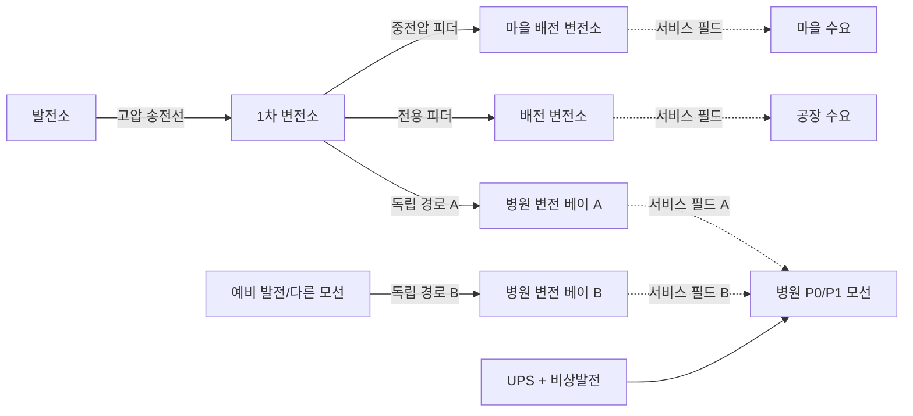

# Gridworks

> 상태: 통합 게임 기획·시스템 설계 기준서
>
> 게임명: `Gridworks`
>
> 한 줄 소개: **안전 기준을 지키면서, 다음 고장까지 가장 많은 현금을 남기는 전력망을 건설하라.**

이 문서는 제품 원칙과 **이미 개방된 시스템 규칙**을 정의하는 기준서다. 현재 구현 범위·완료조건과
첫 코드 전 Scope 0 fixture 숫자는 [첫 플레이 검증판](SCOPE_0_PLAYABLE.md)이 우선하고, 첫 코드부터
그 fixture 숫자는 `data/scenario.json`이 기계 권위다. 화면 제작 기준과 콘셉트 스케치 재현 방법은
[비주얼 제작 명세](VISUAL_PRODUCTION_SPEC.md)를 따른다. 이미지는 본문을 이해하기 위한 필수 입력이
아니며 규칙이나 숫자를 새로 정의하지 않는다.

현재 승인된 구현은 [첫 플레이 검증판](SCOPE_0_PLAYABLE.md)뿐이다. 이 문서는 완성 제품의
방향과 조건부 시스템 규칙도 설명하지만, [1.0 후보 범위](SCOPE_1_0.md)와 함께 언급된 기능은
적응형 게이트에서 별도로 열리기 전까지 구현 약속이 아니다. `현재`, `1.0 후보`, `1.0 이후`의
세 층을 섞지 않는다.

## 0. 게임 비전

마을, 병원, 공장과 지형은 존재하지만 전력 인프라는 부족하다. 플레이어는 지역 전력회사와
인프라 건설 책임자가 되어 발전소, 송전선과 철탑, 1차 변전소, 배전 변전소를 직접 배치하고
공사한 뒤 그 계통을 운영한다.

게임의 핵심은 다음 네 문장이다.

1. **전기가 들어온 변전소만 주변에 서비스 권역을 만든다.**
2. **그 권역은 발전소까지 실제 송전 경로로 연결되어야 한다.**
3. **가장 싼 계통이 아니라, 고장 하나를 견디는 계통 중 가장 싼 계통이 좋은 계통이다.**
4. **전기를 실제로 전달해 팔면 돈을 벌고, 끊으면 보상금을 낸다.**

마을과 공장은 플레이어가 짓는 도시 건물이 아니라, 전력을 공급해야 할 수요처다.
플레이어의 역할은 지역 전력회사 겸 인프라 건설 책임자다.

지도는 완전히 빈 지역, 부분적으로 전력망이 깔린 지역, 노후 설비를 인수해 교체해야 하는
지역을 모두 지원한다. 어떤 시작 상태에서도 공간 건설, 실제 전력 흐름, 공사 시간, 경제와
신뢰도 규칙은 동일하게 작동한다.

### 0.1 플레이어가 실제로 경험하는 게임

플레이어는 빈 땅에 마음대로 도시를 만드는 시장이 아니다. 이미 사람들이 살고 병원이
환자를 받고 공장이 주문을 수행하는 지역을 인수한다. 첫 화면에서 보이는 것은 건설 가능한
건물 목록보다 “누가 언제까지 얼마의 전력을 필요로 하는가”다. 마을은 저녁에 수요가 오르고,
병원은 작은 순간 정전도 허용하지 않으며, 공장은 많은 전력을 사는 대신 사전 계약에 따라
일시 감축할 수 있다. 이 차이가 모든 건설 선택의 출발점이다.

플레이어는 먼저 지도를 읽는다. 발전소 후보지에서 마을까지 직선을 긋는 것이 아니라 강을
어디서 건널지, 기존 회랑과 고장 경계를 공유하는지, 병원에 두 번째 경로를 어떻게 독립시킬지 판단한다.
경로를 그리는 동안 게임은 돈, 공사일, 파생 철탑 수와 예상 손실을 즉시 계산한다. 더 짧은 노선이
항상 좋은 것은 아니다. 같은 철탑 회랑이나 같은 모선을 공유하면 한 번의 사고에 두 회선이
함께 무력화될 수 있기 때문이다.

발주 뒤에는 시간이 흐른다. 지역 공사팀은 기초를 만들고 철탑을 세우고 도체를 건 뒤 시험한다.
공사가 끝나기 전의 선로는 전기를 전달하지 않는다. 시운전에 성공하면 발전소에서 변전소까지
전류가 이어지고, 변전소 주변의 서비스 필드 안에 있는 건물이 순서대로 켜진다. 이 순간은
건설의 보상이자 앞으로 지켜야 할 약속의 시작이다. 공급된 MWh는 매출이 되고, 공급하지 못한
MWh는 잃은 매출과 보상금이 된다.

평상시에는 자동급전이 플레이어의 운전 정책에 따라 발전기와 저장장치를 조절한다. 플레이어는
매분 숫자를 맞추는 대신 다음 폭염, 정비일과 수요 증가를 보며 설비를 보강한다. 위기가 오면
시간이 느려지고, 평소에 숨겨졌던 설계의 약점이 드러난다. 한 선로가 끊겼을 때 우회 경로가
살아 있는지, 배터리가 저녁까지 버티는지, 공장 감축 계약을 너무 늦게 부르지 않았는지가
결과를 결정한다.

사고가 끝나면 게임은 성공·실패만 선언하지 않는다. 어떤 고장이 어떤 변전소를 거쳐 어떤
고객에게 영향을 주었는지, 무엇이 피해를 줄였는지, 얼마를 벌고 얼마를 보상했는지를 한
원인 사슬로 설명한다. 플레이어는 그 보고서를 바탕으로 다음 공사를 결정한다. 따라서 한
세션은 “짓고 끝나는 퍼즐”이 아니라 `약속 → 투자 → 운영 → 시험 → 학습`의 반복이다.

### 0.2 이 게임이 주려는 감정

초반의 감정은 부족함이다. 돈과 공사시간이 제한되어 있어 모든 수요처를 최고 사양으로 지킬
수 없다. 중반의 감정은 소유감이다. 플레이어가 직접 고른 경로와 변전소가 지도에 남고,
도시의 불빛이 자신의 설계에 의존한다. 위기의 감정은 공포보다 책임감에 가깝다. 문제는
갑자기 생겼지만 원인은 이전 선택과 연결되어 있고, 대응 수단의 도착시간과 비용도 보인다.
마지막 감정은 안도와 후회가 함께 있어야 한다. 병원을 지킨 우회선은 비쌌지만 가치가 있었고,
미뤄 둔 정비는 결국 더 큰 비용으로 돌아왔다는 사실을 플레이어가 스스로 설명할 수 있어야
한다.

숫자의 현실성은 이 감정을 지탱하는 수단이지 목적이 아니다. 전문 지식이 없는 플레이어도
“이 선은 너무 뜨겁다”, “이 병원은 한 경로에 의존한다”, “이 발전소는 싸게 돌지만 늦게
완공된다”를 이해할 수 있어야 한다. 전문 수치는 그 직관을 확인하거나 더 깊이 파고들 때
제공한다.

### 0.3 핵심 용어를 쉬운 말로 정의하기

| 용어 | 이 게임에서 뜻하는 것 | 뜻하지 않는 것 |
|---|---|---|
| 서비스 필드 | 통전된 배전 변전소가 지역 저압망을 통해 접속할 수 있는 권역 | 발전소 없이도 전기를 만드는 마법 범위 |
| 통전 | 발전소 또는 살아 있는 외부 전원까지 닫힌 전기 경로가 있고 설비를 사용할 수 있는 상태 | 건설이 끝났다는 사실만으로 성립하는 상태 |
| 유효 정격 | 날씨·상태·정비를 반영해 지금 안전하게 쓸 수 있는 MW | 설비 명판에 적힌 영구 고정값 |
| 예비력 | 사고 뒤 정해진 시간 안에 실제 낼 수 있는 추가 MW | 꺼진 발전기 명판의 단순 합계 |
| 독립 N-1 | 전기 설비 하나를 잃어도 중요부하 기준을 지키는가에 대한 검사 | 산불처럼 여러 설비를 함께 잃는 모든 재난의 보증 |
| 공통원인 위험 | 같은 회랑·부지 때문에 여러 설비가 함께 영향을 받는 위험 | 독립 N-1과 같은 하나의 점수 |
| 사용불가 | 고장·정비·보호동작 때문에 전력을 전달할 수 없는 상태 | 반드시 파괴되어 영구 복구 불가능한 상태 |
| 수요반응 | 사전 계약에 따라 고객이 일정 시간 사용량을 줄이는 유상 조치 | 사고 뒤 일방적으로 전기를 끊는 무상 정전 |
| 시운전 | 공사 완료 자산의 접속·보호·전압·지급조건을 확인하고 계통에 편입하는 절차 | 완공 버튼을 누르는 즉시 생략되는 연출 |

문서와 UI는 전문 용어를 먼저 제시한 뒤 설명하지 않는다. 먼저 쉬운 결과를 말하고 필요할
때 정확한 용어와 계산을 펼친다. 예를 들어 `N-1 실패`만 띄우지 않고 “이 모선이 고장 나면
병원의 두 선이 함께 꺼집니다”를 먼저 보여준다.

## 1. 제품 정의

| 항목 | 결정 |
|---|---|
| 장르 | 싱글 플레이 아이소메트릭 전력망 건설·운영 전략 |
| 플랫폼 | 우선 PC/macOS, 마우스·키보드 중심 |
| 한 세션 | 캠페인 임무 45~90분, 고정 챌린지 30~60분 |
| 시간 | 평상시 고속 진행, 경보 시 자동 감속, 언제든 정지 |
| 도시 | 이미 존재하는 마을·병원·공장·공공시설이 성장하거나 authored 일정에 따라 공급 의무로 활성화됨 |
| 건설 | 현재 authored 배치·회랑; 사람 증거가 있을 때 자유 배치와 거리·강 횡단 견적 개방 |
| 물리 | 현재는 단순 용량 그래프; 관찰된 필요가 있을 때만 전력조류·손실·열·섬 분리를 단계 개방 |
| 승리 | 의무 수요의 안전 기준을 통과한 뒤 같은 외부조건에서 기말 현금을 최대화 |
| 실패 | 파산, 병원 장기 정전, 회복 불가능한 광역 정전, 계약상 최저 공급률 위반 |
| 1.0 후보 모드 | 최대 3장 핵심 캠페인, 동일 지도 기반 고정 챌린지 |
| 후속 방향 | 1.0 증거를 본 뒤 원전·데이터센터·공유 냉각수 확장을 우선 검토 |

플레이어 판타지는 “기계를 돌리는 기술자”에만 머물지 않는다. 지도를 내려다보면 어디에
얼마를 써서 누구를 살렸는지가 한눈에 보여야 한다. 송전선 하나는 단순한 장식이 아니라
예산, 공사 기간, 수용 용량, 노후도와 우회 가능성을 모두 가진 약속이다.

## 2. 디자인 기둥

### 2.1 전력은 공간을 통해 전달된다

발전량 총합만 맞추면 끝나는 게임이 아니다. 발전소와 수요처 사이에 실제 연결 경로가
있어야 하며, 중간의 모든 선로와 변전소가 흐르는 전력을 감당해야 한다. 1.0에서는 거리와
강 횡단이 가격을, 모선·회랑 공유가 안전성을 바꾼다.

### 2.2 변전소는 서비스 권역을 만든다

플레이어가 직관적으로 이해할 수 있는 핵심 규칙이다. 전원이 들어온 배전 변전소는 주변
지면에 `서비스 필드`를 만든다. 범위 안의 호환 수요처는 배전선을 개별로 긋지 않아도
접속된다. 이것은 판타지 에너지가 아니라 마지막 배전망을 추상화한 게임 표현이다.

### 2.3 싸게 짓되 여유를 남긴다

직선 하나로 모든 시설을 잇는 망은 가장 싸지만 선로 하나가 끊기면 모두 꺼진다. 모든
경로를 이중화하면 안전하지만 파산한다. 플레이어는 병원에는 이중 경로를, 공장에는 유상
수요 감축을, 마을에는 적당한 예비 용량을 배치하는 식으로 위험을 다르게 가격화한다.

### 2.4 위기는 사전 선택의 결과를 드러낸다

폭염이나 노후 선로 고장은 정답을 무효화하는 주사위가 아니다. 예방정비, 예비력,
우회망, 배터리와 수요 감축 계약에 미리 쓴 돈이 가치가 있었는지를 검증하는
시험이다. 위험은 범위와 근거가 먼저 보이고, 사고 후에는 원인 경로가 설명된다.

### 2.5 설비가 곧 도시의 생존권이다

미술과 사운드는 전력망을 추상 숫자가 아니라 주민과 산업이 의존하는 생명선으로 보이게
한다. 켜진 병원, 느려진 공장, 어두워진 외곽 마을이 계통 상태의 결과여야 한다.

### 2.6 장기 확장은 원전·데이터센터·냉각수 한 축에 집중한다

최종 제품의 우선 차별화 방향은 여러 발전원을 넓게 수집하는 포트폴리오가 아니다. 플레이어가
높은 출력의 원전을 직접 입지·건설하고, 외부 데이터센터 프로젝트의 부지·서비스분율·접속과
냉각상태를 승인·조정해 두 시설이 같은 전력망과 하나의 냉각수 권역을 공유하게 만드는 것이다.
수랭은 전력을 아끼지만 물과 수원지 거리에 묶이고, 공랭은 물을 아끼지만 특히 폭염에 계통
피크를 키운다.

다만 1.0은 이 확장을 동시에 검증하지 않는다. 기존 소형 가스발전만 시작 자산으로 확정하고,
배터리와 위기용 임대 피커도 관련 선택의 필요가 사람 플레이에서 관찰된 경우에만 조건부로
연다. 원전·데이터센터·냉각수는 전력망 건설·신뢰도 핵심이 검증된 뒤 별도 milestone으로
열며, 석탄·풍력·태양열 같은 일반 발전 포트폴리오와 프로젝트 금융은 함께 끌어오지 않는다.

### 2.7 세 레이어의 우선순위는 같지 않다

제품의 중심은 **공간 건설과 신뢰도 계획**이다. 평상시 계통 운전은 플레이어가 정한 정책으로
자동화하고, 직접 급전·차단기 조작은 위기 때의 전술 레이어로 제한한다. 1.0은 현금, 전력
판매, 운영비와 정전 보상만 사용하며 공간 건설과 신뢰도 계획부터 검증한다. 프로젝트 금융은
후속 원전·데이터센터 확장과도 분리된 별도 후보이며 장기 레이어로 예약하지 않는다.

## 3. 핵심 플레이 루프

```text
수요·지형 조사
  → 발전원과 변전소 부지 선정
  → 송전 경로를 그리고 비용·기간·안전성 비교
  → 공사 계약 및 단일 대기열 순서 결정
  → 시운전과 계통 투입
  → 평상시 운영·요금 수입·정비
  → 폭염·고장·증산 같은 사건 대응
  → 사고 보고서와 기말 현금·순캠페인 비용 확인
  → 보강·교체·우회망 투자
```

한 번의 작은 루프는 `배치 → 연결 → 점등`의 즉각적인 만족을 준다. 긴 루프는 `절약 →
취약성 노출 → 보강 → 더 큰 수요 수용`으로 진행된다.

### 두 개의 시간 눈금

공사와 사고를 같은 속도로 흘리지 않는다.

- **달력 모드**: 평상시에는 `x1 / x4 / x16 / 다음 이정표까지`로 일·주 단위 공사와
  수요 성장을 빠르게 진행한다. 한 임무는 보통 게임 안의 30~120일을 다룬다.
- **운영 모드**: 경보가 발생하면 `정지 / x1 / x2 / x4`로 바뀌고 분 단위 열 누적,
  배터리와 차단기 조작을 처리한다. 중요한 차단·고장에는 자동 정지한다.
- 발전소나 대형 송전선처럼 한 임무보다 오래 걸리는 공사는 장 사이에도 진행 상태가
  유지될 수 있다. 확장 캠페인의 달력 길이는 해당 milestone을 실제로 열 때 정한다.

본문 설명에서는 `day 75` 같은 축약을 허용하지만 플레이어에게 노출되는 절대시각은 항상
`DAY 75 16:00` 형식으로 표시한다. 기간과 기한은 `4일 공사`, `마감까지 2일`처럼 의미를 붙인다.

플레이어가 아무 결정을 기다리지 않는 시간은 자동으로 압축한다. 반대로 과부하 선로가
몇 분 뒤 차단될 때는 남은 시간을 정확히 보여준다.

아래 시간 적분·해시 계약은 시간축과 저장·리플레이 게이트가 각각 열린 뒤에만 적용하며
Scope 0의 완료조건이 아니다. 통합 후보의 권위 시간 모델은 하나의 `AdvanceOneMinute()`뿐이다.
달력 고속 진행도 시간을
수학적으로 건너뛰지 않고, 화면 렌더링과 UI 갱신 빈도를 낮춘 채 1분 틱을 CPU가 허용하는
만큼 반복한다. 이벤트 큐는 다음 자동정지 시각을 찾지만 상태 적분을 생략하지 않는다.

- **달력 고속 진행**: 한 프레임에 여러 1분 틱을 묶어 실행하고 렌더링을 간헐적으로 갱신한다.
- **위기 진행**: 같은 1분 틱을 한 번씩 보여주며 플레이어 명령을 받을 수 있게 한다.
- **빠른 사고**: 발전기·선로 탈락 직후의 자동 절체, 초고속 저장 반응과 자동 부하차단은
  한 1분 틱 안의 순서 있는 사건으로 해결한다.

저장·리플레이 게이트까지 열렸다면 같은 명령·외부사건 입력에서 화면을 그리는 실시간 실행과
무렌더링 고속 실행의 canonical state hash가 같아야 한다. 프로파일링 뒤 실제 병목이 확인될
때만 변화 없는 하위 시스템의
계산 생략이나 증명 가능한 선형 누계를 단계적으로 도입한다. 별도의 정적 밸런스 시뮬레이터는
후보 파라미터를 거르는 비권위 도구이며 이 시간 모델을 대체하지 않는다. 위기가 끝났을 때
이전 달력 속도로 돌아갈지 일시정지를 유지할지는 접근성 설정으로 둔다.

### 플레이 10분의 예

1. 마을 18 MW와 병원 8 MW의 신규 의무가 authored 일정에 따라 활성화되고, 같은 상위 회랑에는 12 MW 공장이
   이미 연결되어 있다.
2. 마을 배전 변전소를 두 후보지에 놓아 서비스 범위와 상위 연결거리를 비교한다.
3. 발전소까지 가장 짧은 송전 경로는 강을 건너므로 싸지만 공사 기간이 길다.
4. 더 긴 독립 회랑은 1.2 M 비싸지만 같은 상위 고장에 함께 끊기지 않는다.
5. 공사를 발주하면 건설비 전액이 빠지고 단일 대기열에서 철탑이 순서대로 완성된다.
6. 시운전 후 서비스 필드가 켜지고 범위 안의 주택과 병원에 불이 들어온다.
7. 폭염은 40 MW 마을 변전소의 유효 정격을 36 MW로 낮추고 마을·병원 피크를 34 MW로,
   공장을 포함한 상위 회랑 피크를 48 MW로 올린다.
8. 플레이어는 공장 4 MW 감축으로 상위 회랑 여유를 만들고, 예약한 배터리로 병원 피크를
   지킨다. 싸게 넘겼지만 배터리 SOC가 줄어 다음 시간대의 여유는 작아진다.

### 세션의 다섯 단계

한 임무는 시스템을 한꺼번에 던지지 않고 다섯 단계의 압력 곡선으로 진행한다.

1. **인수와 진단**: 플레이어는 기존 계통, 수요 계약, 현금, 공사 기한과 알려진 위험을
   받는다. 이때는 정답을 요구하지 않고 어디가 단일 경로인지, 어느 회선이 노후 태그인지
   표시한다.
2. **새 의무**: authored 일정에 따라 마을, 병원 또는 공장 의무가 자동 발효된다. 플레이어는
   계약 수락·거절이나 요금 협상이 아니라 필요한 MW, 서비스율과 정전 보상 책임을 만족할
   설계와 공사 순서를 결정한다.
3. **건설과 운영**: 부지와 경로를 정하고 공사를 발주한다. 수요가 증가하는 동안 플레이어는
   공사 순서와 현금을 배분하고, 배터리 예약 SOC와 위기 대비 계약을 조정한다.
4. **시험 사건**: 예보된 폭염, 계획 정비 또는 설비 경고가 여러 단계로 다가온다. 준비
   시간이 끝나면 한 개 이상의 설비가 감용되거나 사용불가가 되어 망의 실제 여유를 시험한다.
5. **복구와 결산**: 서비스율을 회복한 뒤 원인·대응·비용을 검토한다. 임시 우회나 비상연료를
   사용했다면 다음 임무로 넘길 영구 복구 의무가 생긴다.

각 단계에는 하나의 주 질문이 있다. 진단에서는 “어디가 취약한가”, 새 의무에서는 “이 수요를
어떻게 감당할 것인가”, 건설에서는 “어떤 위험을 돈으로 줄일 것인가”, 사건에서는 “무엇을 먼저
살릴 것인가”, 결산에서는 “다음에는 무엇을 바꿀 것인가”다. UI와 튜토리얼은 이 질문보다
앞서 새로운 전문 용어를 제시하지 않는다.

### 결정의 세 시간범위

- **지금 15분**: 배터리, 자동절체, 피커와 DR로 사고 직후의 부족분을 막는다.
- **다음 며칠**: 공사 대기열, 임시선과 예방정비 순서를 정한다.
- **다음 장**: 소형 발전소, 영구 회랑과 배터리 중 먼저 지을 것을 결정한다.

좋은 선택은 한 시간범위만 최적화하지 않는다. 배터리를 지금 모두 쓰면 즉시 정전은 막지만
저녁 피크를 잃을 수 있고, 가장 싼 임시선을 오래 유지하면 다음 사건 때 더 큰 복구비를 낸다.
게임은 선택 버튼 옆에 `도착시간`, `지속시간`, `즉시비용`, `후속의무`를 함께 표시해 이
연결을 글과 숫자로 설명한다.

## 4. 월드와 전력망의 두 겹 구조

두 겹 구조는 제품 원칙이지만 충실도는 단계적으로 연다. Scope 0은 authored 노드·간선의
`연결 여부 → 병목용량 → 우선순위 공급 → 고정 사고 제거`만 계산한다. 자유 geometry,
메시형 전력조류와 동적 topology는 사람 검증 뒤 조건부 게이트다. 따라서 아래의 공간·전기
책임 분리는 처음부터 지키되, 미개방 계산을 빈 interface로 선구현하지 않는다.

### 4.1 공간 월드

공간 월드는 다음을 책임진다.

- 설비의 위치, 회전, 점유 면적과 접속 포트
- 선로의 꺾임점, 길이, 철탑 간격과 지형 통과 비용
- 마을·병원·공장의 건물 위치와 서비스 필드 포함 여부
- 강 횡단, 금지 구역과 공통위험 회랑
- 화면에 보이는 공사 단계와 손상 상태

### 4.2 전기 그래프

물리 게이트가 열리면 전기 그래프는 다음을 책임진다.

- 발전소와 변전소의 모선
- 송전선, 배전 피더, 변압기의 간선
- 선로별 전력 흐름, 손실, 정격, 온도와 차단 상태
- 계통 분리, 발전·수요 균형, 불균형 대응 대리모델과 자동 부하 차단
- 발전소의 출력, 기동 시간, 연료와 예비력

3D 오브젝트가 직접 게임 규칙을 계산하지 않는다. 공간 월드에서 공사가 완료되면 하나의
원자적 명령으로 전기 그래프에 노드와 간선을 추가한다. 저장과 리플레이는 이 명령을 같은
순서로 재현한다.



## 5. 서비스 필드 규칙

### 5.1 활성 조건

변전소의 서비스 필드는 아래 조건을 모두 만족할 때만 활성화된다.

1. 공사가 끝나고 시운전을 통과했다.
2. 상위 모선에서 변전소까지 닫힌 전기 경로가 있다.
3. 변전소와 상위 선로가 사용 가능 상태다.
4. 변전소가 최소 여자 전력과 자체 사용 전력을 공급받는다.

미연결 변전소는 회색 점선 범위만 보이며 주변 건물을 켜지 못한다. 전원이 들어오면 중심에서
바깥으로 육각 셀이 점등되어 “연결 성공”을 즉시 보여준다.

판정은 수평 유클리드 반경 하나만 사용하고, 25 m 육각 셀은 그 결과를 그리는 표현이다.
서비스 필드가 지역 저압 배전망까지 추상화하므로 도로·경사·건물·강은 반경을 바꾸지 않는다.
강 건너 수요까지 서비스하고 싶다면 그쪽 반경 안에 변전소를 두고 상위 선로를 연결한다.

### 5.2 접속 대상과 용량 배분

- 범위 안에 있고 변전소 전압 등급과 호환되는 수요처만 후보가 된다.
- 다른 변전소로 넘길 수 있는 수요처는 실제 예비 피더와 절체 설비가 설치된 후보만 포함한다.
  서비스 필드가 겹친다는 사실만으로 전력이 순간이동하지 않는다.
- 공급 배정은 P0→P1→P2→P3, 부족 때 차단은 P3→P2→P1 순서다. 같은 등급에서는 scenario의
  authored `ShedOrder`를 쓰며 P0는 자동 차단하지 않는다.
- 변전소가 공급할 수 있는 전력은 `정격`, `실제 유입 가능 전력`, `온도 보정 정격` 중
  가장 작은 값이다.
- 용량이 부족하면 전체 필드가 갑자기 꺼지지 않는다. 권위 상태는 수요점 하나의 집계 공급률만
  계산하고, 화면은 그 비율만큼 authored 외곽→내곽 순서의 셀을 호박색으로 바꾼다. 셀은
  개별 부하나 실제 차단구역이 아니라 결정론적 시각화다.
- 겹치는 필드의 건물은 접속할 때 플레이어가 `주 공급` 하나를 고른다. 중요시설 이중화
  모듈이 있는 병원만 `예비 공급` 하나를 추가로 고를 수 있다. 설정하지 않은 변전소로는
  자동 재배정하지 않으므로 거리 가중치·부하율 점수·전환 비용·히스테리시스 파라미터가 없다.

서비스 오버레이는 세 상태를 색과 패턴으로 분리한다.

1. `기하학적 범위`: 피더를 설치하면 접속할 수 있는 셀
2. `전기적 활성`: 상위 계통에서 변전소까지 전원이 들어온 셀
3. `실제 공급`: 현재 용량 배정과 우선순위에 따라 계량 중인 셀

출시 시나리오의 서비스 필드는 `AggregateLoadOnly` 축약모델 하나만 쓴다. 전압강하·무효전력·
3상 불평형을 직접 계산하지 않으며 이 모델로 전압품질을 주장하지 않는다. 상세 배전모델용
interface나 빈 데이터 필드는 1.0에 만들지 않는다.

### 5.3 변전소 유형

아래 수치는 첫 밸런스 프로토타입용이며 실제 공학 가격을 뜻하지 않는다. 화폐 `M`은
게임 안의 백만 예산 단위다.

| 설비 | 서비스 반경 | 정격 | 비용 | 기본 공기 | 용도 |
|---|---:|---:|---:|---:|---|
| 배전 변전소 | 550 m | 40 MW | 6 M | 14일 | 마을·병원·1.0 공장이 공유하는 단일 형식 |
| 1차 변전소 | 없음 | 180 MW | 18 M | 35일 | 154 kV를 66 kV 하위망으로 분배 |
| 중요시설 이중화 모듈 | 반경 변화 없음 | 2×40 MW | +6 M | +7일 | 분할 모선·독립 E1/E2 베이·자동 절체 |

1.0의 마을·병원·공장은 같은 배전 변전소를 사용한다. 수요 프로필과 정전 비용만 다르며,
산업 전용 변전소·이동식 변전소·광역 허브는 후속 범위다. 병원은 기본 변전소에 중요시설
이중화 모듈을 붙이고 서로 다른 상위 모선과 회랑의 두 경로를 연결해야 `이중 공급`이다.

이중화 모듈은 UI에서 한 시설처럼 보이지만 전기 그래프에는 방화벽으로 분리된 A/B
변압기 베이와 분할 모선 두 개로 존재한다. 각 베이가 중요 부하 100%를 감당한다. 설치용량은
`2×40 MW`지만 정상 firm service capacity와 한 베이 제거 뒤 firm service capacity는 모두
40 MW다. 두 베이를 합쳐 80 MW 부하를 붙일 수 없다. 두 경로는
선로 구간, 차단기, 변압기 베이, 상위 1차 변전소와 동일 물리 회랑을 공유하지 않아야 완전
독립이다. N-1 제거 단위도 UI 카드 전체가 아니라 독립 베이·상위 자산 각각이다.

병원 건물의 P0 모선에는 무정전 UPS가 직접 붙어 자동 절체와 비상발전 기동 사이를 15분
버틴다. 현장 연료 4시간 이상인 비상발전은 두 번째 경로를 일시 대체할 수 있지만 영구
이중화로 표기하지 않는다. 발전 측에서는 가장 큰 온라인 발전기 하나를 잃는 N-1 조건도
별도로 통과해야 한다.

## 6. 송전선과 철탑

Scope 0에서는 A/B authored 회랑을 클릭해 선택하며 선로 등급도 하나뿐이다. 아래의 자유 배선,
두 전압등급, 손실과 열은 각각 조건부 1.0 후보다. authored 회랑만으로 핵심 선택이 충분하면
제품 규칙을 더 복잡하게 만들지 않는다.

### 6.1 배선 조작

자유 경로 게이트가 사람 증거로 열렸을 때만 다음 조작을 사용한다.

1. 발전소 또는 변전소의 접속 포트를 누른다.
2. 마우스로 경로를 그리면 철탑이 허용 간격으로 자동 배치된다.
3. 클릭으로 꺾임점을 고정하고, 종점 포트를 누르면 노선이 닫힌다.
4. 확정 전 `총비용`, `공사 기간`, `철탑 수`, `예상 피크 부하율`, `손실`, `N-1 결과`를
   비교한다.
5. 공사를 발주하면 유령 노선이 공사 진행 표시로 바뀐다. 전기적으로는 전체 공사와 양단
   시운전이 끝난 뒤 한 번에 사용 가능해진다.

배선 중에는 건물과 수목의 채도를 낮추고 접속 포트, 강 횡단, 금지 구역과 기존 회랑만
선명하게 보인다. 가장 싼 경로, 가장 빠른 경로, 가장 안전한 경로를 한 번에 미리볼 수
있지만 최종 꺾임점은 플레이어가 결정한다.

전신주와 철탑은 경로 길이에서 파생한 고정 간격으로 자동 배치한다. 1.0에서는 개별 지지물의
가격·공기·상태를 따로 계산하지 않고 선로 km당 비용에 포함한다. 최종 견적은
`접속 고정비 + 거리비 + 강 횡단 고정비 + 독립 단말 설비`다.
두 선로가 지도에서 교차해도 자동으로 접속되지 않는다. 전기적으로 연결하려면 개폐소나
변전소를 명시적으로 건설해야 한다.

### 6.2 선로 등급

| 선로 | 정격 | 고정비 | 도체·회랑비 | 기본+거리 공기 | 특징 |
|---|---:|---:|---:|---:|---|
| 66 kV 전신주 피더 | 60 MW | 0.8 M | 1.1 M/km | 3일 + 4일/km | 싸고 빠르나 폭염 여유가 작음 |
| 154 kV 철탑 송전선 | 180 MW | 2.0 M | 2.7 M/km | 7일 + 6일/km | 중거리 주력, 병렬 증설 가능 |
| 임시 우회선 | 35 MW | 1.5 M | 1.8 M/km | 1일 + 1일/km | 30일 수명, 손실이 높음 |

이 표는 플레이어가 보는 건설 카탈로그다. 권위 데이터에는 아래의 최소 전기·복구 값만 둔다.

| 파라미터 | 역할 |
|---|---|
| 전압 등급과 접속 포트 | 잘못된 전압의 직접 연결 차단 |
| 리액턴스 또는 서셉턴스 | 메시형 계통의 흐름 분배 |
| 저항 근사·손실계수 | 흐름 제곱에 따른 손실 |
| 정상 정격 | 지속 가능한 장기 흐름 |
| 전역 열 시정수 | 모든 1.0 선로의 과부하 누적·냉각 속도; 자산별 override 금지 |
| 자산종류별 기상계수 | `WeatherFactor[AssetClass, GameMinute]`; 자산별 override·풍향 하위계수 없음 |
| 전기 고장·회랑·부지 그룹 | 독립 N-1과 공통원인 사건 구분 |
| 고정 복구시간 | 예방정비·고장수리의 시나리오 시간 |

선로는 변전소나 개폐소 사이의 한 회선을 권위 자산 하나로 저장한다. 1.0에서 상태를 가진
노후 대상은 시나리오가 지정한 154 kV 회선 하나뿐이며 `정상/노후/사용불가/수리중` 네 상태만
쓴다. 거리별 열화, 지지물별 상태와 중간 고장점은 만들지 않는다.

철탑·전신주 수는 노선 길이와 고정 간격에서 파생되어 지도에 배치하지만 별도 비용·공기
파라미터를 갖지 않는다. 표의 고정비와 km당 비용·공기가 기초, 도체와 양단 시험을 모두
포함한다. 1.0 공기는 단일 산식 `ceil(고정일 + 길이×거리일 + 강 횡단 추가일)`로 계산하며
구간별 작업 DAG나 병렬 작업반은 없다.

추가 비용 계수 예시:

- 강 횡단: 노선당 고정 6.14 M, 공기 +22.2일
- 독립 상위모선 단말: 노선당 고정 3.87 M, 공기 +20일

급경사, 도로 할인, 주거지 보상, 회랑 병렬 할인과 지지물별 상태는 후속 범위다. 1.0에서
노선 선택을 바꾸는 공간 변수는 `길이`, `강 횡단`, `독립 모선·회랑 여부` 세 가지뿐이다.

### 6.3 흐름, 손실과 열

물리 게이트가 열리면 내부 계산은 메시형 계통에서 전력이 자동으로 나뉘는 DC-like
전력조류를 사용한다.
플레이어가 지정한 “한 경로”로 물류처럼 흘리는 방식은 사용하지 않는다. 대신 선택한 선로에
현재 흐름 방향과 `현재 MW / 유효 정격 MW`를 표시한다.

선로 손실은 다음 형태로 근사한다.

```text
손실 = 손실계수(전압, 길이, 상태) × 흐름²
```

각 전기적 섬의 계산 순서는 고정한다.

```text
1. 자동급전 정책으로 발전·수요 균형의 초기값을 만든다.
2. 섬마다 결정론적 기준 모선을 고른다.
3. Bθ = P를 풀어 손실 없는 1차 선로 흐름을 계산한다.
4. 각 선로의 손실 kF²를 계산해 절반씩 양단의 추가 수요로 배분한다.
5. 손실은 온라인 발전기의 participation factor와 재급전 정책으로 보충한다.
6. 3~5를 정확히 4회 반복한다. 네 번째 반복 뒤 최대 모선 전력수지 잔차 또는 직전 반복 대비
   총손실 변화가 0.001 MW를 넘으면 `NumericalFault`, 아니면 흐름을 1 kW 단위로 양자화한다.
7. 부족과 잉여를 아래의 서로 다른 순서로 해소한다.
```

`ReferenceBusResolver`는 grid-forming 가능한 온라인 가스발전기 중 가장 작은 안정 `AssetId`를
기준 모선으로 고른다. 공급원이 없는 섬은 무전압
섬으로 분류해 행렬을 풀지 않는다. 모선과 행렬 행은 안정 ID 순서로 만들고 관리 코드의 고정
선형해법과 고정 피벗 동률 규칙을 쓴다. 행렬 특이, NaN 또는 예상 밖 비수렴이 발생하면 이전
틱 흐름을 재사용하거나 게임 속 정전으로 정산하지 않는다. 시뮬레이션 시간을 멈추고
`NumericalFault` 진단 fixture를 저장한다. 공급원 없는 섬과 실제 과부하처럼 예상된 물리
상태만 게임 규칙으로 처리한다.

```text
전력 부족:
  온라인 발전 상향 재급전
  → 배터리 방전
  → 이미 발효됐거나 사전 승인 자동트리거인 계약 DR
  → P3 / P2 / P1 순 비자발적 부하차단

전력 잉여:
  온라인 발전 하향 재급전
  → 배터리 충전
  → 발전 출력 제한
```

발전기 기동은 현재 공급력에 넣지 않고 완료시각을 가진 예약 사건으로 만든다. 사고를 본 뒤
같은 틱에 최소 통보시간이 있는 DR을 새로 발효할 수 없다. 비자발적 부하차단은 계통 붕괴를
막는 보호수단이지 예비력으로 세지 않는다.

보호 판정은 양자화한 흐름을 사용하고 경보 해제에는 정격의 0.5% 히스테리시스를 둔다.
차단 후보는 `(예상 차단시각, AssetId)` 순으로 한 개씩 처리한 뒤 섬 탐지와 전력조류를 다시
푼다. 한 1분 틱에서 재해석 횟수는 시작 시 통전된 보호대상 수를 넘을 수 없다. 이 상한에
도달하거나 해석을 끝내지 못하면 `NumericalFault`로 멈추고 조용히 부분 결과를 확정하지 않는다.

플레이어에게 보이는 총 발전 MWh는 `고객 인도 + 저장 순충전 + 선로 손실 + 출력제한
전 이미 생산한 에너지`와 같은 계량 경계에서 닫혀야 한다. 완전한 AC 해석은 런타임에 넣지
않되, 선로 손실의 위치와 비용은 사라지지 않는다. 1.0 후보의 변압기 손실은 0으로
추상화하며 별도 효율 파라미터를 만들지 않는다.

1.0의 `LineThermalModel`은 상세 도체 열수지가 아니라 설명 가능한 1차 과부하 지수다.
시나리오가 제공하는 `WeatherFactor[AssetClass, GameMinute]`로 유효 정격을 구하고,
양자화한 `흐름/유효 정격`의
제곱을 한 개의 고정 열 시정수로 누적한다. 일사율·복사율·도체별 대류계수·바람 방향은 1.0
파라미터가 아니다. 노후 회선에는 시나리오의 단일 고정 노후계수를 한 번만 적용한다.

```text
유효 정격 = 명판 정격 × 자산종류별 기상계수 × 노후계수(대상 회선만 0.90, 그 외 1.00)
u = abs(양자화 흐름) / 유효 정격
H_next = H + (u² - H) / 60             # 1분 틱, 전역 시정수 60분
보호 차단 = u > 1.50 또는 H_next >= 1.00
```

`H`는 UI 표시보다 높은 정밀도의 정수 고정소수점 상태로 저장하고 매 틱 basis point로
반올림하지 않는다. UI에서만 basis point로 표시한다. `H=0`은 신규 자산의 최초 시운전에만
적용한다. 개방·보호차단·정비 중에도 상태를 보존하고, 무전류에서는 `u=0`으로 같은 식에 따라
자연 냉각한다. 재투입은 H를 초기화하지 않는다. 60분과 차단 경계는 구조 고정값이며 자산별
override나 sweep을 허용하지 않는다.

변압기는 동적 열상태나 노후·정비계수를 갖지 않는다. 별도
`TransformerEffectiveRatingResolver`가 `명판정격×자산종류별 기상계수`만 계산한다. 선로와
변압기 모두 직전 틱의 감용 결과에 계수를 다시 곱하지 않는다.

과부하는 즉시 폭발하지 않고 열을 축적한다.

| 유효 정격 대비 흐름 | 결과 |
|---:|---|
| 0~70% | 안전 여유, 정상 냉각 |
| 70~90% | 경제 운전, 단일 고장 시 혼잡 가능 |
| 90~100% | 여유 부족 경보 |
| 100~120% | 열 누적, 수십 게임 분 안에 조치 필요 |
| 120~150% | 빠른 열 누적, 보호 차단 가능 |
| 150% 초과 | 거의 즉시 차단 |

자산종류별 고정 폭염계수와 공개 노후계수는 허용흐름을 낮추고, 과부하 지수는 그 결과를 시간에 따라
누적한다. 따라서 평상시 82%인 선로가 폭염에는 96%가 될 수 있다.

## 7. 발전, 저장과 수요

### 7.1 1.0 발전·저장 설비

Scope 0에는 기존 가스발전과 병원 비상전원만 있다. 아래 배터리와 피커는 관련 선택이 사람
증거로 열린 뒤의 1.0 후보이며 발전원 비교 게임을 함께 만들지 않는다. 신규 소형 발전소는
공사 캘린더와 기말 현금에서 실제로 유효하다는 별도 게이트를 통과하기 전까지 수치와 해금일을
정하지 않는다. 아래 값은 후보 fixture이며 실제 시장가격이 아니다.

| 발전·저장 | 정격 | 비용 | 준비 | 변동비 | 게임 역할 |
|---|---:|---:|---|---:|---|
| 기존 소형 가스엔진 | 80 MW | 시작 자산 | grid-forming, 기동 45분 | 0.115 M/GWh | 기본 발전·재기동 기준원 |
| 임대 가스 피커 | 30 MW | 30일 선불 6 M | grid-following, 사전 임대·대기 시 기동명령 10분 뒤 전출력 | 0.25 M/GWh | 위기 전 계약한 단기 예비 |
| 배터리 | 35 MW / usable 70 MWh | 24 M, 40일 | grid-following, 즉시 | 없음 | 두 시간 인도 가능 예비 |

피커는 임대기간 시작 때 6 M을 한 번 선불로 내고 일할 환급하지 않는다. 사전 임대되어 대기
중인 피커만 기동명령 10분 뒤 30 MW 전출력을 낼 수 있으며 별도 동원·램프 단계를 중복 적용하지
않는다. 이 피커는 grid-following이라 온라인 grid-forming 전원이 있는 통전 섬에서만 기동하며,
무전압 섬을 가압하거나 블랙스타트하지 못한다. 배터리는 정상 가격차익보다 짧은 사고와 2시간
지속공급을 검증할 때만 연다.

1.0은 별도 기동비와 최소 운전·정지시간을 계산하지 않는다. 고정 기동시간만 지키며 실제
발전량에 같은 변동비를 적용한다. 이 단순화로 플레이어의 결정은 설비 준비 여부와 예비량에
머물고 발전기 운전계획 최적화로 번지지 않는다.

### 7.1.1 자동급전과 예비력 정책

평상시 MW를 매분 직접 맞추는 것은 플레이어의 일이 아니다. 플레이어는 아래 운전 정책을
설정하고, 예측 가능한 merit-order와 제약 휴리스틱이 정상 급전과 혼잡 재급전을 수행한다.

- 배터리의 위기 대비 예약 SOC
- 임대 피커 자동기동 허용 여부
- 공장 DR 사전무장 여부

정상 급전 순서는 `기존 가스 → 배터리 충전/예약`으로 고정한다. 위기에는 살아 있는
가스 여유 → 배터리 → 사전 임대한 피커 → 사전무장 공장 DR → P3/P2/P1 차단 순서를 쓴다.
이 화살표는 **도착한 자원의 배분 우선순위**이지 명령을 순차로 늦게 보내는 뜻이 아니다.
피커 자동기동을 허용했다면 사고를 감지한 같은 경계에 기동요청을 보내고, 플레이어가 같은
경계에 호출한 사전무장 DR과 병렬로 10분을 센다. 그동안 가스 여유와 배터리가 bridge를 맡는다.
플레이어는 발전기별 merit order를 튜닝하지 않는다. 자동화가 선택한 이유는
`수요`, `기동시간`, `혼잡`, `예약 SOC`의 네 원인 행으로 설명한다.

예비력은 하나의 명판 합계가 아니라 지속시간별 검증 능력이다.

| 구간 | 대표 수단 | 의미 |
|---|---|---|
| 즉시~1분 | 배터리 | grid-forming 전원이 살아 있는 섬의 계통 불균형 보호 |
| 15분 | 임대 피커, 사전무장 DR, 배터리 | 단기 사고를 버티는 운전 여유 |
| 2시간 | 가스 여유, 70 MWh 배터리, 지속 DR | 저장 고갈까지의 지속 가능한 공급 |

```text
EligibleReserveMW(h)
  = h 안에 실제 증가 가능한 발전 + 방전 + 사전무장 DR
BatteryEligibleMW(h), h > 0
  = 같은 섬에 온라인 grid-forming 전원이 있으면
      min(MaxDischargeMW, UsableSocMWh / hHours)
    아니면 0
RequiredResponseMW(h)
  = 시나리오 기준사고와 계약 요구 중 h에서 더 큰 값
ReserveMarginMW(h)
  = EligibleReserveMW(h) - RequiredResponseMW(h)
ReserveMarginPercent(h)
  = ReserveMarginMW(h) / CurrentFirmDemandMW × 100
```

세 구간의 퍼센트 분모는 모두 현재 확정 의무수요로 같게 한다. HUD는 각 구간의 적격 MW,
요구 MW와 마진을 함께 보이고, 좁은 화면은 숫자를 재현할 입력이 있을 때만 최저
`ReserveMarginPercent`와 `LIMITING: 2H` 같은 제약 시간대를 표시한다. 비자발적 자동
부하차단은 예비력에 넣지 않고 `비상 차단 가능량`으로 별도 표시한다. 예비력이 음수여도
부하차단 때문에 양수처럼 보이게 만들지 않는다.

피커나 DR이 10분 뒤 도착한다는 사실만으로 15분 적격성을 인정하지 않는다. 사고 시작 경계에
요청된 **각 지연 자원별로** `0~10분`은 가스 여유나 배터리가 부족분을 연속으로 메우고,
`10~15분`은 도착한 피커·DR을 포함한 대체 공급이 이어지는지 검증한다. 늦게 호출한 자원은
그만큼 도착시각도 늦춘다. 정적 스냅샷만으로 이 연결을 증명할 수 없으면
`NeedsTimelineValidation`이며 안전으로 추정하지 않는다.

Grid Reserve, 병원 P0 연속성과 블랙아웃 복구는 서로 다른 판정이다.

- `GridReserve`: 온라인 grid-forming 가스 모선이 있는 섬의 가스 여유, SOC·지속시간 한도를
  적용한 grid-following 배터리, 각 자원별 첫 10분 bridge가 확보된 경우에만 시간 안에 도달하는
  grid-following 대기 피커와 사전무장 DR
- `HospitalP0Continuity`: 독립 E1/E2, UPS와 고객 비상 디젤
- `BlackoutRecovery`: grid-forming 가스발전과 고정 30분 계통 재기동

1.0 후보 배터리는 grid-forming이나 블랙스타트 기능이 없다. 온라인 grid-forming 발전원이
없는 섬에서는 계통 예비력으로 세지 않는다. 병원 UPS·디젤도 계통 예비력에 넣지 않는다.

주파수는 1분 틱에서 Hz 동특성을 적분하지 않는다. 설비 탈락 때 `최초 불균형 MW → 자동
절체·즉시 예비력 → 부족분 자동 부하차단 → 안정화된 1분 상태` 순으로 처리하는
`FrequencyAdequacyProxy`를 쓴다. UI는 최초 부족량, 즉시 대응 MW, 자동 차단 부하와 15분 뒤
필요한 지속 공급력을 보여준다. 이는 과도안정도나 상세 보호계전 시뮬레이션이 아니다.

배터리의 `70 MWh`는 계통에 인도할 수 있는 usable AC-side 에너지다. 충전 입력의 94%만 usable
SOC에 더하고, 방전 때는 인도 MWh를 같은 양만큼 뺀다. 따라서 35 MW를 정확히 2시간 인도할
수 있으며 방전효율을 다시 곱하지 않는다. 자기방전·열화·교체주기와 처리량 비용은 없다.
충전 전력은 최종 판매가 아니며 방전 뒤 수요처 경계에 전달된 양만 매출이다.
병원 소유 UPS와 비상 디젤은 자동절체 검사에만 쓰고 플레이어 발전자산·매출로 세지 않는다.

프로젝트 채권, 공동투자, 이자·원금, 설계수명과 연환산 자본비용은 1.0에 없다. 원전·
데이터센터 확장에도 자동 포함하지 않고 [1.0 이후 방향](POST_1_0.md)의 별도 후보로만 둔다.
1.0 코드와 저장 schema에 빈 금융 필드나 미래 인터페이스를 미리 만들지 않는다.

### 7.2 수요처 차이

| 수요처 | 평시 예시 | 피크 특성 | 정전 비용 | 특별 규칙 |
|---|---:|---|---|---|
| 마을 | 12~28 MW | 아침·저녁, 폭염 냉방 | 중간 | 외곽부터 단계 감축 가능 |
| 병원 | 6~12 MW | 비교적 일정, 폭염 시 증가 | 매우 높음 | 이중 경로 또는 비상발전 요구 |
| 공장 | 20~35 MW | 교대 시작 때 급증 | 낮음 | 사전 계약한 유상 감축 가능 |

수요는 차단 우선순위도 가진다.

- `P0 생명 안전`: 중환자실·수술실·핵심 통신. 자동 차단 금지.
- `P1 필수`: 병원 일반 진료. 마지막 단계에서만 제한.
- `P2 일반`: 주거·상업. 외곽 셀부터 순환 제한 가능.
- `P3 유연`: 공장 비핵심 공정·예약 충전. 계약에 따라 먼저 감축.

공급 제한은 단순히 “행복 -10”을 만들지 않는다. 공장 감축은 고정 DR 지급금, 마을 정전은
잃은 판매와 복구 보상, 병원 정전은 안전등급·임무 실패 위험으로 환산된다.

### 7.3 원전·데이터센터 입지와 냉각수는 1.0 이후다

후속 우선 방향에서는 플레이어가 원전을 배치·건설하고 외부 사업자의 데이터센터 부지·접속을
추진한다. 원전은 큰 출력과 낮은 변동비를 주지만 냉각수와 송출망이 필요하고, 데이터센터는
큰 전력 판매수입과 높은 정전 위약을 준다. 두 시설은 하나의 `CoolingWaterZone`을 공유한다.
데이터센터가 수원지 hard cut 안에 있으면 운영 중 수랭↔공랭 전환이 가능하다. 수랭 접속은
수원지와의 직선거리에 선형 비례하는 펌프 보조전력을 쓰고, 공랭은 물 제약을 피하는 대신 특히
폭염에 최종 전력 수요를 늘린다. 원전 후보지는 주거지와의 관계를 authored `LOW/HIGH` 입지
부담으로 축약해 가까운 부지에 고정 추가비·허가 지연을 준다.

1.0의 신규 소형 가스발전은 일정·경제 게이트가 별도로 열릴 때만 후보지·비용·공기를 정한다.
원전·데이터센터·냉각수 데이터나 미래 interface는 만들지 않는다.
후속 확장의 정확한 규칙, `TBD` 목록과 명시적 비범위는
[1.0 이후 방향](POST_1_0.md)에 둔다.

## 8. 돈, 수익, 보상과 기말 현금 목표

### 8.1 돈의 흐름

이 절의 일일 결산과 전체 원장은 경제·시간축 게이트가 열린 뒤의 통합 후보 규칙이다. 현재
Scope 0은 자체 문서에 정의한 decision-marker 결산만 사용한다.

발전소는 전기를 만들기만 해서는 돈을 벌지 않는다. 수요처까지 실제로
전달되어 계량된 전력량만 판매로 정산한다. 버리거나 출력 제한한 전력은 매출이 0이고 연료·
변동비는 이미 사용한 만큼 남는다.

경제 시스템의 목적은 회계 자체를 퍼즐로 만드는 것이 아니라 설계의 결과를 돈으로 되돌려
주는 것이다. 값싼 단일 회선은 처음에는 현금을 남겨 다음 인프라 의무를 준비하게 하지만,
사용불가가 되면 판매가 멈추고 보상금·피커·DR·수리비가 동시에 발생한다. 반대로 너무
많은 예비 회선은 사고를 쉽게 넘기더라도 큰 건설비 때문에 다음 공사를 늦춘다. 플레이어가
비교해야 하는 것은 `지금 지불할 돈`, `평상시에 벌 돈`, `고장 때 잃을 돈`이다. 대출·이자·
자기자본 조달은 이 판단을 흐리므로 1.0 경제에 존재하지 않는다.

예를 들어 자동 발효된 공장 의무는 큰 매출을 주지만 저녁 피크에 병원과 같은 회랑을 사용할
수 있다. 플레이어는 새 회선을 건설하거나, 고정된 공장 DR 옵션을 사전무장하거나, 가스 피커를
대기시킬 수 있다. 세 선택은 현금 흐름의 시점과 사고 때의 행동 가능성이 다르다. 견적 화면은
이 차이를 `초기 현금`, `평시 일수익`, `IncidentEconomicImpact`, `완공일`로
나눠 보여주고 하나의 불투명한 총점으로 숨기지 않는다.

`IncidentEconomicImpact`는 확률을 임의로 곱한 기대값이 아니다. 시나리오가 이름, 시작상태,
날씨·수요 이력과 제거할 설비를 고정한 하나 이상의 스트레스 케이스를 같은 견적에 적용해
추가 연료·DR·보상·수리비를 합산한 값이다. UI는 예를 들어 `폭염 피크 + 회랑 A 사용불가
2시간`처럼 어떤 사건을 계산했는지 함께 표시하며, 발생확률을 검증하지 않은 채 현실 위험의
기대비용처럼 말하지 않는다.

```text
수요처 i의 의무 MWh = max(0, 기준 MWh - 사전 승인 DR MWh)
수요처 i의 공급 MWh = 계약 경계 계량기의 실제 인도량
수요처 i의 미공급 MWh = max(0, 의무 MWh - 공급 MWh)

전력 판매 매출 = Σ(공급 MWh ÷ 1,000 × 단일 판매단가[M/GWh])
운영 현금흐름 = 전력 판매 매출 - 발전 변동비 - 피커 임대료
                - 수요반응 지급금 - 정전 보상금 - 수리비
기말 현금 = 기초 현금 - 건설 발주액 + 운영 현금흐름
```

내부 구현의 `ServiceContractId`는 플레이어가 수락·거절하는 계약이 아니라 authored 일정에
자동 발효되는 공급 의무의 안정 ID다. UI는 이를 항상 `공급 의무`라고 부른다. 매출 계량점은
그 ID가 소유한 수요처 경계 하나뿐이다. 서비스 필드가 겹쳐도
같은 `DemandPointId`는 한 번만 계량한다. 선로 양단, 변전소 통과량, 배터리 충전은 매출이
아니다. 발전 변동비는 발전기 모선의 실제 주입 MWh에 붙는다. 사전에 출력 제한해 만들지
않은 전력에는 변동비가 없지만, 이미 생산한 뒤 버린 전력에는 비용이 남는다.

P0 안전판정 경계는 병원 내부 핵심모선이다. 승인된 UPS·비상발전이 자동절체 공백을 메우면
P0 미공급은 아니지만, 그 시간이 상위 전력회사 공급 가용성으로 둔갑하지는 않는다. 계약은
1.0에서 `E1/E2 독립`, `절체 10초 이하`, `UPS 15분`, `비상 디젤 4시간`으로 고정한다.
고객 소유 비상발전 MWh는 전력 판매 매출이 아니며, 운영자 소유 설비만 계약 단가와 연료비를
한 번씩 정산한다. 내부전원이 P0를 지켜도 전력회사 경계에서 공급하지 못한 MWh에는 판매가
없고 해당 고객등급 보상이 발생한다. Scope 0의 총 4시간 패키지는 첫 실험만을 위한 더 작은
fixture이며 이 후보의 `UPS 15분 + 디젤 4시간`을 재정의하지 않는다.

1.0의 수입은 실제 전달·계량한 전력 판매 하나뿐이다. 지출은 건설비, 가스 변동비, 피커
임대료, 공장 DR 지급금, 미공급 보상과 수리비뿐이다. 접속 분담금, 용량대금, 피크 요금,
탄소가격, 보조금, 수출입, 세금, 감가상각, 대출과 이자는 후속 범위다.

보상은 정전이 끝나야 생기는 비용이 아니다. 각 권위 1분 틱의 미지급 보상채무를 발생시켜 다음 일일
결산에 지급한다. 계획한 유상 수요반응은 사전 계약
가격만 지급하며 정전으로 보지 않지만, 플레이어가 일방적으로 끊은 부하는 미공급이다.

```text
이번 틱 보상채무 = Σ(등급별 미공급 MWh ÷ 1,000
                       × 고객등급별 보상 단가[M/GWh])
OutageCompensationCost = 모든 틱 보상채무
```

용어는 비용 범위를 숨기지 않는다. `LostSales`는 공급하지 못해 사라진 판매수입,
`EmergencyOperatingSpend`는 피커·DR 같은 대응비, `RepairSpend`는 수리비다.
`IncidentEconomicImpact`는 다음 네 항목 합으로만 표시한다.

```text
IncidentEconomicImpact = LostSales + OutageCompensationCost
                       + EmergencyOperatingSpend + RepairSpend
```

보상금만을 “사건 총비용”이라고 부르지 않는다. 이 진단합의
`LostSales`는 이미 발생하지 않은 매출이므로 기말 현금에서 다시 지출로 차감하지 않는다.

보상은 고객등급 세 개의 단가만 사용하고 사고 기본금, 지속시간 배수와 별도 SLA 위약을
1.0에서 쓰지 않는다. 잃은 사용 요금은 애초에 매출이 없었던 것이므로 보상에 다시 더하지
않는다. 병원 P0는 보상금을 냈다고 안전 실패가 지워지지 않는다. 일일 결산액을 낼 현금이
부족하면 별도 신용 인출 없이 파산한다.

강제 정전 사건은 `ServiceContractId`의 공급률이 100% 아래인 첫 틱에 열리고 100%로 돌아온
틱에 닫힌다. 보상은 미공급 MWh에만 비례하므로 사건을 잘게 나눠 금액을 줄일 수 없다.
계획 정지 면제는 2장의 고정 튜토리얼 구간 하나뿐이다. 공장 DR도 `10분 뒤 10 MW를 2시간,
장당 1회`인 계약 하나만 제공하며 차단 결과를 본 같은 틱에 소급 호출할 수 없다.

계량기는 안정 상태와 위기를 구분하지 않고 모든 권위 1분 틱마다 공급·미공급 에너지와
발전원별 변동비를 누적한다. 달력 고속 진행도 같은 틱을 화면 갱신 없이 반복할 뿐 구간 적분으로
대체하지 않는다. 판매, 발전비와 누적 보상채무는 매일 00:00에 한 번 원자적으로 정산한다.
정산 직전에 MWh를 GWh로 나누어 표의 `M/GWh` 단가를 적용한다. 자정에 걸친 사건은 하나의
사건 ID를 유지하므로 이중 정산되지 않는다. 장·임무 종료 때 열린 계량 구간, 정전 사건,
보상채무를 강제 마감한다.

건설비는 발주 승인 때 전액 현금으로 낸다. 현금이 부족하면 발주할 수 없고, 대출·분할납부·
예약자금은 없다. 공사는 정해진 기간 동안 진행되며 완공 전에는 전력을 전달하거나 매출을
만들지 않는다. 취소하면 이미 지불한 건설비는 돌려받지 않는다. 이 규칙은 현실 금융의 묘사가
아니라 1.0의 공간·신뢰도 선택을 분리해 검증하기 위한 단순화다.

### 8.1.1 조건부 1.0 경제 fixture

아래 단가는 경제 게이트에서 단위와 관계를 검산하기 위한 시작값이다. 캠페인 평가기간은
공사 캘린더와 장기자산 지배 여부를 확인한 뒤 별도로 승인하며 지금 120일로 고정하지 않는다.

| 항목 | 기준값 |
|---|---:|
| 시작 현금 | 120 M |
| 캠페인 평가 기간 | 경제 게이트의 authored calendar, 현재 `TBD` |
| 모든 고객 전력 판매 | 0.18 M/GWh |
| 소형 가스 변동비 | 0.115 M/GWh |
| 임대 피커 변동비 | 0.25 M/GWh |
| 공장 유상 감축 | 0.20 M/GWh |
| 병원 / 마을 / 공장 미공급 보상 | 20 / 0.8 / 0.3 M/GWh |

숫자 단위 oracle은 자동화 테스트로 고정한다. `10 MW×1시간 = 10 MWh = 0.01 GWh`이므로
매출은 `0.01×0.18 = 0.0018 M`이다. 같은 변환을 발전비, 수요반응과 보상에 적용한다.

예를 들어 50 MW를 하루 내내 공급하면 매출은 `1.2 GWh×0.18 = 0.216 M`, 기존 소형 가스의
변동비는 `1.2×0.115 = 0.138 M`이므로 손실 전 영업마진은 0.078 M이다. 10 MW 마을 부하가
2시간 강제 정전되면 잃은 매출 0.0036 M과 보상 0.016 M이 함께 생긴다. 단순한 숫자로도
안정적으로 파는 것이 수익이고 정전은 비용이라는 관계가 닫혀야 한다.

### 8.2 단일 공사 대기열

1.0에는 작업반 종류, 임대, 교대, 날씨별 생산성과 자재 재고가 없다. 지역 공사팀 하나가
한 번에 프로젝트 하나만 수행하고 플레이어는 대기열 순서만 바꾼다. 노선 기간은 길이와
강 특수경간으로 견적 때 확정되며 시작 뒤에는 무작위로 늘어나지 않는다. 긴급수리를
시작하면 현재 공사를 일시정지하므로 “새 망을 빨리 지을지, 고장선을 먼저 살릴지”만 남는다.
공사 중 설비는 전력을 전달하지 않고 양 끝 시운전이 끝난 뒤 한 번에 그래프에 편입된다.

### 8.3 승리 판정

경제 게이트가 열리면 공식 비교는 아래 하나로 정의한다.

```text
1차: 아래 안전·서비스·지급능력 제약 통과
2차: 기말 현금 최대화

순캠페인 비용 = 시작 현금 - 기말 현금
평가기간: 경제 게이트에서 승인한 동일 authored calendar
제약조건:
  P0 미공급 에너지 = 0
  P1 에너지 서비스율 ≥ 99.5%, 연속 정전 ≤ 30분
  전체 의무 수요 에너지 서비스율 ≥ 99.0%
  정상 피크에서 핵심 설비 부하율 ≤ 90%
  지정된 단일 고장 후 아래 N-1 복구 기준 통과
  파산 상태가 아님
  미지급 보상 = 0
```

미래 수명·잔존가치·할인율을 가정하지 않는다. 승인된 평가기간 동안 실제 지출하고 실제 공급한 값만
합산하며 모든 플레이어가 같은 시작일·종료일과 의무 수요 이력을 사용한다. 캠페인 마지막에
발주만 하고 완공하지 못한 공사도 이미 전액 지불했으므로 비용에서 사라지지 않는다. 장기
생애주기 비용, 감가상각과 프로젝트 금융은 장기 캠페인에서 필요성이 확인될 때 별도 검증한다.

이 방식은 짧은 기간에 임대·임시수단을 유리하게 만들 수 있다. 신규 영구자산이 안전과 기말
현금 모두에서 지배되는 경우 잔존가치 파라미터를 더하지 않고 평가기간, 자산 범위 또는
scenario 의무를 다시 설계한다. 이 검산 전에는 짧은 고정 평가기간과 신규 발전소를 함께 확정하지 않는다.

기본 N-1 검사는 핵심 선로 하나와 변압기·변전소 베이 하나를 각각 제거한다. 가장 큰 온라인
발전기 제거는 대체 grid-forming 전원을 실제로 열고 캠페인 캘린더가 대응 가능해진 뒤 별도
발전 적정성 게이트로 추가한다. 단일 기존 발전기만 있는 단계에서 불가능한 합격조건으로
사용하지 않는다. P0는 UPS가 고정 `10초 이하` 자동절체를 이어 받아 고객
경계의 미공급이 없어야 한다. P1은 30분 안에 95% 이상으로 회복해야 한다. 남은 설비는
120% 초과를 15분 넘게 지속하면 안 되며 60분 안에 모두 100% 이하로 복귀해야 한다.
첫 점등의 안내 구간만 이 안전 게이트를 명시적으로 면제하고, 병원 이중 공급을 배우는
임무부터는 실제 통과해야 한다.

먼저 안전 조건을 통과해야 경제 등급을 받는다. 위험한 초저가 계통이 “최고 점수”를 받는
문제를 막기 위함이다.

- **통과**: 의무 공급과 안전 기준 달성
- **효율적**: 통과한 해법 중 기준 기말 현금 이상
- **탁월**: 비용·손실 상위 기준을 달성하고 임시 패치나 P1 정전 없이 N-1 통과

단일 점수 대신 `전력 판매 매출`, `기말 현금`, `순캠페인 비용`, `총지출`, `정전 보상금`,
`미공급 에너지`, `병원 정전 시간`, `최대 부하율`, `복구 시간`을 나란히 기록한다. 매출은 생존과 확장에
필수지만, 같은 의무를 덜 안전하게 떠안아 점수를 높이지 못하도록 경제 등급은 고정된 의무
수요와 같은 평가기간 입력으로 비교한다.

캠페인의 행정 종료 조건은 안전 등급과 별도다. P0 연속 정전 15분 또는 광역 정전 6시간이면
종료될 수 있다. 1.0에서 전체 계통이 무전압이지만 기존 가스발전이 사용 가능하면
`계통 재기동` 한 조치가 정확히 30분 뒤 발전소 모선을 가압한다. 발전소도 사용불가면
`회복 불가능`으로 종료한다. 모선별 충전, 여러 기동원, 위상 동기화와 가변 기동시간은 없다.

P0 미공급이 한 권위 틱이라도 생기면 제로정전 안전 등급은 그 캠페인에서 즉시 상실하지만,
15분 미만이면 플레이와 복구는 계속된다. UI는 `캠페인 진행 가능`과 `안전 등급 상실`을 서로
다른 상태로 표시한다.

## 9. 신뢰도와 안전 여유

플레이어에게 어려운 전문 용어만 보여주지 않는다. 모든 핵심 자산은 쉬운 상태와 정확한
수치를 함께 제공한다.

| 쉬운 상태 | 의미 | 기본 조치 |
|---|---|---|
| 여유 | 예측 피크에도 30% 이상 남음 | 유지 |
| 주의 | 예측 피크 또는 단일 고장 때 70~90% | 증설 검토 |
| 혼잡 | 90~100%, 날씨 보정 후 정격 근접 | 수요 분산·우회 |
| 과부하 | 100% 초과, 열 누적 | 즉시 급전·감축·차단 |
| 고립 위험 | 상위 경로가 하나뿐 | 우회선 또는 비상전원 |
| 사용불가 | 고장, 정비, 보호 차단 | 격리 후 수리 |

`N-1 검사` 버튼은 선로 또는 변전소 하나를 가상으로 제거해 어떤 서비스 필드와 수요가
꺼지는지 보여준다. 병원으로 들어가는 선이 두 개여도 같은 상위 철탑 회랑을 공유하면
독립 경로로 인정하지 않는다.

각 설비는 단순 자산 ID 외에 1.0에 필요한 네 경계만 가진다.

- `ElectricalContingencyId`: 한 전기 사고로 제거되는 단위
- `BusSectionId`: 분할 모선과 베이의 독립 경계
- `CorridorGroupId`: 같은 회랑을 공유해 한 고정 사건에 같이 노출되는 선로 묶음
- `SiteGroupId`: 같은 변전소 부지의 공통원인 경계

한 회선은 회랑 그룹 하나에만 속한다. 부분 구간, 다중 위험집합과 보호구역 중첩은 1.0에서
모델링하지 않는다. `독립 N-1`은 전기적 단일 고장을 뜻하고, 같은 회랑의 두 회선을 함께
제거하는 고정 사건은 `공통원인 사고`로 별도 표기한다. 두 지표를 하나의 N-1 배지로 합치지
않는다. 분석은
`토폴로지 경로 존재 → 남은 설비의 정상상태 용량 → 자동절체 후 15·30·60분 복구`의 세
단계다. 경로를 드래그하는 동안에는 앞의 두 단계만 근사하고 확정 견적에서 상세 복구를
실행한다.

성과에서도 신뢰도와 복원력을 분리한다. 신뢰도는 N-1 통과율, 미공급 에너지, P0/P1 연속
정전시간과 최대 과부하를 기록한다. 복원력은 사건 직후 최저 서비스율, P0 100%와 전체 부하
50%·90%·99% 복구시간, 서비스율 곡선 아래 손실, 임시복구 의존기간과 복구비용을 기록한다.
안전 게이트를 비용과 가중합하지 않고 먼저 통과시키는 원칙은 유지한다.

## 10. 설비 노후화와 사용불가 사건

아래 예방정비·수리 규칙은 Timeline 게이트가 열린 뒤에만 적용한다. Scope 0에는 예방정비와
수리 명령이 없다.

1.0은 확률적 노후화 모델을 만들지 않는다. 대표 154 kV 회선 하나는 `정상`, `노후`,
`사용불가`, `수리중` 네 상태만 가진다. 권위 scenario에는 day 75 16:00 사용불가 시각이
처음부터 고정되어 있다. 플레이어는 시작부터 `노후·폭염 취약` 태그를 보고, day 65에는 위험
기간, day 69 16:00에는 정확한 시각과 계산된 최종 정비 착수시각을 받는다. 4일 정비의 최종
착수는 day 71 16:00이다. 고정 사건시각의 사고 판정 전에 예방정비가 **완료**되면 사건이 취소되고,
아니면 같은 시각·구간에서 발생한다. 같은 분에 완료하면 `공사 완료 → 상태 갱신 → 사고
판정` 순서로 완료를 인정한다. 저장·불러오기로 결과를 바꿀 난수는 없다.

예방정비는 4일과 2 M, 고장 뒤 영구수리는 7일과 6 M으로 시작값을 하나씩 둔다. 둘 다 단일
공사팀을 점유한다. 임시 우회선은 별도 건설 선택이고, 더 비싼 긴급수리·센서·검사 정확도·
상태 0~100·숨은 누적위험은 없다. 사고 순간 게임은 자동 정지하고
`발전소 → 고장 선로 → 영향 변전소 → 위험 수요처`를 강조한다. 플레이어는 격리, 살아 있는
우회선, 배터리, 계약한 피커와 사전무장 공장 DR로 대응한다.

예방정비를 시작하면 대상 154 kV 회선 **한 자산만** `[start, completion)` 동안
`UnavailableForMaintenance`가 되어 그래프에서 빠진다. 같은 `CorridorGroup`의 다른 회선이나
공통 베이를 자동으로 함께 제거하지 않으며, 살아 있는 다른 경로가 전기적으로 유효하면 그
경로로 공급할 수 있다. 계획정지 동안의 의무 공급을 견디는지는 발주 전 미리보기와 권위
시간축에서 모두 검증한다. 고정 사건은 정비가 성공적으로 완료된 경우에만 취소되며, 착수·진행
중이거나 중단된 상태는 취소 조건이 아니다.

과부하와 폭염이 과부하 지수와 보호차단에 영향을 주는 실시간 열모델은 유지한다. 그러나 그것이
별도의 확률적 수명 소모나 다음 고장확률을 만들지는 않는다. 확률, 관측 신뢰도와 다양한 점검은
[1.0 이후 방향](POST_1_0.md)에서 사람에게 정보 구매가 재미있는지 별도로 검증한 뒤 추가한다.

## 11. 폭염 사건

폭염은 단일 수요 배수가 아니라 여러 계통 요소에 동시에 작용한다.

### 11.1 예보

- 5~7일 전: 기온과 수요 범위를 넓게 제시
- 48시간 전: 최고 기온, 피크 시간, 지역별 냉방 수요 범위 갱신
- 6시간 전: 공장 조업 계획과 병원 비상 준비 반영
- 발생 중: 예보 오차가 해소되고 실제 수요가 결정론적으로 나타남

### 11.2 첫 밸런스 효과

| 항목 | 폭염 효과 예시 |
|---|---|
| 마을 수요 | 오후·저녁 기준 +30% |
| 병원 수요 | 냉각·응급 수요 기준 +16% |
| 공장 수요 | 공정 냉각 기준 +8%, 계약 감축 가능 |
| 소형 가스 발전 | 최대 출력 -6% |
| 66 kV 선로 | 유효 정격 -12% |
| 154 kV 선로 | 유효 정격 -7% |
| 변압기 | 유효 정격 -10% |

표의 효과값은 아직 미검증 fixture다. 어떤 폭염 parameter family와 하·중·상 값을 active
knob로 열지는 사람 관찰 뒤 별도 Balance Lab 게이트에서 정하며, 지금 구체 sweep 값을
예약하지 않는다. 수요 증가와 설비 감용을 한 sweep에 동시에 섞지 않는다.

### 11.3 플레이어 대응

사전 대응:

- 병원 고정 4시간 비상전원 상태 확인. 별도 연료 구매는 없음
- 배터리의 최소 충전량 예약
- 노후 선로 예방 정비
- 공장과 유상 수요 감축 계약
- 임시 우회선 또는 병렬 회선 조기 완공

발생 중 대응:

- 사전에 임대한 가스 피커 기동
- 공장 감축, 마을 비필수 부하 단계 제한
- 배터리 방전과 예비력 재배분
- 병목 선로 개방·폐쇄를 통한 토폴로지 변경
- 노후 회선의 안전 정지 또는 고정 사건 전까지 운전

사후 결과:

- 최대 선로 온도, 공급 제한과 보상금 기록
- 준비 비용과 실제 회피 비용 비교
- 다음 폭염 전에 필요한 보강 추천

### 11.4 복합 사건: 열돔 아래 끊어진 회랑

게임의 대표 복합 임무다.

1. 평소 76%인 오래된 154 kV 회선이 폭염 보정 후 91%가 된다.
2. 마을 냉방과 병원 부하가 오르며 피크 예상은 104%다.
3. day 69 16:00의 정확한 경고 뒤, 최종 착수 day 71 16:00까지 4일 예방정비를 예약하지 않아
   day 75 16:00의 사고 판정 전에 완료하지 못하면 회선이 사용불가가 된다.
4. 우회선이 없으면 공장 감축만으로는 병원을 지킬 수 없다.
5. 플레이어가 미리 만든 35 MW 우회선은 34 MW, 즉 97%로 운전된다. 수요지 측 가스·배터리
   24 MW와 합쳐 살아 있는 공급력은 58 MW다.
6. 총수요 54 MW를 지킬 수 있지만, 배터리를 너무 일찍 쓰면 저녁 피크에 이 24 MW 현지
   공급을 유지할 에너지가 남지 않는다.
7. 성공 조건은 병원 무정전, 전체 서비스율, 임시선 열 한계와 지급능력을 함께 본다. 안전을
   통과한 뒤 기말 현금을 비교한다.

이 임무는 “비싼 완전 이중화”와 “아무 대비 없는 최저가” 사이에 여러 유효 해법을 만든다.

91%는 임의의 추가 감용이 아니다. 이 대표 운전점의 자산종류별 고정 폭염계수와 공개 노후계수를 한 번씩
적용하면 유효 정격이 명판의 83.7%가 되고, 명판 기준 76% 흐름은
`0.76 / 0.837 = 90.8%`가 된다. 피크에 회랑 흐름이 14.5% 오르면 약 104%다. 83.7%는 고정
시나리오 회귀값이며 매 틱 중복 곱하지 않는다. UI는 `폭염 감용`, `노후 감용`, `수요 증가`를
서로 다른 원인 행으로 보여준다.

## 12. 사건 설계 원칙과 출시 사건군

모든 사건은 `징후 → 예보 범위 → 실제 충격 → 대응 → 복구 → 보고서` 구조를 따른다.
대응할 수 없는 완전 무작위 파괴는 사용하지 않는다.

| 범위 | 사건 | 먼저 보이는 단서 | 직접 영향 | 대표 대응 |
|---|---|---|---|---|
| 수직 슬라이스 | 폭염 | 기상 예보, 냉방 계약 | 수요 증가, 선로·변압기 감용 | 예비력, 감축, 냉각, 우회 |
| 수직 슬라이스 | 노후 선로 열화 | 노후 태그, day 65 위험기간, day 69 16:00 정확 경고 | day 75 16:00 사용불가 | 예방정비, 임시선 |
| 출시 핵심 | 공장 증산 | authored 의무 활성화 | 급격한 지역 피크 | 새 배전 변전소·피더, 고정 DR |
| 후속 우선 후보 | 폭염·가뭄 속 데이터센터 | 기온·냉각수 예보 | 원전 출력·데이터센터 냉각·계통 피크 충돌 | 원전 감발, 수랭↔공랭, 계약 제한 |

강풍·홍수·연료시장 같은 다른 사건을 이 확장에 함께 넣지 않는다. 후속에서 지금 정의하는
대표 사건은 원전·데이터센터·공유 냉각수의 trade-off 하나뿐이다.

## 13. 화면과 조작

Scope 0의 화면은 탑다운 2D 지도와 짧은 `왜?` 패널뿐이다. 아래 아이소메트릭 3D, 상세
레이어, 단선결선도와 사고 보고서는 각각의 게이트가 사람 증거로 열렸을 때의 제품 방향이다.

### 13.1 기본 시점

- 30~35도 아이소메트릭 3D
- 90도 단위 회전과 자유 줌
- 줌인하면 주민 건물과 공사 애니메이션, 줌아웃하면 계통도 우선 표현
- 가장 멀리 줌아웃하면 지형이 어두워지고 전기 그래프가 청사진처럼 읽힘
- 건설 모드에서는 가림 물체를 반투명 처리

단선결선도 게이트가 실제로 열리면 공간 지도와 `단선결선도`를 연결된 두 작업 화면으로 쓴다. 지도는 부지·회랑·서비스 필드·공사와
공통위험을 보여주고, 단선결선도는 모선·변압기·차단기·전기적 섬·흐름과 N-1 제거 결과를
보여준다. 선택 상태는 공유한다. 지도에서 선로를 고르면 결선도의 같은 간선이, 결선도에서
베이를 고르면 지도상의 부지와 회랑이 강조된다.

### 13.2 HUD

```text
┌ 자금 ─ 수요/공급 ─ 예비력 ─ 안전도 ─ 날짜·예보 ─ 일시정지 ┐
│ 목표/경보 │                  지도                  │ 선택 설비 │
│ 공사 대기 │                                        │ 용량/상태 │
│           │                                        │ 조치 버튼 │
├────────── 발전 | 송전 | 변전 | 저장 | 정비 ── 시간 모드별 제어 ┤
```

상단은 지금 망이 버티는지, 좌측은 무엇이 곧 일어나는지, 우측은 선택한 설비를 어떻게
바꿀 수 있는지만 보여준다. 상세 원장은 별도 패널로 연다.

```text
CALENDAR: 일시정지 | ×1 | ×4 | ×16 | 다음 사건
OPERATIONS: 일시정지 | ×1 | ×2 | ×4
```

기본 재무 HUD는 `현금`, `오늘 전력매출`, `오늘 운영·보상비`를 보인다. 별도 재무 패널,
신용, 부채와 다음 지급액은 없다. 분개 ID와 멱등성 상태는 개발자 감사 화면에서만 보인다.

### 13.3 정보 레이어

| 레이어 | 질문 |
|---|---|
| 서비스 권역 | 어느 변전소가 어떤 건물을 담당하는가? |
| 전력 흐름 | 전력이 어느 방향으로 얼마나 흐르는가? |
| 용량·열 | 어디가 병목이고 몇 분을 버티는가? |
| 상태·정비 | 무엇이 낡았고 고정 일정상 언제 사용할 수 없게 되는가? |
| N-1 안전성 | 하나가 고장 나면 무엇이 꺼지는가? |
| 경제성 | 이 경로의 건설·운영·정전 비용은 얼마인가? |
| 공사 | 단일 공사팀이 무엇을 언제 완성하는가? |

한 번에 한 주 레이어만 활성화한다. 색만으로 구분하지 않고 선 모양, 흐름 입자, 점멸
패턴과 아이콘을 함께 사용한다.

모든 진단 UI는 네 질문에 같은 형식으로 답한다.

1. 왜 이 시설에 전기가 들어오지 않는가?
2. 이 설비가 고장 나면 무엇이 꺼지는가?
3. 이 설비를 지으면 무엇이 개선되는가?
4. 사고까지 남은 시간 안에 무엇을 할 수 있는가?

원인 트리는 고객에서 상위 자산으로 거슬러 올라가고, 가능한 조치는 `즉시 MW·지속시간·비용`
순으로 정렬한다. 예를 들어 병원 부족 4.2 MW 아래에 고장 베이, 과부하 회랑, 폭염 감용과
공장 수요 증가를 중첩 원인으로 보여주고, 배터리·DR·피커·임시선의 도착시간을 나란히 둔다.

### 13.4 상태 표현

| 상태 | 지도 표현 |
|---|---|
| 계획 | 호박색 점선, 반투명 철탑 |
| 공사 | 노란 사선, 작업 차량, 구간 진행 링 |
| 정상 | 청백색 선, 느린 흐름 입자 |
| 70~90% | 선 굵기와 호박색 표식 증가 |
| 과부하 | 위험 구간만 주황 맥동, 열 아지랑이 |
| 사용불가 | 전류가 끊긴 어두운 선, 차단·정비 표식 |
| 우회 공급 | 새 경로가 짧게 점등되고 흐름 방향 전환 |

제작 UI는 색각 이상 대응 패턴, 경고 점멸 감소, UI 스케일과 글꼴 확장, 키보드 포커스,
현지화에 따른 문자열 증가를 처음부터 지원한다. 설비 상태별로 모델을 복제하지 않고 기본
모델에 재질·데칼·라인·아이콘을 조합해 계획·공사·정상·과부하·고장·수리를 표현한다.

### 13.5 핵심 작업 흐름

#### 새 수요처를 연결할 때

authored 의무가 활성화되면 지도는 해당 수요처의 위치, 평시·피크 MW, 우선순위,
최초 공급기한과 정전 조건을 보여준다. `연결 검토`를 누르면 호환 변전소 후보와 새 변전소
후보지가 나타난다. 후보를 고르면 필요한 상위 경로까지 추적해 현재 계통이 감당할 수 있는지
계산한다. 부족하면 “발전량 부족”, “변전소 용량 부족”, “상위 회랑 혼잡”, “서비스 피더 없음”을
서로 다른 원인으로 표시한다. 플레이어는 한 화면에서 기존 설비 증설, 신규 경로 발주 또는
고정 DR의 사전무장 여부를 선택한다. 계약 거절·요금 재협상은 없다.

#### 송전 경로를 건설할 때

Scope 0은 authored A/B 카드를 고른다. 자유 경로 게이트가 열린 뒤에는 시작 포트를 고른 뒤
지형 위에 꺾임점을 놓는다. 커서가 움직일 때마다 총길이와 철탑 수,
강 횡단, 회랑 공유와 접속 모선의 변화가 견적 원인
행에 반영된다. 경로를 닫으면 `가장 싼 안`, `가장 빠른 안`, `현재 선택안`을 비교하고,
독립 N-1과 공통원인 위험을 별도로 검사한다. 발주 전에는 전액 현금, 공사 대기열 위치,
사용 가능일과 취소 시 전액 손실을 확인한다. 확인 뒤에만 공사 현장이 생성된다.

#### 경보에 대응할 때

중요 경보는 시간을 자동 정지하고 결과가 아니라 원인을 먼저 선택한다. 예를 들어 “병원
예비경로 상실”을 누르면 고장 자산, 끊어진 전기 경로, 현재 버티는 UPS 시간과 이후 부족 MW가
한 사슬로 펼쳐진다. 그 아래에는 지금 실행 가능한 조치를 도착시간 순으로 놓는다. 즉시
배터리 방전, 10분 뒤 DR, 10분 뒤 피커, 견적 길이로 계산된 임시선 완공시각처럼 서로 다른 시간범위를 같은 목록에서
비교한다. 실행 불가능한 조치는 단순 비활성화하지 않고 부족한 공사팀·현금·접속조건을
설명한다.

#### 사고를 복구한 뒤

Scope 0의 사고 요약은 원인·서비스·돈 세 묶음의 짧은 텍스트다. 상세 보고서 게이트가 열리면
타임라인, 원인 트리, 서비스 결과와 돈의 네 열로 확장한다. 타임라인은 예보를
받은 때부터 완전 복구까지의 명령을 보여준다. 원인 트리는 최초 고장과 연쇄 과부하를 구분한다.
서비스 열은 P0/P1/P2/P3별 미공급 MWh와 복구시간을 기록하고, 돈 열은 준비비·잃은 매출·
보상·긴급대응·후속 정비를 나눈다. 반사실 게이트가 별도로 열린 경우에만 마지막에 시나리오가 미리 허용한 조치 또는 플레이어가
실제로 제안받고 건너뛴 조치 중 하나만 바꾼 `참고 반사실`을 하나 또는 둘 제시한다. 사건 직전
권위 스냅샷에서 단일 명령만 교체하고 같은 외생 표본으로 재실행하며, 결과를 “최적해”나 추천
정답으로 부르지 않는다. 다음 투자에서 검토할 국소 차이를 알려주는 역할이다.

## 14. 비주얼·사운드 방향

### 14.1 목표 감정

전체적인 감정은 “혹독한 환경에서 도시를 살리기 위해 거대한 기계를 관리한다”이다.
`Frostpunk`에서 참고할 것은 생존형 산업 도시 게임의 무게감과 기반시설 의존성이다. 그
감정을 가져오되, 지도 구조·건축·UI·세계관은 고유한 전력망 게임으로 만든다.

가져올 속성:

- 풍화된 철제 패널, 리벳, 물리 계기판 같은 무거운 UI
- 설비의 점등 여부가 도시의 생존 상태를 바꾸는 강한 명암
- 매연, 먼지, 비, 열기와 바람이 지도 가독성과 분위기를 동시에 바꿈
- 공사와 정비가 사람의 노동과 시간을 요구한다는 물성
- 제한된 돈으로 필수시설과 산업 사이를 선택하는 긴장감

복제하지 않을 속성:

- 원형 도시와 중앙 거대 발전기 구도
- 특정 작품의 건물 실루엣, 아이콘, 글꼴, UI 배치와 문구
- 증기기관 중심의 세계관, 세력·인물·서사 장치
- 특정 색보정이나 로고를 그대로 연상시키는 브랜드 요소

### 14.2 계절 팔레트

- 평상시: 숯검정, 청회색, 산화 갈색, 더러운 상아색, 전력 청백색
- 폭염: 백색 눈부심, 구리색 하늘, 먼지, 국소 주황 경보
- 한파: 저채도 청색, 긴 그림자, 서리와 취약한 절연 표식
- 폭풍: 녹청색 구름, 젖은 검은 지면, 번개보다 설비 아크와 차단음 강조

위험하다고 화면 전체를 빨갛게 만들지 않는다. 정상 전류는 청백색, 계획은 호박색, 실제
위험 구간만 주황·적색으로 표현한다.

### 14.3 사운드

- 줌인: 변압기 저주파 진동, 차단기, 도체 바람 소리, 공장과 병원 비상발전
- 줌아웃: 각 소리를 줄이고 망 전체의 낮은 전기음과 바람을 강조
- 서비스 필드 활성화: 과장된 마법음 대신 차단기 투입 → 변압기 상승음 → 건물 점등 순서
- 과부하: 반복 경고음보다 불균형 경고음과 팬·변압기 소리가 먼저 변함
- 사용불가: 전류음이 갑자기 사라지고 차단기 충격음, 이후 공간의 정적을 사용

## 15. 핵심 상황과 화면의 텍스트 명세

이 절의 본문만 읽어도 세 상황의 규칙, 플레이어 결정과 화면 정보가 이해되어야 한다. 이미지는
분위기와 공간 구도를 빠르게 공유하는 보조 자료이며 규칙을 대신하지 않는다. 프로토타입은
이미지와 다른 임시 도형을 사용해도 아래의 질문, 정보 위계와 상호작용을 그대로 구현해야 한다.

### 15.1 발전소에서 마을까지 처음 전기를 연결하는 상황

#### 상황과 목표

지도에는 가스 발전소, 전원이 없는 마을과 병원, 가동을 준비하는 공장이 있다. 발전소는
전기를 만들 수 있지만 수요지까지 이어진 상위 송전망과 배전 변전소가 없어 아직 매출이 없다.
플레이어의 단기 목표는 의무 공급기한 안에 마을 32 MW를 공급하는 것이다. 장기 목표는 같은 공사를
병원과 공장 확장에 재사용하면서도 변전소 40 MW 정격을 넘지 않는 것이다.

처음 마을을 선택하면 건물 위에 막연한 “전력 없음”만 띄우지 않는다. 진단은 `서비스 필드
없음 → 호환 배전 변전소 없음 → 상위 전기 경로 없음`의 순서로 부족한 연결을 설명한다.
플레이어가 마을 변전소를 집어 들면 550 m의 기하학적 서비스 범위가 나타나고, 범위 안의
현재 수요와 예상 피크를 합산한다. 후보지를 움직이면 범위에 들어오는 셀과 상위
연결거리도 함께 갱신된다.

변전소를 놓는 것만으로 마을이 켜지지는 않는다. 플레이어는 1차 변전소와 발전소 사이의
고압 경로, 1차 변전소와 마을 변전소 사이의 피더를 완성해야 한다. 청백색 실선은 이미
시운전되어 전력을 전달하는 회선, 호박색 점선과 반투명 철탑은 아직 계획인 회선이다.
서비스 필드 역시 `연결 가능`, `통전`, `실제 공급`의 세 패턴을 사용한다. 따라서 반경 안에
있지만 용량이 부족한 건물과 아예 전기 경로가 없는 건물을 같은 어둠으로 표현하지 않는다.

#### 플레이어가 하는 결정

플레이어는 다음 순서로 행동한다.

1. 마을의 의무 MW와 공급기한을 확인한다.
2. 변전소 후보지를 옮겨 범위, 상위 연결거리와 예상 부하율을 비교한다.
3. 발전 측과 수요 측 포트 사이에 송전 경로를 그리고 거리·강 횡단·회랑 공유를 비교한다.
4. 견적에서 전액 현금, 공사 대기열과 완공예정일을 확인한다.
5. 공사를 발주하고 단일 공사 대기열의 순서를 정한다.
6. 모든 구간이 완성된 뒤 시운전을 요청하고, 보호·전압등급·접속조건 검사를 통과한다.

공사가 끝나면 발전소에서 수요지까지 전류가 순서대로 이어지고 서비스 셀이 안쪽부터 켜진다.
상단에는 `32 MW / 40 MW`가 표시되어 현재 공급과 변전소의 유효 정격을 구분한다. 플레이어는
점등의 만족과 동시에 남은 8 MW가 다음 폭염에는 충분하지 않을 수 있음을 본다. 첫 성공은
새로운 위험을 감추지 않고 다음 보강 질문을 만든다.

#### 이미지 없이 확인할 구현 기준

- 발전소만 켜거나 변전소만 배치해서는 마을이 공급되지 않는다.
- 마을을 선택하면 끊긴 연결 사슬의 첫 원인을 글로 알 수 있다.
- 계획·공사·통전·용량부족 상태를 색 없이도 선 모양과 패턴으로 구분할 수 있다.
- 공사 완료 전후의 매출, 실제 공급 MW와 서비스 셀 상태가 함께 바뀐다.

보조 구도 참고:


### 15.2 값싼 경로와 안전한 경로를 비교하는 상황

#### 상황과 핵심 질문

산업 발전 구역과 마을 변전소 사이에 154 kV 회선을 추가해야 한다. 현재 망은 하나의 상위
모선과 회랑에 의존하므로 계획 정지나 고장 때 병원까지 영향을 받을 수 있다. 자동 경로
탐색기는 두 개의 유효 후보를 제시하지만 결정을 대신하지 않는다. 플레이어가 답해야 하는
질문은 “1.2 M과 6일을 더 지불해 전기적 독립성과 회랑 분리를 살 것인가”다.

경로 A는 3.8 km로 짧고 강을 직접 건넌다. 철탑은 12개, 비용은 18.4 M, 완공은 52일 뒤다.
그러나 기존 선로와 같은 상위 모선과 전기적 차단 경계에 접속한다. 그 모선이나 차단 경계를 제거하면
두 선이 함께 무전압이 되므로 독립 N-1 경로가 아니다. 강 접근부의 공간 회랑도 공유하여
산사태나 공사 사고 같은 공통원인 위험이 남는다.

경로 B는 5.1 km로 더 길고 공공도로를 따라간다. 철탑은 15개, 비용은 19.6 M, 완공은 58일
뒤다. 대신 발전 측에서 다른 모선과 전기적 차단 경계를 사용하고 공간적으로도 별도 회랑을 따른다.
선택한 선로·모선 contingency 뒤에도 경로가 남아 해당 경로 검사를 통과하고 공통원인 노출도
낮다. 이는 발전기와 모든 변전설비까지 포함한 전체 N-1 배지가 아니다. 더 긴 선로는
평상시 손실과 점검 대상을 늘린다.

#### 화면이 설명해야 하는 것

지도는 두 후보를 동시에 보여주되 실제 통전선과 혼동시키지 않는다. 후보를 가리키면 오른쪽
비교표의 같은 행이 강조되고, 비용 차이를 누르면 `고정비`, `거리비`, `강 횡단`,
`독립 단말`로 분해한다. N-1 실패를 누르면 제거되는 모선과 함께 꺼지는 수요를 단선결선도와
지도에서 동시에 강조한다. 공통회랑 경고는 N-1 실패와 별도의 원인 행이다.

견적 반올림 전 계산은 다음과 같다.

```text
A 비용 = 2.0 + 3.8×2.7 + 강 횡단 6.14 = 18.40 M
B 비용 = 2.0 + 5.1×2.7 + 독립 단말 3.87 = 19.64 M
A 공기 = ceil(7 + 3.8×6 + 강 횡단 22.2) = 완공까지 52일
B 공기 = ceil(7 + 5.1×6 + 독립 단말 20) = 완공까지 58일
```

철탑 12/15개는 길이에서 파생한 표시값이고 가격·공기에 다시 더하지 않는다. B가 따르는
도로는 시각적으로 별도 회랑을 설명하지만 1.0에는 도로 할인 파라미터가 없다. B의 추가비와
기간은 다른 상위 모선에 접속하는 독립 단말 설비에서 나온다.

플레이어가 A를 선택했다고 즉시 실패하는 것은 아니다. 배터리, 계획정비 조정과 비상발전으로
위험을 운영적으로 감수하는 저비용 전략이 될 수 있다. B도 언제나 정답이 아니다. 임무가
짧거나 현금이 부족하면 1.2 M이 다른 필수 설비를 막을 수 있다. 화면의 역할은 선택을
도덕화하는 것이 아니라 무엇을 사고 무엇을 포기하는지 글과 숫자로 드러내는 것이다.

보조 구도 참고:


### 15.3 폭염 중 노후 선로가 사용불가가 되는 상황

#### 사건이 오기 전

5일 전 예보는 폭염 가능성과 넓은 수요 범위를 알린다. 48시간 전에는 마을·병원 피크와
154 kV 회선 감용 범위가 좁아진다. 회선의 `노후·폭염 취약` 태그는 시작부터, 위험기간은
day 65, 정확한 day 75 16:00 사용불가 시각과 최종 정비 착수 day 71 16:00은 day 69 16:00에
공개된다. 플레이어는 예방정비,
임시 우회선, 배터리 SOC 예약, 피커 임대와 공장 DR 가운데 무엇을 미리 살지 결정한다.

이 상황의 핵심은 고장 버튼을 빠르게 누르는 순발력이 아니다. 사고 전에 지급한 준비비가
사고 뒤 어떤 선택지를 남기는지가 중요하다. 예방정비를 하면 4일 계획 정지를 감수하는 대신
고정 사용불가 사건을 취소한다.
임시 우회선은 `1일 + 1일/km` 견적이라 대표 경로 길이에 따라 완공일이 달라지며 35 MW밖에
전달하지 못한다. 완공 30일 뒤에는 철거하거나 영구 해결이 필요하다.

#### 사고 순간과 계통 상태

16시에 노후 154 kV 회선이 사용불가가 되면 게임은 자동 정지한다. 사건 제목 아래에는
`노후 상태 + 폭염 감용 + 피크 흐름`이 각각 독립 원인으로 표시된다. 고장선은 명판정격
180 MW지만 현재 흐름은 0 MW다. 미리 완성한 임시 우회선은 35 MW 정격 중 34 MW를 전달하고,
수요지 측 가스 피커와 배터리가 24 MW를 공급한다. 따라서 살아 있는 공급력은 58 MW,
현재 총수요는 54 MW다.

이 4 MW 여유는 안전을 뜻하지 않는다. 배터리 에너지는 유한하고 저녁 수요는 더 오르며,
우회선은 97%로 운전되어 열 한계가 가깝다. 병원은 유지되고 있지만 외곽 마을과 공장은
감축 후보가 된다. 플레이어는 공장 DR로 우회선 열을 낮출지, 배터리를 아껴 저녁을 대비할지,
피커를 더 올려 연료비를 감수할지 결정한다.

#### 대응 화면과 결과

경보를 선택하면 오른쪽에 고장 자산의 `사용불가`, `노후`, 격리 범위와 고정 복구시간이
나온다. 그 아래 조치는 도착시간 순으로 정렬한다. 이미 실행 중인 우회 공급, 즉시 가능한
배터리, 10분 뒤 피커·DR, 공사팀 전환 뒤 영구수리를 한 목록에서 비교한다.
각 조치는 확보 MW뿐 아니라 지속시간, 현금과 공사 대기열 영향을 표시한다.

성공은 단순히 54 MW 합계를 맞추는 것이 아니다. 병원 P0 미공급 0, 우회선 열 한계 준수,
저녁까지 지속 가능한 공급과 지급능력을 함께 만족해야 한다. 사고 뒤 보고서는 시나리오에
미리 등록된 `예방정비`, 실제 건설 때 제안받았던 `우회선 생략`, 플레이 중
제안받았던 `배터리 조기 방전` 가운데 해당 이력에 존재하는 단일 변경의 참고 반사실만 보여준다.
그 결과 플레이어는 준비비가 실제로 얼마의 정전과 보상금을 피했는지 이해한다.

보조 구도 참고:


## 16. 캠페인 구조

1.0 후보의 분량 상한은 한 지도에서 핵심 인과관계를 끝까지 검증하는 3장 캠페인과 고정
챌린지다. Scope 0 뒤에 자동 제작하지 않으며 각 장의 시스템 게이트가 먼저 통과해야 한다.

| 장 | 제목(가제) | 핵심 학습 | 위기 |
|---:|---|---|---|
| 1 | 첫 점등 | 배치·연결·서비스 필드·공사 | 첫 공급 기한 |
| 2 | 두 번째 심장 | 병원 이중 공급·N-1·예비력 | 한 피더 계획 정지 |
| 3 | 열돔 아래의 계통 | 예방정비·DR·복구 | 폭염 + 노후 회랑 사용불가 |

시간축 게이트를 열기 전에는 장 시작·종료, 의무 활성·공급기한, 시작 자산, 해금, 모든 필수
공사의 단일 대기열 점유, 경고·최종 착수·사고시각을 한 권위 캘린더 표로 닫는다. 필수 공사가
기한 전에 완료되지 않거나 장기 프로젝트가 모든 대응 공사를 막으면 숫자 조정이 아니라 범위
실패다. 신규 발전소는 이 캘린더와 기말 현금 검산을 통과하기 전에는 장에 넣지 않는다.

**1장 「첫 점등」**은 빈 지도 튜토리얼이 아니라 작은 가스 발전소와 끊어진 인입설비를
인수하는 상황으로 시작한다. 마을은 정해진 기한까지 첫 공급을 요구하고 공장 의무는 아직 활성화 전이다.
플레이어는 변전소의 서비스 범위와 실제 전기 경로가 다른 개념임을 배우고, 두 송전 후보 중
하나를 골라 공사를 끝낸다. 위기는 자연재해가 아니라 현금과 공사기한이다. 장의 끝에서 마을에
불이 들어오고 첫 매출이 발생하지만, 결산은 다음 수요를 감당할 여유가 크지 않음을 보여준다.
신규 발전소는 이 장에서 해금하지 않는다. 발전소 건설은 실제 공기와 경제기간 안에 유효한
선택임을 별도 게이트에서 증명한 뒤에만 캠페인에 넣는다.

**2장 「두 번째 심장」**은 같은 계통에 병원이 들어오면서 시작한다. 병원은 전력량보다
연속성이 중요하며, 단순히 선 두 개를 연결하는 것으로 이중 공급이 되지 않는다. 플레이어는
분할 모선, 별도 전기적 차단 경계, UPS와 비상 디젤의 역할을 배운다. 장 후반에는 한 피더의 계획
정지가 미리 공지된다. 제대로 독립시켰다면 자동절체로 넘기고, 그렇지 않다면 임시전원과
공사 대기열로 수습한다. 장의 결산은 공급 MWh보다 절체시간과 독립 경로를 먼저 평가한다.

**3장 「열돔 아래의 계통」**은 마을과 공장이 성장한 뒤 시작한다. 노후 154 kV 회선은
day 65에 위험기간, day 69 16:00에 정확한 사고시각과 최종 착수시각을 알린다. 4일 예방정비를
day 71 16:00까지 시작해 day 75 16:00의 사고 판정 전에 완료하지 않으면 회선이 사용불가가 된다.
플레이어는 예방정비로 사건을 없앨지, 임시 우회·배터리·피커·공장 DR로 고정 사건을 감수할지
선택한다. 폭염 피크에는 1·2장에서 만든 망과 공사 순서가 함께 시험받는다. 성공 뒤에도
임시 설비 철거와 영구수리가 남아 “위기를 넘겼다”와 “문제를 해결했다”가 다름을 가르친다.

고정 챌린지는 같은 지도와 규칙에서 예산, 시작 계통과 고정 사건시각만 바꾼다. 이 3장으로
공간 건설, 안전 여유와 위기 결과의 재미를 검증한 뒤에만 [1.0 이후 방향](POST_1_0.md)을
다시 계획한다. 장기 캠페인 장수와 기능 순서는 지금 확정하지 않는다.

## 17. 튜토리얼 원칙

긴 설명 창 대신 플레이어가 잘못 연결해 보고 원인을 지도에서 찾게 한다.

1. 발전소를 켜도 마을이 켜지지 않는다: 변전소와 실제 선로가 필요함을 배운다.
2. 범위 안인데 외곽 집이 꺼진다: 서비스 반경과 변전소 용량이 별개임을 배운다.
3. 공장을 연결하자 선로가 주황색이 된다: 상위 선로 용량을 배운다.
4. 병원에 선 두 개를 붙였지만 N-1 실패다: 독립 경로를 배운다.
5. 폭염 예보가 온다: 정격이 고정 숫자가 아님을 배운다.
6. 노후 선로가 정지한다: 예방정비와 우회망이 보험임을 배운다.

모든 경보는 `무슨 일이 일어났나 → 왜 일어났나 → 무엇을 할 수 있나` 세 줄을 넘지
않는다. 원인을 누르면 지도에서 전체 경로가 강조된다.

## 18. 기술 구현 청사진

### 18.1 핵심 기반 모듈

기본 엔진 후보는 `Godot 4.7.1 .NET`, 언어는 C#이다. Scope 0 구현을 열 때 `global.json`을
만들어 검증한 `.NET SDK 8.0.x` 정확한 patch를 pin하고 CI와 개발 PC가 같은 SDK를 쓴다. Godot의 .NET 빌드
요건은 [공식 .NET 컴파일 문서](https://docs.godotengine.org/en/stable/engine_details/development/compiling/compiling_with_dotnet.html)의
SDK 8.0 이상 기준을 따른다. Godot 또는 SDK 버전 변경은 별도 기술결정과 현재 열린 게이트의
전체 검증을 통과해야 한다. 캡처·리플레이 검증은 그 시스템들이 실제로 열린 뒤에만 추가한다.
게임 규칙은 Godot 어셈블리를 참조하지 않는 순수 C#/.NET 라이브러리이며,
프레젠테이션 엔진을 바꾸어도 재사용할 수 있어야 한다. GDScript는 핵심 런타임에 사용하지 않고
일회성 자산 변환 도구에만 예외적으로 허용한다.

Scope 0은 아래 전체 구조를 만들지 않는다. `Gridworks.Core`, `game/`의 2D Godot 화면,
`data/scenario.json`과 tests만 만든다. Core는 단순 용량 그래프·고정 사건·집계 공급·최소 돈
계산을 맡고 Godot은 명령과 읽기 상태만 교환한다. 다음 프로젝트는 실제 게이트가 열릴 때
추출할 후보 경계다.

```text
Gridworks.Core
  Domain/       명령, 이벤트, 안정 ID, 콘텐츠 ID
  Simulation/   토폴로지, 급전, 전력조류, 열·보호, 발전·저장, 1분 시간
  Projects/     단일 공사 대기열, 견적, 시운전, 예방정비와 복구
  Economy/      계량, 현금 원장, 전력 판매와 보상
  Campaign/     시나리오, 수요·날씨, 목표와 사건
  Analysis/     N-1, 공통원인 위험, 경로 비교와 사고 보고서
Gridworks.Application
  유스케이스 조정, 명령 검증과 읽기 모델
Gridworks.Persistence
  저장·리플레이, 데이터 schema와 콘텐츠 로딩
Gridworks.Godot
  3D 월드, Control UI, 입력, 오디오와 VFX
Gridworks.Headless
  골든 시나리오, Balance Lab, 데이터·리플레이·캡처 검증
```

열린 1.0 기능은 최대 이 다섯 프로젝트 안에서만 분리한다. 위 하위영역은 후보 폴더·namespace
경계이며 처음부터 빈 어셈블리로 만들지 않는다. `Core`는 외부 프로젝트를 참조하지 않고,
`Application → Core`, `Persistence/Godot/Headless → Application + Core` 방향만 허용한다.
도메인 규모나 독립 배포 필요가 실제로 드러날 때만 별도 어셈블리를 추출한다.

권위 상태 전이는 초기에는 단일 스레드에서 처리한다. 경로 탐색, N-1 미리보기와
차트 집계만 상태 복사본에서 비동기로 계산하고, 요청 때의 상태 버전이 여전히 같을 때만
화면에 반영한다.

권장 저장소 경계는 `src/`, `tests/`, `game/`, `data/`, `tools/`다. 대형 지도와 시나리오는
씬에 직접 쓰지 않고 버전된 데이터에서 생성한다. `src/Gridworks.*`는 Godot을 참조할 수 없다.
Scope 0의 `game/`은 Core 명령만 보내고, Application 게이트가 열린 뒤에는 Application 명령만
보낸다. 어느 경우에도 권위 상태를 직접 수정하지 못한다.

활성 저장소 규칙은 루트 `.AGENTS.md`의 현재 게이트, 의존성, 필수 테스트와 완료 정의를 따른다.
미개방 headless·저장·캡처 검증을 현재 완료조건으로 요구하지 않는다. 큰 생성 노드 트리를 직접 편집하지 않고 작은
재사용 씬과 데이터 생성기를 사용하며, 하나의 composition scene은 한 작업에서만 수정한다.

### 18.2 월드·응용 계층

아래 항목은 관련 게이트가 열린 뒤의 최대 후보다. Scope 0은 authored 위치·회랑,
capacitated graph와 단일 scenario만 구현한다.

- 런타임에서 노드와 간선을 생성·교체·철거하는 동적 그래프
- 공간 배치, 접속 포트, 충돌, 길이와 강 횡단을 다루는 월드 계층
- 변전소 서비스 필드와 수요처당 하나의 `ConnectionAssignment`를 결정하는
  `CoverageResolver`. 부하 원본은 만들지 않고 `DemandPointId` 중복을 제거
- 마을·병원·공장 수요 프로필과 authored 의무 활성화 모델
- 수요처 경계의 불변 MWh를 쓰는 `EndpointMeterJournal`
- 고객별 사건 시작·병합·종료를 맡는 `OutageIncidentTracker`
- 자동 발효 의무, 단일 판매요금과 사전무장 공장 DR을 판정하는 `ContractEngine`
- 고유 분개 ID를 만드는 `SettlementAccrualEngine`과 정확히 한 번만 적용하는
  `LedgerPostingGateway`
- 판매·지출·기말 현금을 함께 내는 `CampaignCashSummary`
- 고정비·거리·강 횡단·독립 단말만 합치는 `QuoteComposer`
- 전신주 자동 간격과 강 횡단 검증
- 단일 공사 대기열, 시운전, 예방 정비와 고장 복구
- 선로 기상 입력은 `LineThermalModel`만 읽는다. 자산종류별 기상계수와 공개 노후계수로
  유효 정격을 한 번 계산하고, 흐름/정격 제곱을 고정 열 시정수로 누적해 보호 한계까지 남은
  시간을 낸다. 상세 도체·일사·풍향 파라미터는 없다.
- 변압기는 `TransformerEffectiveRatingResolver`가 매 계산 경계마다 명판정격에서
  자산종류별 기상계수만 한 번 계산한다. 상태·정비계수가 없고 직전 틱의 유효 정격에 다시
  곱하지 않는다.
- 발전기는 `GeneratorAvailabilityResolver`가 자산종류별 기상계수를 명판 최대출력에 한 번
  적용한다. 자산별 날씨 override는 없다.
- 권위 노선은 순수 C# polyline과 포트 ID로 저장하고, Godot `Curve3D`는 그 결과를 그리는 데만
  사용
- 반복 철탑은 구간별 `MultiMesh`로 그리고 선택·고장·정비 대상만 독립 Node로 승격
- 고정 heightmap 또는 Blender static terrain, 별도 강·도로·위험 데이터 레이어. 런타임 지형
  변형과 지형 플러그인 종속은 1.0 범위에서 제외
- Godot `Control`과 typed ViewModel 기반 건설·진단 화면. Node에 현금·정격·보상 규칙을 두지
  않음

```text
WorldPlacement
  ├─ Placement & River Rules
  ├─ Quote Composer
  ├─ Route Planner
  └─ Construction Sites
          ↓ verified commissioning event
DynamicGridGraph
  ├─ Coverage Resolver → one assignment per DemandPoint
  ├─ Power Flow / Loss / Thermal / Protection
  ├─ Generation & Storage
  └─ Thermal State & Fixed Events
          ↓ endpoint metering & incidents
Supply Obligation → Settlement Accrual → Cash / CampaignCashSummary
          ↓ full authoritative state
Save / Replay / Presentation
```

각 계층은 안정 ID로 연결한다. 명령 영수증은 그 게이트가 열린 뒤에만 계층 간 추적에 추가한다.
프레젠테이션은 권위 상태를 읽기만 하며 월드 배치·물리·경제 결과를 직접 수정하지 않는다.

### 18.3 주요 명령

Scope 0의 명령은 `StartTownConnectionPackage(SiteId)`,
`StartCorridorConstruction(CorridorId)`, `AdvanceToNextDecisionMarker()` 세 종류로 제한한다.
앞의 두 명령은 현금·선행조건·단일 대기열을 검증하고 비용을 즉시 차감하며, 완료 사건에서만
자산을 그래프에 편입한다. 마지막 명령은 가장 이른 공사 완료·의무 활성·경고·사고·복구까지
진행하지만 해결되지 않은 플레이어 결정을 건너뛰지 않는다. 세부 oracle은 Scope 0 문서가
권위다. 어떤 Scope 0 명령이든 검증에 실패하면 시간·현금·대기열·그래프를 바꾸지 않는다. 다음은
해당 시스템 게이트가 열린 뒤의 후보 명령이다.

- `QuoteAssetPlacement`, `PlanRoute`
- `StartConstruction(QuoteId)`, `ReorderConstruction(ConstructionId)`, `CancelConstruction`
- `RetireTemporaryAsset`
- `RequestCommissioning`. 공사 진행과 실제 시운전 성공은 시스템 이벤트
- `SetDemandConnection(DemandPointId, PrimarySubstationId, OptionalBackupSubstationId)`
- `OpenBreaker`, `CloseBreaker`, `SetBatteryReserveSoc`, `LeasePeaker`, `SetPeakerAutoStart`
- `SchedulePreventiveMaintenance`, `StartEmergencyRepair`, `RestartGrid`
- `ArmDemandResponse(FactoryId)`, `CallDemandResponse(FactoryId)`. 임시 우회선도 별도 특수 명령이
  아니라 견적 뒤 `StartConstruction(QuoteId)`으로 발주

DR은 scenario의 고정 `10 MW·2시간·장당 1회`를 사용하고 임의 MW·기간을 명령 인자로 받지
않는다. 플레이어가 `AdvanceConstruction`을 반복 호출해 시간을 건너뛰거나 `CommissionAsset`으로
검사를 강제 통과시키는 명령은 두지 않는다. 공급은 P0→P3 순서, 비자발적 차단은 P3→P1
순서이며 P0 자동차단은 금지한다. 접속 명령은 범위·용량·예비 피더가 실제로 유효한지만 바꾼다.

아래 명령 인프라 계약은 영수증·저장 게이트가 열린 뒤에만 적용하며 Scope 0 요구가 아니다.
그때의 모든 명령은 성공·실패 영수증, `CommandId`, 전후 정규화 상태 해시,
`QuoteId/ConstructionId`, 생성된 분개 ID, 비용과 완료예정일을 남긴다. 전체 상태 해시는
그래프뿐 아니라 현금, 열린 정전, 계량 커서, 공사 대기열, 배터리 SOC, DR과 고정 사건 상태를
포함한다.

### 18.4 권위 틱 순서와 저장 경계

아래 전체 순서는 시간축·물리·경제·저장 게이트가 열린 뒤의 통합 계약이다. Scope 0은
[첫 플레이 검증판](SCOPE_0_PLAYABLE.md)의 단순 그래프, 사건·공사 이정표와 분 단위 최소
계량 순서만 구현한다.

```text
1. 다음 권위 1분 틱 경계에서 유효한 명령 확정
2. 고정 날씨·수요·고장 시계와 단일 공사 대기열 갱신
3. 완성 공사를 `ReadyForCommissioning`으로 전환하고 시운전 성공 시 그래프에 편입
4. 명판정격에서 유효 정격 재계산
5. 급전·저장·전력조류·보호·부하차단
6. [t, t+1분) 고객·발전 `kW·minute` 계량
7. 정전 사건·DR 실적과 보상채무 갱신
8. 일일 결산이면 판매·변동비·DR·보상 분개를 현금 원장에 적용
9. 파산·안전·목표 판정
10. 이벤트 발행. 전체 상태 해시는 명령·고정 사건·정산·주기적 스냅샷 경계에서 생성하고,
    매 틱 해시는 디버그 검증 모드에서만 생성
```

따라서 발주 때 전액을 내고 공사·시운전이 끝나기 전에는 설비가 한 틱 먼저 발전·판매하거나
물리 그래프에 나타나지 않는다.

저장 게이트가 열리면 저장에는 열린 정전, 미지급 보상, 마지막 계량 커서, 적용 완료 분개 ID, 공사 대기열,
배터리 SOC, DR 상태와 고정 사건 진행 여부를 포함한다. 저장 직전과 직후를 오가며 매출이나
보상을 이중 적용하거나 고정 사고를 취소할 수 없어야 한다.

### 18.5 수치·데이터·버전 계약

Scope 0은 integer game minute, integer money, exact energy 단위와 한 `scenario.json`만 요구한다.
아래 전력조류 양자화, 저장 버전과 hash는 각각 물리·저장 게이트가 열린 뒤의 계약이다.

| 영역 | 권위 표현 |
|---|---|
| 전력조류 행렬 | `double`; 고정 반복 뒤 1 kW로 ToEven 양자화 |
| 게임 시간 | `long GameMinute`, 이벤트는 정수 분 경계 |
| 전력·계량 에너지 | `long PowerKw`, `long EnergyKwMinutes` |
| 화폐 원장 | 정수 최소 화폐단위 |
| 비율·상태 | 정수 고정소수점; 열상태는 UI basis point보다 높은 내부 정밀도 |
| ID와 순회 | 안정 ID, 모든 컬렉션은 ID 정렬 순회 |

전력조류 결과는 `MidpointRounding.ToEven`으로 가장 가까운 1 kW에 양자화한 뒤 보호·계량·
경제의 입력이 된다. `1 MW × 1분 = 1,000 kW·minute`이며 표시할 때
`MWh = EnergyKwMinutes / 60,000`, `GWh = EnergyKwMinutes / 60,000,000`으로 변환한다.
각 틱의 끝에는 양자화로 생긴 수지 차이를 `QuantizationResidualKwMinutes`에 부호까지 기록해
발전·저장방전과 부하·손실·저장충전·잔차의 정수 합이 정확히 닫혀야 한다. 잔차는 매출,
손실 또는 벌금으로 정산하지 않는다.

상태 해시는 raw `double` 바이트가 아니라 위 규정 해상도로 양자화한 canonical state를 사용한다.
저장에는 `SimulationVersion`, `BalanceVersion`, `ScenarioVersion`, `SaveSchemaVersion`을
포함한다. 밸런스 버전이 다른 저장은 기존 콘텐츠
번들로 재생하거나 명시적 마이그레이션을 거쳐야 하며 조용히 새 숫자를 적용하지 않는다.

같은 build/runtime/architecture에서는 같은 입력의 canonical 결과와 직렬화가 byte-identical이어야
한다. 지원 플랫폼 사이는 양자화된 게임 판정·원장·사건 결과가 같아야 하지만 raw 부동소수점
바이트나 파일 hash 동일성은 초기 기술 spike로 입증하기 전 약속하지 않는다. 안정 ID는
tie-break일 뿐 물리 의미가 아니며, 동일 망의 ID를 일대일 재명명해도 물리·경제 결과가 같다는
property test를 둔다.

첫 코드 커밋 전 Scope 0 fixture 숫자는 `SCOPE_0_PLAYABLE.md`의 표와 oracle이 설계 권위다.
Scope 0 첫 코드부터 현재 fixture는 `data/scenario.json` 하나가 기계 권위다. 이 문서의 표와
산식은 해당 제품 시스템 게이트가 열린 경우에만 그 규칙의 설계 권위가 된다.
catalog·여러 scenario·schema가 실제로 필요해지는
게이트에서만 `data/catalog/*.json`, `data/scenarios/*.json`과 `data/schema/*.schema.json`으로
분리한다. CSV는 긴 수요·기상 시계열이 열린 뒤에만 사용하고
각 열의 단위·timezone·결측규칙을 동반 schema에 적는다. C# catalog 상수와 Godot scene 내부
복제 숫자는 금지하며, 문서 표·UI 기준값·밸런스 보고서는 기계 권위에서 생성한다. schema
게이트가 열린 뒤의 CI는 schema, 단위 누락, 중복 ID, 잘못된 전압 연결, 견적·완공일·화면
표기의 불일치를 차단한다. Scope 0 CI에 미개방 schema 검사를 요구하지 않는다.

공개 저장소의 코드, 문서와 콘셉트 이미지 라이선스는 서로 분리해 명시적으로 결정한다.
라이선스 파일이 없는 공개 상태를 재사용 허가로 간주하지 않으며, 외부 기여를 받기 전에
세 범위와 기여 조건을 확정한다.

### 18.6 검증 충실도와 적용 한계

검증 충실도는 한 번에 하나씩 연다.

- `L0 현재 권위`: authored 회랑의 연결, 병목용량, 우선순위와 고정 자산 제거
- `L1 조건부 권위`: 필요할 때만 손실 보정 DC 흐름, 자동급전, 저장, 열, 불균형 대리모델과 경제 원장
- `L2 후속 오프라인 오라클`: 선택된 골든 스냅샷만 외부 AC 조류 도구로 감사

L1은 L0로 표현하지 못한 플레이 문제가 관찰될 때만 연다. L2는 1.0 구현 게이트의 필수
의존성이 아니다. L1 골든 시나리오가 안정된 뒤 필요하면
pandapower 단방향 export를 추가한다. 별도의 장기 급전·입지 최적화 도구는 원전·데이터센터
확장을 실제로 열기 전까지 도입하지 않는다. 오라클을 추가한 뒤에는 오라클이 위험하다고 판정한 상태를 안전으로
표시하는 `false-safe`를 골든 적용영역에서 허용하지 않는다.

이 경계는 연구 확장 가능성을 보존하기 위한 검증 계약이지 1.0을 연구 플랫폼으로 만드는
범위 확장이 아니다. 캘리브레이션되지 않은 게임 수치를 현실 예측, 디지털 트윈 또는 전문
계통운영자 훈련 결과로 주장하지 않는다.

## 19. 개발 게이트와 수직 슬라이스

첫 구현 목표는 넓은 캠페인이 아니라 다음 한 지도다.

### 지금 상세화할 다음 개발단위

현재 개발단위는 [첫 플레이 검증판](SCOPE_0_PLAYABLE.md) 하나뿐이다. 10~15분 2D 지도에서
기존 발전소, 마을·병원, authored A/B 회랑과 고정 사고를 단순 용량 그래프로
구현한다. active knob와 자동 sweep은 0개다. 작은 sanity sheet는 예산·용량·공기·경고
여유와 단위만 확인한다.

완료는 코드량이나 시스템 수가 아니라 최소 5명의 신규 플레이에서 판단한다. 5명 중 4명
이상이 5분 안에 첫 마을을 점등하고, 서비스 반경과 실제 연결, A/B의 고장 차이와 사고의
원인을 자기 말로 설명해야 한다. 집단에서 최소 두 가지 계획이 실제 선택되어야 한다. 정확한
전체 기준은 Scope 0 문서가 권위다.

완료 뒤 구현·테스트·성능·플레이 증거와 놀라운 결과를 기록하고, `경로 조작`, `경제`,
`시간축 물리`, `표현` 중 증거상 필요한 축 하나만 다음 개발단위로 다시 쓴다. 정식 Static
Balance Lab은 선택공간이 손검산을 넘은 뒤의 후보이며 첫 게이트가 아니다.

### 조건부 1.0 통합 지도

- 6×6 km 계곡
- 기존 가스 발전소 1곳. 신규 발전소 후보지는 일정·경제 게이트를 통과한 경우에만 추가
- 마을 1, 병원 1, 공장 1
- 강 1, 공통위험 회랑 1
- 시작부터 노후 상태와 고정 경고일이 공개된 154 kV 회선 1개

### 조건부 포함 설비

- 기존 소형 가스엔진, 조건부 배터리. 가스 피커는 위기 대응 게이트가 열린 경우에만 등장
- 66 kV와 154 kV 선로
- 배전·1차 변전소와 중요시설 이중화 모듈
- 임시 우회선

### 조건부 포함 사건

- 평시 수요 성장
- 3일 폭염
- 노후 선로의 고정 예방정비 기회
- 예방정비를 하지 않았을 때 폭염 피크의 고정 사용불가

### 조건부 1.0 통합 완료 기준

아래는 관련 기능이 하나씩 검증되어 통합 게이트가 열린 뒤의 최대 기준이다. 현재 Scope 0의
완료조건이나 자동 작업목록이 아니다.

1. 배치 게이트가 열렸다면 유효 위치에 변전소를 놓고 공급 범위를 실시간 미리볼 수 있다.
2. 발전소까지 연결되기 전과 후가 명확히 다르다.
3. 자유 경로 게이트가 열렸다면 그린 선로의 거리, 철탑 수, 비용과 공기가 결정론적으로 계산된다.
4. 공사가 즉시 완성되지 않고 전액 현금과 단일 공사 대기열을 사용한다.
5. 열 게이트가 열렸다면 선로·변전소 용량 초과에 열과 보호가 작동한다.
6. 폭염이 수요와 설비 정격을 동시에 바꾼다.
7. 노후 선로가 사용불가가 되어도 미리 만든 우회 경로로 병원을 살릴 수 있다.
8. 저장 게이트가 열렸다면 저장·불러오기와 리플레이 후 그래프, 현금, 사건 결과가 동일하다.
9. 실제 전달한 MWh만 매출이 되고 강제 정전은 같은 틱 이력으로 보상금이 원장에 기록된다.
10. 최소 두 개의 서로 다른 안전한 해법이 존재하며 비용 차이가 설명된다.
11. 신규 플레이어가 외부 설명 없이 15분 안에 첫 마을을 점등한다.
12. headless·리플레이 게이트가 열렸다면 같은 명령을 재생한 화면 운전과 고속 운전의 분 단위 사건·계량·현금·상태
    해시가 정확히 같다.
13. 필드가 겹쳐도 예비 피더가 없는 수요는 고장 뒤 다른 변전소로 자동 이동하지 않는다.
14. 자동급전·예비력 게이트가 열렸다면 그 선택 이유와 시간대별 예비력이 결정론적으로 설명된다.

다음 자동 검증은 **각 관련 시스템 게이트가 열린 경우에만** 해당 항목이 필수다. 2모선
에너지수지, 3모선 흐름 분배, 병렬선 대칭, 섬 탐지, 발전기 탈락, 열 차단, 저장 SOC, 정산
단위, 중복 분개·견적 차단과 저장 전후 해시를 기능별로 추가한다. 현금·분개·
`EnergyKwMinutes`·사건 분·양자화된 선로 kW와 고정소수점 과부하 지수는 exact equality로
비교한다. `NumericalFault`는 이전 틱 흐름을 재사용하거나 플레이어 비용으로 정산하지 않고
진단과 함께 시간을 멈춰야 한다.
무작위 그래프에서는
전압이 다른 포트 연결, 음수 SOC·현금, 중복 매출, 프리뷰의 권위 상태 변경이 없어야 한다.

성능·저장 게이트가 열린 뒤 기준 개발 PC와 대표 지도·저장본을 기록하고 다음 후보 예산을
회귀 검사한다.
경로 드래그 L0 미리보기 p95는 100 ms 이하, 확정 N-1 분석 p95는 500 ms 이하, 1080p 일반
플레이 프레임 p95는 16.7 ms 이하·draw call 1,500 이하, 전체 캠페인 저장은 25 MB 이하이며
저장·불러오기는 각각 2초 이하다. 초기 측정이 예산을 못 맞추면 수치를 조용히 완화하지 않고
대표 장면·측정기기·원인과 승인된 변경을 기술결정으로 남긴다.

정식 3D와 headless 캡처 게이트가 모두 열린 뒤에만 아래 네 고정 캡처를 재현한다.

```text
capture_reference construction
capture_reference heatwave
capture_reference route-comparison
capture_reference hospital-transfer
```

기존 `plant-siting` 이미지는 후속 화면의 레이아웃 참고일 뿐 더 이상 계획된 장기 캡처가 아니다.
원전·데이터센터 milestone을 실제로 열면 `nuclear-datacenter-cooling` 캡처의 상태와 `TBD`가
아닌 UI 토큰을 새로 정의한다. 1.0은 병원의 정상 E1 경로, E1 제거 직후 UPS 유지, 고정
자동절체 뒤 독립 E2 공급을 한 구조 캡처에서 재현해야 한다.

픽셀 완전일치 대신 UI 토큰, 노드·레이어·카메라 상태를 구조 검증하고 생성 PNG는 사람이
시각 검수한다. 대표 지도에서는 frame time과 draw count를 함께 기록한다.

## 20. 밸런싱과 파라미터 튜닝

밸런싱은 LLM 에이전트가 숫자를 바꾸며 전체 게임을 반복 플레이하는 방식으로 하지 않는다.
그 방식은 느리고, 탐색 근거가 남기 어렵고, 실제 사람이 정보를 이해하고 행동하는 시간과
가상 정책의 시간을 혼동한다. Gridworks는 아래 순서를 사용한다.

1. **Scope 0 sanity sheet**: 용량합, 예산, 최단 완공, 의무 활성시각, 경고 여유와 단위만
   손계산한다. 자동
   탐색은 없다.
2. **첫 사람 플레이**: 2D authored 선택으로 재미, 경보 이해, 망설임과 사고 귀인을 먼저 본다.
3. **최소 권위 회귀**: 사람 테스트 뒤 살아남은 규칙만 시간축·돈·사건 테스트로 고정한다.
4. **조건부 Static Balance Lab**: 선택공간이 손검산을 넘었을 때만 스냅샷, bounded grid,
   지배전략·민감도 검사를 연다.
5. **다시 사람 플레이**: 자동 후보의 재미와 이해는 실제 플레이로만 승인한다.

파라미터 registry는 각 값을 네 종류로 분류한다.

| 종류 | 예 | 조정 원칙 |
|---|---|---|
| 구조 고정값 | 1분 틱, P0 우선순위, 원장 단위 | 밸런싱 sweep 금지; 기술결정으로만 변경 |
| 파생값 | 거리에서 계산한 철탑 수, MWh 환산 | 직접 조정 금지; 입력과 산식만 검증 |
| 밸런스 knob | CAPEX, 수요 배수, 고장 수리시간 | 범위·기본값·변경 이유·담당 milestone 필수 |
| 표현값 | 경보색, 애니메이션 시간 | 물리·경제 결과에 영향 금지 |

Scope 0의 active knob는 0개다. 각 플레이테스트 라운드에서는 가설 하나와 parameter family
하나만 바꾼다. Static Lab을 실제로 열 때 동시에 자동 탐색하는 knob는 최대 3개이고, 모든
milestone의 절대 최대는 6개다. 예외는 없다. 하·중·상 3점이면 최대 27개 full grid라 복잡한
탐색 알고리즘이 필요 없다. “점수가 오를 때까지” 무제한 최적화하지 않으며 목표 범위와 실행
예산을 먼저 고정한다. 자동 도구는 안전 제약 뒤 기말 현금, ENS·복구·총지출과 국소 민감도를
보고한다. 모든 케이스를 한 설계가 압도하면 콘텐츠나 선택 구조부터 다시 본다.

선로 리액턴스·손실·열상수·정격, 발전 효율, 배터리·임시선 비용, 공사시간, 판매요금과 사건시각도
틀릴 수 있는 가정이다. 첫 milestone에서 sweep하지 않는다는 말은 검증됐다는 뜻이 아니다.
각 값은 `미검증 fixture`, `관찰로 지지`, `재검토 필요` 상태를 갖는다. 모델 오류는 knob로
덮지 않고 규칙·scenario 수정과 회귀테스트로 남긴다.

원전·데이터센터·냉각수 확장의 숫자는 현재 모두 `TBD`이며 1.0 Lab에 넣지 않는다. 후속
milestone을 여는 adaptive checkpoint에서만 필요한 값과 처음 열 세 knob를 고른다. 냉각수
거리 효과는 펌프 보조전력 선형식 하나, 수원지 거리는 hard cut 하나, 냉각 상태는 수랭/공랭 둘로 제한하며
상세 원칙은 [1.0 이후 방향](POST_1_0.md)을 따른다.

사람의 플레이와 가상 정책의 차이는 제거할 잡음이 아니라 별도 증거다. 첫 플레이 검증판과 첫 Balance Lab에는
ghost policy나 플레이어 모사 AI를 만들지 않는다. 플레이테스트는 성공률, 망설인 지점,
반응시간과 인터뷰 이유를 별도 표에 기록한다. 저장·리플레이가 이미 완성된 뒤에만 동의받은
실제 리플레이를 고정 회귀입력으로 재사용하며 명령을 자동 개선하지 않는다. 각 플레이테스트
라운드 뒤에는 문제와 직접 관련된 1~2회의 제한된 sweep만 허용하고 새 빌드는 변경한
파라미터 계열과 예상 효과를 명시한다. LLM은 가설·경계사례·테스트와 보고서 요약을 제안할 수
있지만 최종 수치 선택, 출시 승인과 사람 행동의 대체물을 맡지 않는다.

상세 입력, 전략 원형, 출력 schema, 실행 예산과 human calibration 절차는
[Static Balance Lab 명세](BALANCING_STATIC_SIM.md)를 따른다.

## 21. 범위에서 제외할 것

초기 제품이 흐려지지 않도록 다음은 만들지 않는다.

- 개별 시민 AI와 주택 하나하나의 전기 회로
- 서비스 필드 내부의 저압 배전선을 수동으로 모두 긋는 기능
- 무효전력과 상세 보호계전기 설정을 포함한 완전한 AC 교육 시뮬레이터
- 모선 충전·섬 동기화까지 직접 조작하는 완전한 블랙스타트
- 복잡한 도매 전력시장 입찰
- 도시 건물 자유 건설과 교통 시뮬레이션
- 작업반 차량별 도로 경로·부품 창고를 푸는 복구 물류 최적화
- 멀티플레이, 계정, 라이브 서비스
- 1.0의 절차 지도·무한 경제·본격 샌드박스
- 1.0의 원전·데이터센터·냉각수 권역과 수랭↔공랭 전환
- 상수도·하수도·냉각수 배관망과 데이터센터 내부 경영
- 런타임의 외부 AC·최적화 솔버 의존
- 사전 단서나 대응 수단이 없는 무작위 대재앙
- 특정 생존 도시 게임의 원형 도시, 중앙 발전기, UI와 세계관 복제

## 22. 1.0 플레이테스트에서 답할 질문

1. 서비스 필드가 “범위”와 “실제 공급 가능 용량”을 혼동하게 만들지 않는가?
2. 플레이어가 선로를 많이 짓는 이유가 안전성 때문인지 단순 장식 때문인지 이해하는가?
3. 비용 미리보기만 보고도 두 경로의 장기 차이를 예측할 수 있는가?
4. 폭염 중 감용과 수요 증가가 한 번에 일어나도 원인을 구분할 수 있는가?
5. 노후 선로 고장이 불공정한 랜덤이 아니라 무시한 위험의 결과로 느껴지는가?
6. N-1 검사가 전문가용 기능이 아니라 병원을 지키는 도구로 사용되는가?
7. 가장 싼 안전 해법과 가장 비싼 안전 해법 사이에 의미 있는 중간 선택이 있는가?
8. 어두운 산업 미학이 지도와 전력 흐름의 가독성을 해치지 않는가?

## 23. 최종 제품 원칙

이 게임의 정체성은 “전력망을 사실적으로 보이게 하는 게임”이 아니라 **안전 여유를
돈으로 사는 게임**이다. 변전소의 서비스 필드는 연결의 즐거움을 주고, 실제 전력조류와
용량은 그 연결을 정직하게 심판한다. 공사 시간은 잘못된 결정을 즉시 되돌리지 못하게 하고,
폭염과 노후 고장은 미리 남긴 여유가 낭비가 아니었음을 증명한다.

장기 확장은 이 정체성을 전력 밖으로 흩뜨리지 않고 더 날카롭게 만든다. 원전을 직접 입지하고
외부 데이터센터의 부지·접속을 승인한 뒤 공유 냉각수가 줄어들면, 물을 아끼는 공랭이 전력망
여유를 먹고 전력을 아끼는 수랭이 물 여유를 먹는다. 중요한 것은 물을 정교하게 시뮬레이션하는
일이 아니라 두 자원이 같은 송전망 설계를 서로 다른 방향에서 압박하게 만드는 일이다.

플레이어가 임무를 끝냈을 때 가장 먼저 하고 싶은 말은 다음이어야 한다.

> “한 줄을 덜 지어서 돈을 아꼈지만, 병원을 지킬 우회선 한 줄은 남겨 두었다.”

후속 확장이 검증된다면 다음 말도 나와야 한다.

> “물을 아끼려고 공랭으로 돌렸고, 그 전력 피크까지 견디도록 망을 미리 지어 두었다.”
