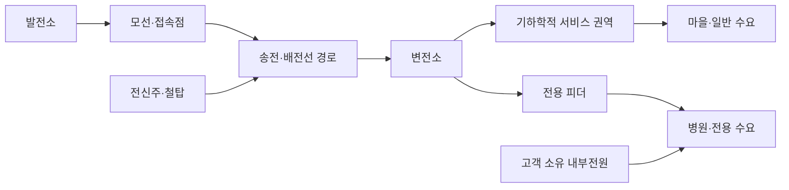

# Gridworks — 오브젝트 카탈로그

이 문서는 게임에 등장하는 대상이 **실제 오브젝트인지, 플레이어가 무엇을 할 수 있는지, 아직
무엇을 할 수 없는지**를 정리한다. 제품 원칙은 [게임 기획서](GAME_DESIGN_KO.md), 현재 구현 상태와
권한은 루트 [README](../../README.md)가 우선한다. 이 문서는 수치 fixture나 새 기능을 승인하지
않는다.

## 1. 상태 표기

| 상태 | 의미 |
|---|---|
| `현재` | 저장소의 완료된 구현에서 실제로 사용하는 개념 |
| `제품 방향` | 완성 제품이 지향하지만 아직 구현이 승인되지 않은 기능 |
| `조건부 후보` | 선행 증거와 별도 단계 승인 뒤에만 열 수 있는 기능 |
| `없음` | 현재 규칙도 승인된 후보도 없음. 구현자가 추론해 추가하면 안 됨 |

`제품 방향`이나 `조건부 후보`는 backlog가 아니다.

## 2. 요청된 건설·철거 요소의 현재 판정

| 요소 | 현재 기획 판정 |
|---|---|
| 발전소 직접 건설 | `제품 방향·1.0 필수 능력`. 완료된 제품 경로에는 기존 가스발전만 사용 |
| 변전소 직접 건설 | `현재`. 한 기의 초안 배치·이동·취소, 별도 발주·원자 완공을 구현 |
| 전신주·철탑을 하나씩 직접 건설 | `현재`. 마을 선로와 병원 주·예비 회선의 support를 직접 배치 |
| 각 오브젝트 사이 전선 길이 hard limit | `현재`. 인접 endpoint 사이 하나의 `MaxSpan`을 사용 |
| 완공 자산 철거 | `조건부 후보`. 1.0은 초안 수정·취소와 현재 임무/장 재시작으로 복구하며, 그것만으로 실제 플레이가 막힐 때만 범위·비용·시간을 처음 검토 |

완료된 Scope 0은 authored 경로로 전력망 인과를 먼저 검증했고 Scope 1은 고정 endpoint 사이 선로만
검증했다. 현재 제품 경로는 변전소와 마을 선로에 이어 병원 주·예비 `LineProject`, 전기 단일회선
제거와 공간사건 결산까지 통합했다. 발전소 신규 건설과 완공 자산 철거는 아직 구현되지 않았다.

## 3. 전력망 관계



서비스 권역, 전기 contingency와 공간 위험대는 규칙을 설명하는 데이터 레이어이며 건설 가능한
설비가 아니다.

## 4. 오브젝트별 기능

| 오브젝트 | 소유·생성 | 플레이어가 할 수 있는 일 | 핵심 특성 | 현재 할 수 없는 일 |
|---|---|---|---|---|
| 발전소 | 전력회사 설비. Scope 0에서는 기존 가스발전만 authored | 해당 로드맵 단계에서 유효 부지에 배치·발주하고 접속점 연결 | 위치·footprint, 접속 terminal, 건설비·공기, 출력용량, 가용상태, 변동비 | Scope 0 신규 건설·철거·연속 수동급전 |
| 모선·접속점 | 전기 그래프의 authored node | 연결경로와 고장영향 확인 | 연결관계, 통전상태, 상위 공급원 | 직접 배치·이동·철거·상세 개폐조작 |
| 변전소 | 전력회사 설비. 첫 점등에서는 한 기를 플레이어가 생성 | 초안 배치·이동·취소, 견적 확인, 발주·완공 | 위치·footprint, 건설비·공기, 정격, terminal, 기하학적 서비스 권역 또는 전용부하 | 여러 변전소·upgrade·철거 |
| 송전·배전선 | 인접 endpoint 사이의 전기 span과 이를 묶은 `LineProject` | 마을 선로와 병원 주·예비 회선을 직접 연결·일괄 발주 | 정격, 길이, `MaxSpan`, 비용, 공기, 전기 contingency, 공간 위험 group | 부분 통전·철거·일반 graph 편집 |
| 전신주·철탑 | 전력회사 설비. 완료된 제품 경로의 support 한 종류 | 하나씩 위치 지정하고 마지막 support를 되돌리거나 전체 초안을 취소한 뒤 선로를 일괄 발주 | 위치, support class, 건설상태, 소속 `LineProject`, 연결 span과 인접 endpoint까지 거리 | 철거·지지물별 노후·재고·장력 설정 |
| 서비스 권역 | 변전소 위치·형식에서 생기는 공간 data layer | 잠재 접속범위와 통전상태 확인 | 무전압일 때도 기하학은 존재하며 실제 공급에는 상위 경로와 용량이 필요 | 건설·판매·철거·독립 전원 역할 |
| 마을 | authored 수요처, 전력회사 소유 아님 | 공급상태·의무·보상 확인 | 일반 수요, 서비스 권역 접속, P2 후보 | 건설·이동·철거·개별 시민 조작 |
| 병원 | 완료된 제품 경로의 authored 중요 수요처, 전력회사 소유 아님 | 주·예비 회선을 직접 만들고 계통공급·P0 확인 | P0, 서로 다른 terminal·회선, 고객 내부전원, 높은 미공급 책임 | 건설·철거·P0 자동차단·내부전력을 판매로 계량 |
| 공장 | `제품 방향`, 완료된 Scope 0B에는 미등장. authored 산업 수요처, 전력회사 소유 아님 | 용량 확장 단계에서 발효된 큰 수요와 공급 부족 확인 | 큰 부하, 증설·교대 수요사건 | 현재 생성·건설·철거·수요반응. 유상 감축은 조건부 후보 |
| 병원 UPS·비상 디젤 | 병원 소유 내부전원 | 남은 지속시간과 P0 공급원 확인 | 계통 절체 공백과 제한시간을 담당 | 전력회사 판매·Grid Reserve·일반 고객 공급 |
| 배터리 | `조건부 후보`인 전력회사 설비 | 별도 단계가 승인된 뒤 충·방전 정책 후보 | MW, MWh, 효율과 grid-forming 의존 후보 | 현재 건설·운영·철거 |
| 데이터센터 | `1.0 이후` 외부 계약 수요 후보 | 후속 gate에서 서비스·냉각 운전안 비교 | 큰 계약부하, 수랭/공랭, 신뢰도 요구 | 현재 생성·건설·계약·운영 |

발전원별 태양광·풍력·원전·LNG·석탄은 별도 클래스 tree가 아니라, 발전소가 실제로 열릴 때
비교할 기술 프로필이다. 현재 상태와 장기 후보는 [게임 기획서](GAME_DESIGN_KO.md)와
[1.0 이후 방향](../future/POST_1_0.md)이 담당한다.

## 5. 공통 상태와 동작

### 건설

현재 제품 경로에서 변전소는 하나의 `AssetProject`, 마을 선로와 병원 주·예비 회선은 서로 support를
공유하지 않는 `LineProject`다. 플레이어는 변전소를 유효 부지에 놓고, 각 완공 terminal 사이에
지지물을 하나씩 배치해 선로 경로를 만든다. 발전소 직접 건설이 열리면 같은 최소
`AssetProject` 생명주기를 사용한다.

```text
배치 초안 작성
→ 발주 전 설비 초안 이동·취소 또는 선로의 마지막 지지물 되돌리기·전체 초안 취소
→ 부지 또는 모든 span의 거리·endpoint·충돌 검증
→ 전체 견적과 완공시각 확인
→ AssetProject 또는 LineProject로 발주
→ 비용 지불·공사
→ 모든 구성요소 완공 뒤 원자 시운전·graph 편입
```

`LineProject`는 완공된 terminal 사이에서만 발주한다. 새 변전소와 그 선로가 필요하면 변전소
`AssetProject`를 먼저 완공한 뒤 선로를 별도 발주한다. 둘을 한 package로 묶거나 계획 terminal에
선로를 예약하는 공사 DAG는 만들지 않는다. 개별 지지물을 직접 놓지만 공사 queue를 pole마다
쪼개지 않고, 미완성 pole이나 일부 span은 전기를 전달하지 않는다. 병렬 crew와 미래 project
예약도 만들지 않는다. 종료된 Scope 0A는 카드 검증이라 직접 건설 UI가 없고, 완료된 Scope 0B
계약도 고정 피더와 authored 회랑만 사용한다.

부채 규칙은 없다. 발주 비용이 현금을 넘으면 거부하고 현금은 음수가 되지 않는다. 초안·preview와
모든 거부 명령은 상태·시각·현금을 바꾸지 않으며 화면은 Core가 반환한 첫 실패 이유를 보여준다.

### 통전과 공급

설비가 존재하는 것, 서비스 권역 안에 있는 것, 실제 전력을 공급하는 것은 서로 다르다. 온라인
발전원까지 사용 가능한 경로가 있고 모든 공유 병목이 수요를 감당해야 전력회사 공급이 성립한다.
수요처 하나는 한 경로로 전량 공급되거나 미공급되며 여러 경로에 나누지 않는다. 완료된 병원
단계는 병원 우선, 안정된 회선 우선순위와 source 잔여용량 예약을 사용한다. 복수 발전원 순서는
발전소 단계가 처음 고정한다.

### 공간 위험

공간 위험은 건설 오브젝트가 아니라 authored polygon data layer다. 직접 만든 선로의 span 하나라도
위험 polygon과 교차하면 해당 whole `LineProject`가 그 위험에 노출된다. 사건 중에는 노출된
project 전체가 사용불가다. 선로가 공간에서 교차해도 terminal이 없으면 전기적으로 접속되지 않고,
서로 다른 `LineProject`는 지지물과 span을 공유하지 않는다. 닫힌 위험 경계의 교차 판정은 완료된
병원 신뢰도 단계 계약이 정한다.

### 사용불가와 수리

사건은 설비를 파괴하거나 소유권을 없애는 것이 아니라 일정 시간 `사용불가`로 만든다. 수리는
1.0의 조건부 후보이며 철거와 다른 행위다. 현재 완료 구현에는 플레이어 수리 명령이 없다.

### 조건부 완공 자산 철거

1.0은 발주 전 초안 수정·취소와 첫 단계부터 가능한 현재 임무 재시작으로 복구하며 완공 자산
철거 UI를 만들지 않는다. 캠페인 골격이 생기면 재시작은 장 시작 checkpoint를 사용한다. 실제
관찰에서 이것만으로 진행이 막힐 때만 로드맵 수정과 별도 승인을 거쳐 완공 자산 철거를
다시 연다. package 소유범위, 비용과 기간은 그때의 단계 계약에서 정하고 미리 schema를 만들지
않는다.

## 6. 거리와 연결 제한

각 전선 span은 발전소 terminal, 변전소 terminal 또는 전신주·철탑 중 두 인접 endpoint만 잇는다.

```text
SpanValid = distance(EndpointA, EndpointB) <= MaxSpan(LineClass)
```

- 한 span이라도 `MaxSpan`을 넘으면 발주할 수 없고, UI는 실패 span과 실제 거리만 표시한다.
- 1.0의 첫 제품 선로에서 지지물은 한 `LineProject`와 한 회선만을 위한 degree-2 공간 waypoint다.
  전기적 분기·합류는 발전소·변전소·모선 terminal에서만 가능하다.
- 공간에서 선이 교차하거나 가까이 지나가도 접속되지 않는다. 전기적 분기·합류는 명시적으로
  허용된 terminal에서만 생긴다.
- 총 선로 길이에는 별도 hard limit을 두지 않는다. pole 수, conductor 길이, 비용과 공기가 자연스러운
  한계가 된다.
- 구현 완료 Scope 1 계약은 line class와 support type을 각각 하나만 사용하므로 `MaxSpan`도 하나다.
  구현·검증 완료 전에는 실행 가능한 조작으로 주장하지 않는다.
- 다회선 공유철탑, 지형별 장력, 처짐, 풍하중, 기초형식과 자동 pole 배치는 계산하지 않는다.

후속 전압 등급이 실제 선택을 만들 때만 line class별 `MaxSpan`을 추가한다. 숫자는 해당 활성 단계의
fixture가 정하며 이 문서에는 하드코딩하지 않는다.

## 7. 문서 갱신 조건

새 활성 단계가 오브젝트를 추가하거나 건설·운영·철거 가능성을 바꾸면 이 문서의 상태표와 해당 행을
같은 변경에서 갱신한다. 숫자, exact ID와 fixture 결과는 이 문서에 복제하지 않는다.
