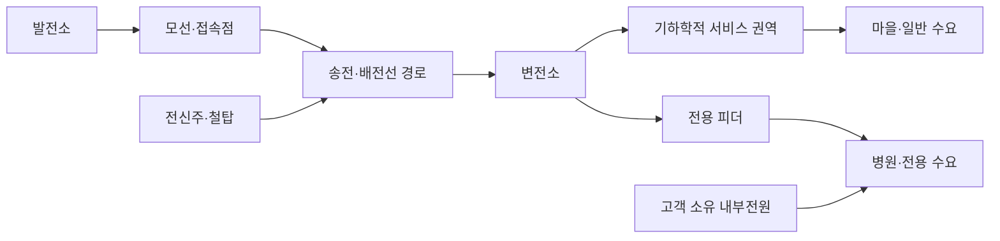

# Gridworks — 오브젝트 카탈로그

이 문서는 게임에 등장하는 대상이 **실제 오브젝트인지, 플레이어가 무엇을 할 수 있는지, 아직
무엇을 할 수 없는지**를 정리한다. 제품 원칙은 [게임 기획서](GAME_DESIGN_KO.md), 현재 구현·검증
범위는 루트 [README](../../README.md)가 지목한 활성 scope가 우선한다. 이 문서는 수치 fixture나
새 기능을 승인하지 않는다.

## 1. 상태 표기

| 상태 | 의미 |
|---|---|
| `현재` | 루트 README가 지목한 활성 scope에서 실제로 사용하는 개념 |
| `제품 방향` | 완성 제품이 지향하지만 아직 구현이 승인되지 않은 기능 |
| `조건부 후보` | 선행 증거와 별도 gate 승인 뒤에만 열 수 있는 기능 |
| `없음` | 현재 규칙도 승인된 후보도 없음. 구현자가 추론해 추가하면 안 됨 |

`제품 방향`이나 `조건부 후보`는 backlog가 아니다.

## 2. 요청된 건설·철거 요소의 현재 판정

| 요소 | 현재 기획 판정 |
|---|---|
| 발전소 직접 건설 | `제품 방향·1.0 필수 능력`. 완료된 Scope 0B에는 기존 가스발전만 사용 |
| 변전소 직접 건설 | `제품 방향·1.0 필수 능력`. 완료된 Scope 0B에는 설치된 고정 변전소와 피더만 사용 |
| 전신주·철탑을 하나씩 직접 건설 | `제품 방향·1.0 필수 능력`. `Interaction` gate 전에는 추상 선로만 사용 |
| 각 오브젝트 사이 전선 길이 hard limit | `제품 방향·1.0 필수 능력`. 인접 endpoint 사이 `MaxSpan`을 초과하면 건설안을 확정할 수 없음 |
| 발전소·변전소·전신주 철거 | `제품 방향·1.0 필수 능력`. 건설 상호작용 검증 뒤 `Decommissioning` gate에서 개방 |
| 철거 추가비 | `제품 방향·1.0 필수 능력`. 즉시 삭제가 아니라 비용과 시간이 드는 철거공사로 처리 |

완료된 Scope 0에서 위 기능을 사용할 수 있었다는 뜻은 아니다. Scope 0은 authored 경로로 전력망 인과를
먼저 검증하고, 직접 배치와 철거는 각각 더 작은 후속 gate에서 연다.

## 3. 전력망 관계



서비스 권역, 전기 contingency와 공간 위험대는 규칙을 설명하는 데이터 레이어이며 건설 가능한
설비가 아니다.

## 4. 오브젝트별 기능

| 오브젝트 | 소유·생성 | 플레이어가 할 수 있는 일 | 핵심 특성 | 현재 할 수 없는 일 |
|---|---|---|---|---|
| 발전소 | 전력회사 설비. Scope 0에서는 기존 가스발전만 authored | 제품 gate에서 유효 부지에 배치·발주하고 접속점 연결, 이후 연결선과 함께 유상 철거 | 위치·footprint, 접속 terminal, 건설비·공기, 출력용량, 가용상태, 변동비 | Scope 0 신규 건설·철거·연속 수동급전 |
| 모선·접속점 | 전기 그래프의 authored node | 연결경로와 고장영향 확인 | 연결관계, 통전상태, 상위 공급원 | 직접 배치·이동·철거·상세 개폐조작 |
| 변전소 | 전력회사 설비. 현재는 고정 위치에 설치된 상태 | 제품 gate에서 직접 배치·발주하고 피더 연결, 이후 연결선과 함께 유상 철거 | 위치·footprint, 건설비·공기, 정격, terminal, 기하학적 서비스 권역 또는 전용부하 | Scope 0 자유 배치·upgrade·철거 |
| 송전·배전선 | 인접 endpoint 사이의 전기 span과 이를 묶은 `LineProject` | authored 회랑 선택; 제품 gate에서 pole별 span 연결·발주하고 whole project 철거 | 정격, 길이, `MaxSpan`, 비용, 공기, 전기 contingency, 공간 위험 group | Scope 0 자유 배치·부분 통전·철거 |
| 전신주·철탑 | `제품 방향`의 전력회사 설비. Scope 0에서는 선로에 포함된 추상 표현 | 제품 gate에서 하나씩 위치 지정·선택·발주하고, 선택한 지지물의 whole line package를 유상 철거 | 위치, support class, 기본 건설·철거비, 건설상태, 소속 `LineProject`, 연결 span과 인접 endpoint까지 거리 | Scope 0 개별 조작, 부분 line 편집, 지지물별 노후·재고·장력 설정 |
| 서비스 권역 | 변전소 위치·형식에서 생기는 공간 data layer | 잠재 접속범위와 통전상태 확인 | 무전압일 때도 기하학은 존재하며 실제 공급에는 상위 경로와 용량이 필요 | 건설·판매·철거·독립 전원 역할 |
| 마을 | authored 수요처, 전력회사 소유 아님 | 공급상태·의무·보상 확인 | 일반 수요, 서비스 권역 접속, P2 후보 | 건설·이동·철거·개별 시민 조작 |
| 병원 | authored 중요 수요처, 전력회사 소유 아님 | 주·예비 경로와 계통공급 확인 | P0, 전용 피더, 고객 내부전원, 높은 미공급 책임 | 건설·철거·P0 자동차단·내부전력을 판매로 계량 |
| 공장 | `제품 방향`, 완료된 Scope 0B에는 미등장. authored 산업 수요처, 전력회사 소유 아님 | 후속 gate에서 수요와 계약 감축 후보 확인 | 큰 부하, 증설·교대 수요사건, P3/DR 후보 | 현재 생성·건설·철거·수요반응 |
| 병원 UPS·비상 디젤 | 병원 소유 내부전원 | 남은 지속시간과 P0 공급원 확인 | 계통 절체 공백과 제한시간을 담당 | 전력회사 판매·Grid Reserve·일반 고객 공급 |
| 배터리 | `조건부 후보`인 전력회사 설비 | 관련 gate가 열린 뒤 충·방전 정책 후보 | MW, MWh, 효율과 grid-forming 의존 후보 | 현재 건설·운영·철거 |
| 데이터센터 | `1.0 이후` 외부 계약 수요 후보 | 후속 gate에서 서비스·냉각 운전안 비교 | 큰 계약부하, 수랭/공랭, 신뢰도 요구 | 현재 생성·건설·계약·운영 |

발전원별 태양광·풍력·원전·LNG·석탄은 별도 클래스 tree가 아니라, 발전소가 실제로 열릴 때
비교할 기술 프로필이다. 현재 상태와 장기 후보는 [게임 기획서](GAME_DESIGN_KO.md)와
[1.0 이후 방향](../future/POST_1_0.md)이 담당한다.

## 5. 공통 상태와 동작

### 건설

제품 방향에서 발전소와 변전소는 각각 하나의 `AssetProject`, 지지물과 도체로 이루어진 선로는
하나의 `LineProject`다. 플레이어는 발전소와 변전소를 유효 부지에 놓고, 완공된 두 terminal
사이에 전신주·철탑을 하나씩 배치해 선로 경로를 만든다. 두 project 종류는 같은 최소 생명주기를
따른다.

```text
배치 초안 작성
→ 부지 또는 모든 span의 거리·endpoint·충돌 검증
→ 전체 견적과 완공시각 확인
→ AssetProject 또는 LineProject로 발주
→ 비용 지불·공사
→ 모든 구성요소 완공 뒤 원자 시운전·graph 편입
```

`LineProject`는 완공된 terminal 사이에서만 발주한다. 개별 지지물을 직접 놓지만 공사 queue를
pole마다 쪼개지 않는다. 미완성 pole이나 일부 span은 전기를 전달하지 않는다. plant→substation
→line 순서의 공사 DAG, 병렬 crew와 미래 project 예약은 만들지 않는다. 종료된 Scope 0A는 카드
검증이라 직접 건설 UI가 없고, 완료된 Scope 0B 계약도 고정 피더와 authored 회랑만 사용한다.

### 통전과 공급

설비가 존재하는 것, 서비스 권역 안에 있는 것, 실제 전력을 공급하는 것은 서로 다르다. 온라인
발전원까지 사용 가능한 경로가 있고 모든 공유 병목이 수요를 감당해야 전력회사 공급이 성립한다.

### 사용불가와 수리

사건은 설비를 파괴하거나 소유권을 없애는 것이 아니라 일정 시간 `사용불가`로 만든다. 수리는
1.0의 조건부 후보이며 철거와 다른 행위다. 현재 Scope 0에는 플레이어 수리 명령도 없다.

### 철거

제품 방향에서 발전소, 변전소, whole `LineProject`와 개별 전신주·철탑은 철거할 수 있다. 철거는
즉시 삭제가 아니라 다음 규칙을 가진 유상 공사다.

- 확인 화면에서 대상과 함께 제거할 span을 하나의 package로 확정한다. 공사 시작 순간 시스템이
  그 package만 원자적으로 격리·사용불가 처리하고 graph를 다시 계산한다. 별도 switch UI는 없다.
- 첫 버전에는 부분 line 철거가 없다. 지지물을 철거 대상으로 고르면 그 지지물이 속한 whole
  `LineProject`가 package에 자동 포함된다.
- 발전소·변전소를 고르면 접속된 whole `LineProject`들이 같은 package에 자동 포함된다.
- whole `LineProject` 철거는 그 도체와 그 project 전용 지지물을 함께 제거한다. 따라서 orphan
  span·지지물이나 재시운전할 수 없는 line fragment를 남기지 않는다.
- `철거비 = Σ 대상 오브젝트 기본 철거비 + 제거 conductor 길이비`의 두 항목만 사용한다.
- 첫 버전에는 salvage, 잔존가치, 중고판매와 환급이 없다.
- 철거도 공사 자원을 점유하고 완료시 package의 node·span을 graph에서 원자 제거한다.
- 철거로 발생한 미공급, LostSales와 보상은 일반 계통 결과와 동일하게 정산한다.
- 미완공 발주 취소는 철거와 다른 기능이며 별도 승인 전에는 제공하지 않는다.

플레이어는 발전소·변전소와 각 지지물을 직접 철거 대상으로 고를 수 있지만, 첫 버전의 실제 제거
단위는 위 자동확장 package다. 부분 철거와 잔존 fragment 재시운전은 별도 gate 전에는 없다.
정확한 비용·기간은 `Decommissioning` gate의 단일 fixture에서 정한다. 그 전에는 철거 UI나 숨은
기본값을 만들지 않는다.

## 6. 거리와 연결 제한

각 전선 span은 발전소 terminal, 변전소 terminal 또는 전신주·철탑 중 두 인접 endpoint만 잇는다.

```text
SpanValid = distance(EndpointA, EndpointB) <= MaxSpan(LineClass)
```

- 한 span이라도 `MaxSpan`을 넘으면 발주할 수 없고, UI는 실패 span과 실제 거리만 표시한다.
- 첫 `Interaction`에서 지지물은 한 `LineProject`와 한 회선만을 위한 degree-2 공간 waypoint다.
  전기적 분기·합류는 발전소·변전소·모선 terminal에서만 가능하다.
- 공간에서 선이 교차하거나 가까이 지나가도 접속되지 않는다. 전기적 분기·합류는 명시적으로
  허용된 terminal에서만 생긴다.
- 총 선로 길이에는 별도 hard limit을 두지 않는다. pole 수, conductor 길이, 비용과 공기가 자연스러운
  한계가 된다.
- 첫 `Interaction` prototype은 line class와 support type을 각각 하나만 사용하므로 `MaxSpan`도
  하나다.
- 다회선 공유철탑, 지형별 장력, 처짐, 풍하중, 기초형식과 자동 pole 배치는 계산하지 않는다.

후속 전압 등급이 실제 선택을 만들 때만 line class별 `MaxSpan`을 추가한다. 숫자는 해당 scope의
fixture가 정하며 이 문서에는 하드코딩하지 않는다.

## 7. 문서 갱신 조건

새 scope가 오브젝트를 추가하거나 건설·운영·철거 가능성을 바꾸면 이 문서의 상태표와 해당 행을
같은 변경에서 갱신한다. 숫자, exact ID와 fixture 결과는 이 문서에 복제하지 않는다.
