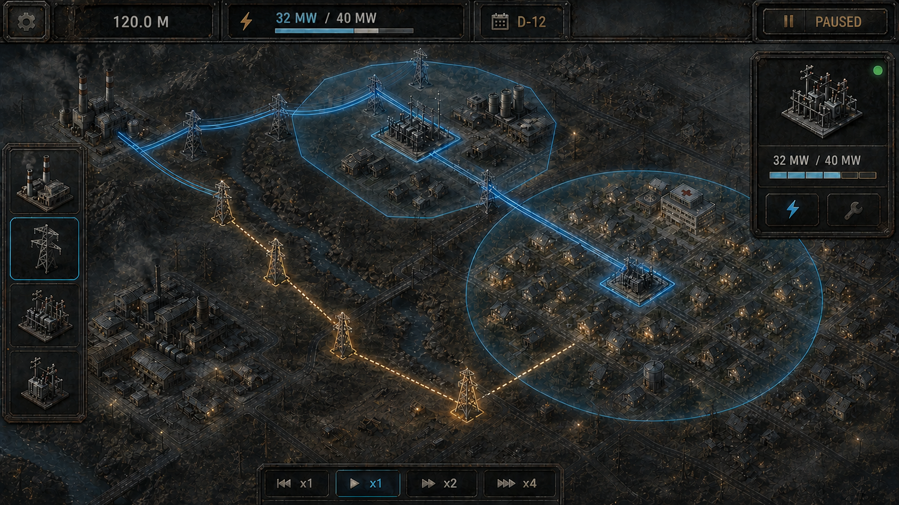
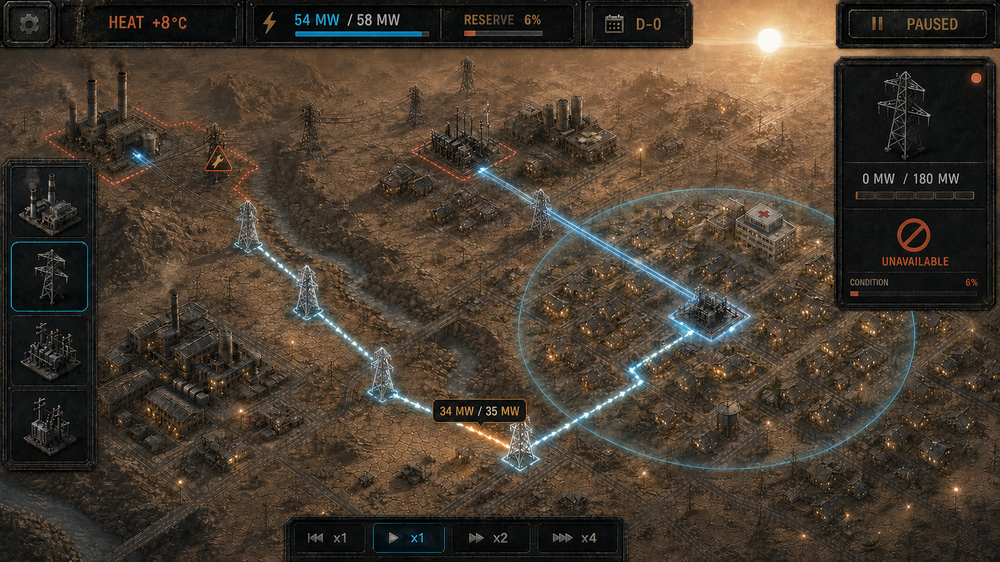
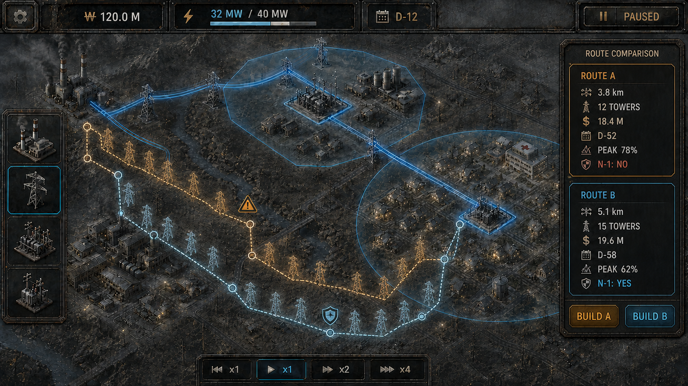
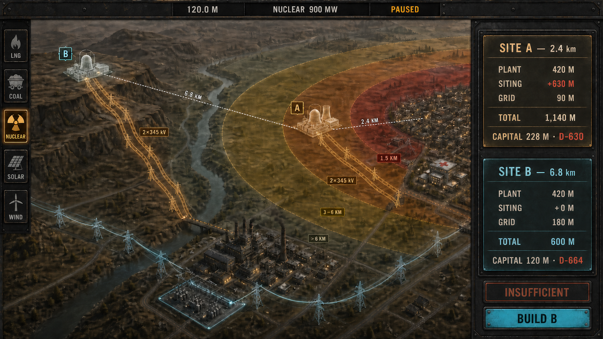

# Gridworks — 비주얼 제작 명세

이 문서는 `Gridworks`의 화면 언어와 시각 산출물 기준을 정의한다. 규칙과 숫자를 새로 만들지
않는다. 현재 사실은 루트 [README](../../README.md)가 지목한 활성 scope가 권위다. 새 scope가
machine-readable fixture를 도입해도 승인된 인계검사를 통과한 시점에만 그 scope의 기계 숫자
권위가 된다.

승인된 시각 작업은 활성 scope가 정한다. 기존 PNG는 장기 분위기와 공간 구도 참고 자료이며
런타임 재현 의무나 숫자 oracle이 아니다.

## 1. 시각 목표

화면을 처음 본 플레이어가 다음 순서로 읽을 수 있어야 한다.

1. 발전소와 수요처가 어디 있는가?
2. 어느 설비와 선로가 현재 사용 가능한가?
3. 어느 배전 변전소가 어떤 지역을 서비스할 수 있는가?
4. 발전소에서 그 변전소까지 실제 경로가 이어져 있는가?
5. 무엇이 병목이며, 어떤 고장에 무엇이 함께 꺼지는가?
6. 지금 고르는 경로가 비용·시간·안전 여유를 어떻게 바꾸는가?

분위기는 이 정보 위계를 강화해야 하며 가리면 안 된다.

## 2. 공통 아트 방향

### 정서와 재질

- 혹독한 환경에서 도시의 생명선을 관리하는 산업 생존 전략
- 풍화된 철, 리벳, 그을린 콘크리트, 산화 갈색 지면
- 먼지 낀 상아색 하늘과 낮은 채도의 반농촌 산업 계곡
- 거대한 설비가 사람의 시간과 노동을 요구한다는 물성
- 전원이 들어온 병원과 마을의 빛이 계통 상태와 직접 연결되는 연출

`Frostpunk`에서 참고하는 것은 기반시설의 무게, 한정된 자원과 생존형 긴장감이다. 원형 도시,
중앙 발전기, 증기기관 세계관, 건물 실루엣, 아이콘, 글꼴, UI 배치와 문구를 복제하지 않는다.

### 상태 언어

| 상태 | 색 | 색 이외의 표현 |
|---|---|---|
| 통전 | 청백색 | 실선, 느린 흐름 |
| 기하학적 서비스 권역 | 저채도 청회색 | 반투명 면, 외곽 점선 |
| 계획 | 호박색 | 점선, 반투명 구조물 |
| 공사 | 황토색 | 사선 패턴, 진행 표식 |
| 철거 예정·철거 중 | 자주빛 회색 | 역방향 사선, 비용·완료시각, 제거될 연결선 강조 |
| 주의·용량근접 | 호박·주황 | 굵기 증가, 한계 아이콘 |
| 사용불가 | 어두운 회색 + 국소 적색 | 끊긴 파선, 잠금·정비 표식 |
| 우회공급 | 청백색 | 바뀐 흐름방향과 짧은 강조 pulse |

색만으로 상태를 구분하지 않는다. 적색은 실제 고장과 즉시 위험에만 쓰며 화면 전체를 붉게
물들이지 않는다. 서비스 권역은 선로와 다른 면 표현을 사용한다.

### UI 원칙

- 숯검정 철제 frame과 절제된 황동 체결부
- 큰 숫자, 분모가 있는 용량 표시와 짧은 원인 문장
- 한 화면에는 현재 결정에 필요한 정보만 표시
- 추천색, 방패·해골과 불투명한 총점으로 선택을 도덕화하지 않음
- 색각 이상 대응 pattern, 키보드 focus, UI scale과 현지화 여유 확보
- 로고, watermark와 알아볼 수 있는 타 작품 UI 금지

## 3. 산출물 상태

| 산출물 | 파일·형태 | 상태 |
|---|---|---|
| Scope 0A 카드 | 16:9 카드 4장 | Scope 0A가 활성일 때만 제작 |
| Scope 0B 화면 | 단일 2D scene + overlay | 별도 승인 뒤 |
| 핵심 건설 콘셉트 | `../../assets/01-grid-construction.png` | 비권위 참고 |
| 폭염·사용불가 콘셉트 | `../../assets/02-heatwave-outage.png` | 비권위 참고 |
| 경로 비교 콘셉트 | `../../assets/03-route-comparison.png` | 비권위 참고 |
| 기존 발전소 입지 구도 | `../../assets/04-plant-siting.png` | 레이아웃 참고 전용 |
| 병원 자동절체 | 런타임 캡처 후보 | 관련 1.0 gate 뒤 |
| 원전·데이터센터·냉각수 | 새 텍스트 명세부터 시작 | P-A 승인 뒤 |

정식 런타임 캡처를 만들게 되면 16:9 RGB PNG를 사용한다. 정확한 해상도와 golden 상태는 해당
presentation gate에서 고정한다.

## 4. Scope 0A 카드

### 공통 형식

- 저충실도 16:9, 탑다운 2D
- 원·사각형 설비, 굵은 선, 한 개의 반투명 서비스 권역
- 배경 장식과 날씨효과 없음
- 논리 카드마다 결정 초점 하나만 전면에 둠. 읽기 전용 상황과 비교 카드는 새 질문을 만들지 않음
- 참가자 응답 전에는 결과와 가치판단 표식을 숨김
- 강변/북부 좌우만 `AB/BA` 두 variant로 교차

### 카드 1 — 연결

목표는 “권역 안에 있으면 자동 공급” 오해를 드러내는 것이다.

화면에는 다음만 둔다.

- 온라인 가스발전소와 발전 측 모선
- 중간에 끊긴 상위 피더
- 설치·시운전됐지만 무전압인 마을 배전 변전소
- 회색 서비스 권역 안의 마을
- 질문: `이 마을은 지금 공급 중인가? 공급되려면 무엇이 더 필요한가?`

공사 중 표현, 전원 광선, 활성 건물 조명과 정답 문구는 넣지 않는다. 실패원인은 발전소까지의
상위 연결 부재 하나뿐이어야 한다.

### 카드 2 — 상황

목표는 병원 주 회로, 두 번째 회로 의무와 내부전원을 구분하는 것이다.

- Scope 0A가 정의한 병원 P0와 주 회로 E1
- 화면 구석의 선형 타임라인: 현재, 두 번째 회로 기한, 강변 통로 사용불가와 복구
- 활성 scope가 정의한 UPS·디젤의 역할과 지속시간
- 전력회사 선로와 병원 내부전원은 서로 다른 선·아이콘 체계
- `병원 내부전원은 전력회사 공급·판매가 아님`이라는 짧은 계량 경계 문장

`OLD_CORRIDOR` 같은 내부 ID는 참가자에게 보이지 않는다. 하나의 반투명 해칭 영역으로 강변
통로를 그리고, 주 회로가 그 안을 지나는 모습을 공간으로 읽게 한다.

### 카드 3 — 선택

두 카드는 같은 순서와 같은 시각 무게로 표시한다.

두 열 위에 `두 안 모두 기한 안에 완공 · E1과 다른 차단 회로`를 한 번만 쓴다. 각 열은
`회랑명 → 활성 scope의 비용 label → 자연어 공간경로` 순서다. 강변 열은 기존 주 회로와 같은
해칭대를, 북부 열은 떨어진 별도 통로를 지도와 같은 위치관계로 보여준다.

`SHARED/INDEPENDENT`, `SAFE/RISKY`, 추천 badge와 초록/빨강 대비는 금지한다. 지도에서는 두
계획선을 모두 호박색으로 두고 line pattern으로만 구분한다.

### 카드 4 — 예측과 결과

선택 버튼보다 먼저 2×2 예측표를 보여준다.

| 계획 | 병원 E1만 사용불가: 전력회사 병원 공급 | 강변 통로 전체 사용불가: 전력회사 병원 공급 |
|---|---|---|
| 강변 병행 | `남음 / 끊김` | `남음 / 끊김` |
| 북부 우회 | `남음 / 끊김` | `남음 / 끊김` |

네 칸과 이유를 확정한 뒤 내부전원·계량 질문, 회랑 선택 순서로 간다. 결과는 제거 자산, 남은
전력회사 경로, 병원 P0의 실제 공급원, 내부전원 잔여와 마을 공급 순서로 공개한다. 현금은
인과 공개 뒤 두 번째 층에서 `건설비`, `판매`, `가스비`, `보상`, `LostSales`의 별도 행으로
보여주며 승자나 점수를 표시하지 않는다.

## 5. 조건부 Scope 0B 화면

Scope 0B가 승인되면 카드 그래픽을 단일 탑다운 2D scene으로 옮긴다. 기존 콘셉트 PNG를
재현하지 않는다.

### 화면 구성

```text
┌ 예고 타임라인 ─ 현금 ─ 공급/수요 ─ DAY·시각 ┐
│                                           │
│                 2D 지도                   │ 왜? 패널
│                                           │
└ 상태 문장 ───────────────── 다음 이정표 ┘
```

- 타임라인 밖의 상단 HUD는 현금, 공급/수요, 시각과 일시정지만 표시한다.
- 왼쪽 위의 선형 예고 타임라인은 Scope 0B fixture의 현재시각, 발주 공사 완공, 병원 회로 기한,
  고정 강변 사용불가와 복구만 시간순으로 표시한다. 점은 시각, 막대는 기간이며 마감과 사건
  경계에서 자동 정지한다.
- 지도는 통전·계획·사용불가 선과 서비스 권역을 보여준다.
- `왜?` 패널은 현재 공급원인, 제거 결과, 선택의 비용·서비스 차이 세 줄만 표시한다.
- `다음 이정표`는 필요한 발주나 예측 확정이 남으면 비활성화하고 이유를 보여준다.
- 결과는 새 탐색화면이 아니라 modal overlay다.
- 3D, 후처리, 날씨 VFX, 단선결선도와 상세 원장은 없다.

예측 overlay의 상태는 scene-local이다. Core, 저장, 경제와 scenario에 들어가지 않는다.

## 6. 장기 콘셉트 화면

아래 화면은 관련 시스템이 검증된 뒤의 제작 방향이다. 기존 PNG 안의 숫자와 배치는 구현
계약이 아니다.

후속 scenario가 폭염이나 공장 증설을 실제로 열면 같은 타임라인 문법에 시작·지속·종료 또는
요구 MW 발효시각을 추가한다. 관련 gate 전에는 Scope 0B 화면에 그 항목이나 빈 slot을 넣지 않는다.

### 6.1 핵심 전력망 건설



목표는 서비스 권역과 실제 연결을 동시에 설명하는 것이다.

- 유효 부지 위에 직접 놓는 발전소·변전소 footprint와 terminal
- 플레이어가 하나씩 놓는 전신주·철탑, 인접 endpoint 사이 conductor span
- 선택 지지물 중심의 `MaxSpan` 원과 유효/초과 span 미리보기
- 가스발전소 → 1차 변전소 → 배전 변전소의 실제 통전 경로
- 배전 변전소에만 붙는 반투명 서비스 권역
- 범위 안의 공급 건물과 범위 밖 또는 미공급 건물의 차이
- 실선 통전망과 호박 점선 계획선의 분리
- 선택 변전소의 `현재 MW / 유효 정격 MW`
- 공사 전액, 대기열 위치와 완공예정일을 견적 원인별로 표시

경로 초안에서는 가장 먼저 실패한 span과 `실제 거리 / MaxSpan`만 표시한다. 플레이어가 중간
지지물을 직접 놓으며 시스템은 위치를 추천하거나 자동 확정하지 않는다. 선이 교차해도 terminal
표식이 없으면 접속처럼 보이지 않게 높이·pattern을 분리한다.

철거 mode는 선택 대상과 자동확장된 whole-line package, 공사 시작시 격리될 설비, 철거비,
공사시간과 예상 미공급 고객을 한 묶음으로 강조한다. 지지물 선택이 소속 선로 전체 철거로
확장된다는 사실을 확인 전에 명시한다. 유효 package를 만들 수 없을 때만 버튼을 비활성화하고
첫 실패 이유를 표시한다. 철거를 판매나 환급처럼 초록색으로 표현하지 않는다.

1차 변전소에 서비스 권역을 그리거나 미완공 계획선을 통전처럼 빛내면 실패다.

### 6.2 폭염과 노후 선로 사용불가



목표는 사용불가 설비, 살아 있는 우회와 지속시간 제한 자원을 구분하는 것이다.

- 사용불가 선로는 `현재 0 MW / 명판정격`과 잠금 표식
- 우회선은 `현재 흐름 / 유효 정격`과 근접한 병목 표시
- 현지 발전·저장은 우회선 용량과 별도 행
- 총수요와 현재 살아 있는 공급력을 분리
- 배터리는 MW뿐 아니라 남은 MWh와 지속시간 표시
- 폭염 glare와 먼지는 경로를 가리지 않음

고장선은 화재·폭발 없이 국소 진단 표식만 쓰고, 공급력 합계가 양수라는 이유로 `안전`이라고
표시하지 않는다.

### 6.3 송전 경로 비교



목표는 짧은 길과 독립 경로의 차이를 미적 취향이 아니라 원인으로 설명하는 것이다.

비교표의 행은 다음 순서로 고정한다.

1. 길이와 파생 철탑 수
2. 건설비와 비용 분해
3. 공기와 완공예정일
4. 예상 피크 부하율
5. 전기 contingency 결과
6. 공간 공통회랑 노출

전기 N-1과 공간 공통원인은 서로 다른 행과 표식을 사용한다. 실제 통전선과 두 계획경로는
line pattern으로 구분한다. 정확한 숫자는 해당 `Interaction/Risk` gate의 기계 데이터에서
생성하며 이미지 prompt에 하드코딩하지 않는다.

### 6.4 병원 자동절체

이 화면은 병원에 선 두 개가 보이는 것과 독립공급이 다름을 설명한다.

- 공간 지도와 작은 단선결선도에서 같은 자산을 함께 강조
- 서로 다른 상위 모선·차단 경계·공간 회랑의 E1/E2
- `E1 OPEN → UPS → E2 TRANSFER` 순서와 실제 절체시간
- 병원 P0 미공급, UPS 잔여와 비상 디젤 대기 상태
- 설치용량은 `2×정격`, firm service는 한 베이 정격으로 표시

두 베이 정격을 합쳐 firm service로 표기하거나 병원 내부전원을 전력 판매로 표시하면 실패다.

### 6.5 원전·데이터센터·냉각수

`../../assets/04-plant-siting.png`는 후보지와 송출경로를 한 화면에서 비교하는 레이아웃만 참고한다.



P-A가 실제로 승인되면 새 텍스트 명세부터 만든다. P-A 화면은 이미 건설된 원전·데이터센터와
수원지를 정상/폭염·가뭄 두 snapshot으로 보여주며 시간진행, 입지, 공사, NIMBY와 돈 UI는 없다.

- 원전: `FULL / REDUCED`, gross MW, pump MW, net injection MW
- 데이터센터: `FULL / REDUCED / OFF`, `WATER / AIR`, grid demand MW와 CW/h
- 냉각수: 원전과 수랭 데이터센터 점유를 나눈 단일 capacity bar
- 운전안 비교: 원전 감발, 공랭 전환, 서비스 제한의 결과와 최초 위반을 나란히 표시

P-B 승인 뒤에만 후보지, hard cut, 거리 펌프와 송전 옵션을 추가한다. P-C 승인 뒤에만 원전
`LOW/HIGH` 입지 추가비, 현금, 공사와 위약을 표시한다. 구체 숫자는 모두 `TBD`이며 지금 golden
capture나 이미지 prompt를 만들지 않는다.

## 7. 사운드 방향

- 통전: 차단기 투입 → 변압기 상승음 → 건물 점등
- 정상 zoom-in: 변압기 저주파, 도체 바람, 공장·병원 환경음
- 정상 zoom-out: 개별 소리는 줄이고 망 전체의 낮은 전기음과 바람 강조
- 과부하: 반복 alarm보다 팬·변압기 음색과 불균형 경고 변화
- 사용불가: 차단 충격 뒤 전류음이 사라지는 정적
- 내부전원: 계통음과 구분되는 UPS·디젤의 국소 기계음

## 8. 제작 검수표

### 현재 카드

- 네 카드가 각각 질문 하나만 전달하는가?
- 회색 서비스 권역이 통전으로 오해되지 않는가?
- 카드 1의 유일한 실패원인이 발전원까지 상위경로 부재인가?
- 내부 ID 문자열 없이 전기회로와 공간회랑이 그림으로 구분되는가?
- 선택 전에 두 계획×두 사고의 네 결과를 모두 예측하는가?
- 두 선택 카드의 정보 순서와 시각 무게가 같은가?
- 응답 전에 추천·정답·결과가 노출되지 않는가?
- 병원 내부전원과 전력회사 선로가 구분되는가?

### Scope 0B 화면 — 승인된 경우만

- 통전·계획·주의·사용불가의 색과 pattern이 일관적인가?
- 예고 타임라인이 현재와 사건 순서·지속시간을 지도 없이도 읽게 하는가?
- 서비스 권역이 배전 변전소에만 붙는가?
- 모든 MW 수치가 현재값과 정격·요구량의 의미를 함께 가지는가?
- N-1과 공간 공통원인을 별도 행으로 보여주는가?
- 현금, 서비스와 안전을 하나의 추천점수로 숨기지 않는가?

### Interaction 화면 — 해당 gate가 승인된 경우만

- `MaxSpan`을 넘은 span, 실제 거리와 수동으로 지지물을 더 놓아야 한다는 사실이 즉시 읽히는가?
- 한 지지물에서 전기 분기하거나 다른 회선이 공유되는 것처럼 보이지 않는가?
- terminal 없는 선로 교차점이 junction처럼 보이지 않는가?
- draft·공사 중 선로가 통전된 선로처럼 보이지 않는가?

### Decommissioning 화면 — 해당 gate가 승인된 경우만

- 철거 package와 함께 격리·제거되는 span, 추가비·시간·미공급 결과가 확정 전에 보이는가?

### 모든 제작 화면

- 산업 미학이 경로·상태·text의 가독성을 해치지 않는가?
- 특정 작품의 화면·건물·icon·font를 알아볼 수 있게 복제하지 않는가?
- 이미지 숫자와 권위 데이터가 다를 때 이미지를 폐기하거나 다시 생성하는가?
