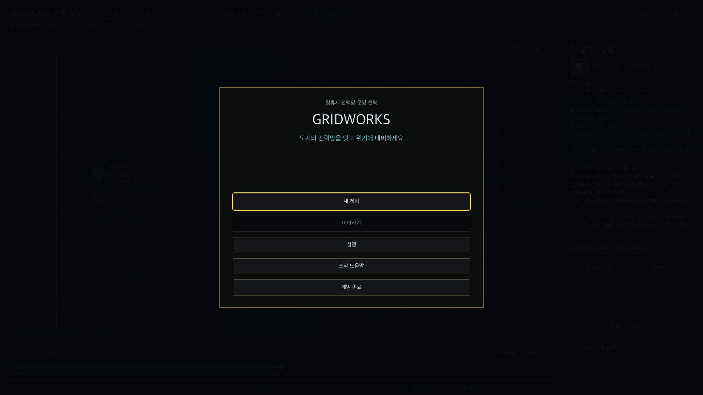
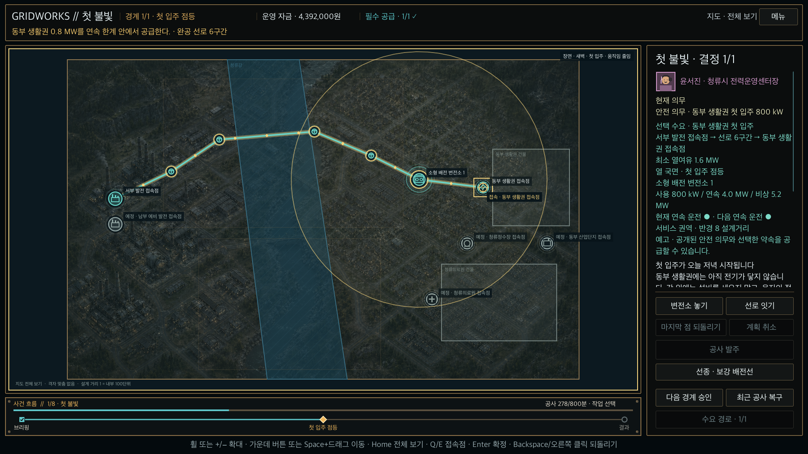

# Commercial 2D layout and input evidence

이 기록은 `docs/scopes/COMMERCIAL_2D_IMPLEMENTATION.md` 단계 G와 G.1의 자동화 가능한 화면·입력 경계만
보존한다. 이해도·재미·한국어 전문 교정이나 사람 playtest를 대신하지 않는다.

## 1920×1080 · UI 100% · 제목 shell

- Title, Pause, Settings, Help와 확인창은 `ReleaseShellOverlay` 한 인스턴스의 상호 배타 page다.
- 실제 keyboard focus가 `새 게임`에서 시작하며 새 게임→조작 도움말→지도 focus 복귀를 Enter 입력으로
  통과했다.
- 저장이 없을 때 `이어하기`는 비활성이고 보이는 label과 접근성 설명을 함께 가진다.

## 1920×1080 · UI 125% · 선택 경로와 ReduceMotion

- 실제 지도·panel 입력으로 첫 변전소와 두 선로를 완공했다. 발전 접속점→전체 6구간→동부 생활권
  접속점을 굵은 외곽선, 고정 흐름점, 접속점 ring과 시설 icon으로 함께 강조한다.
- 도시 plate는 네 concept의 사선 도시 밀도·강·주거·산업 분위기를 사용하되 의료·정수 landmark를
  굽지 않는다. 실제 전력선, 시설 상태, 건물·수면과 위험구역은 v2 좌표의 code-native overlay만
  권위로 그린다. 비활성 위험구역은 낮은 대비 경계만 남고 현재 사건 구역만 pattern과 이름을 펼친다.
- Header는 장·현재 경계·현금·`필수 공급 1/1 ✓`를 표시한다. 오른쪽 inspector는 선택 수요, 실제
  경로, 최소 열여유, 시설 상태를 접근성 문장에도 포함한다.
- 하단 사건 bar는 `브리핑 → 첫 입주 점등 → 결과`를 표시하고 현재 경계와 공사 `278/800분`을
  campaign 권위에서 읽는다. 이 bar는 시간을 진행하거나 배속하지 않는다고 접근성 문장에도 밝힌다.
- 오른쪽 inspector의 고정 code-native 초상은 윤서진·박지현·강민호·이도윤을 서로 다른 얼굴
  윤곽과 직무 색으로 구분하며 이름·직무를 접근성 이름으로 제공한다.
- keyboard로 Pause→Settings에서 UI 125%와 `지도 흐름과 날씨 움직임 줄이기`를 켰다. 핵심 공사,
  승인, 복구, 장 재시작과 수요/국면 전환은 긴 설명 ScrollContainer 밖 고정 영역 안에 남았다.
- 같은 입력 흐름의 Save & Quit은 campaign과 settings temp 파일이 없는 성공 뒤에만 제목으로
  이동했다.

두 화면은 native OpenGL/Metal process에서 저장했다. 최소 지원·검수 해상도는 1920×1080뿐이며
1280×720 모드나 증거는 이 후보에 만들지 않았다.
